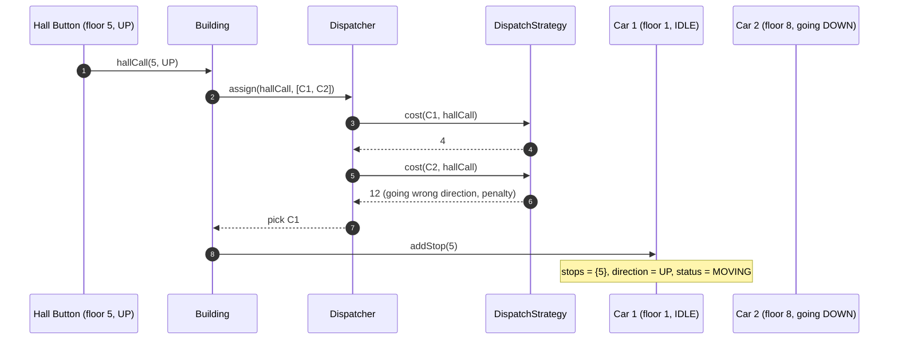
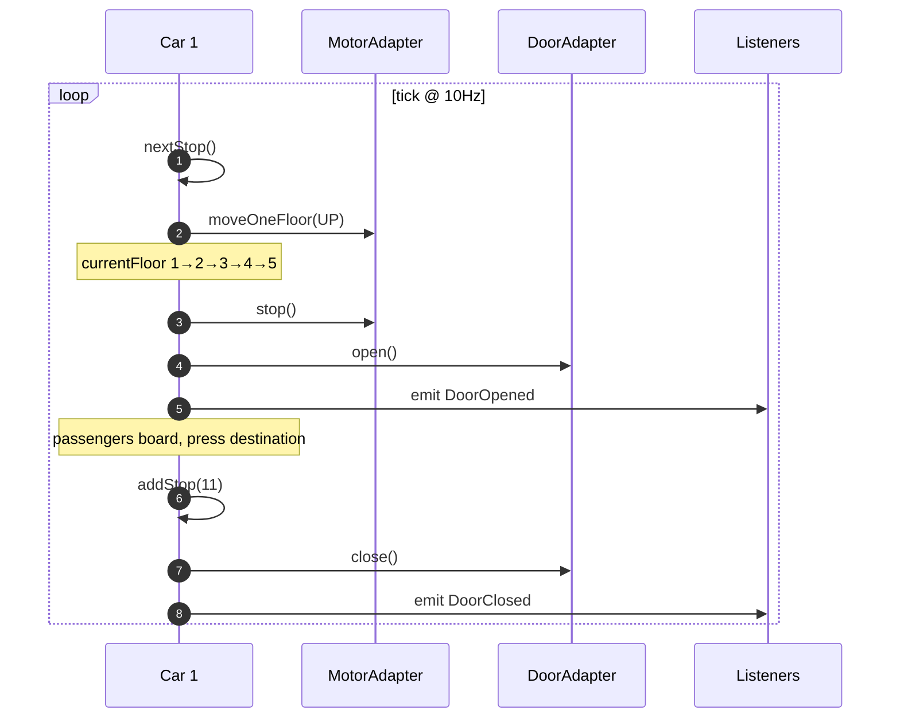
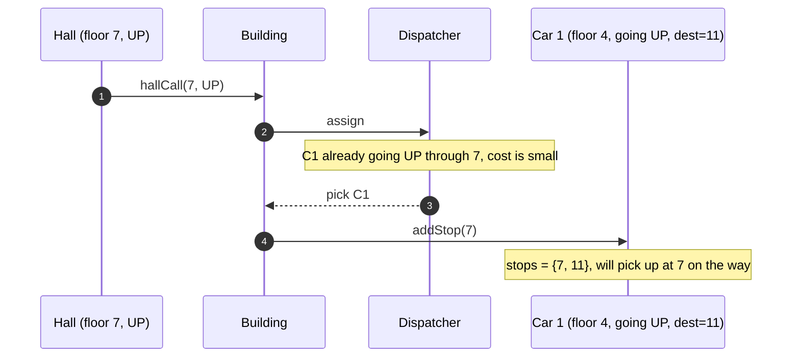
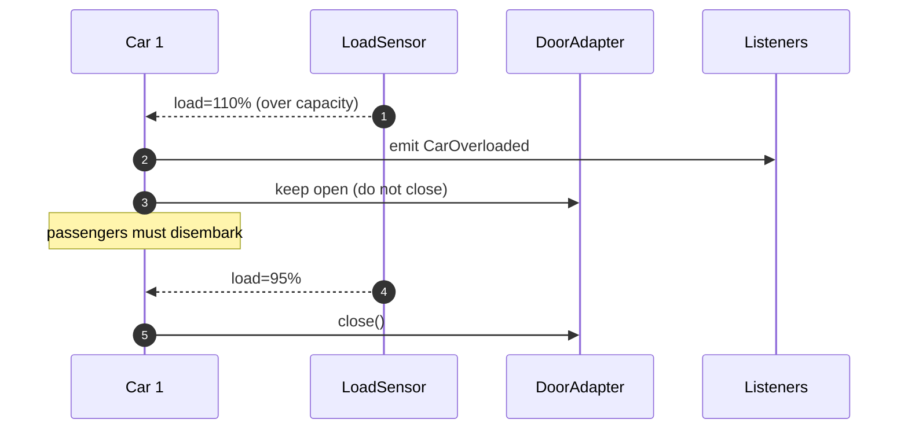
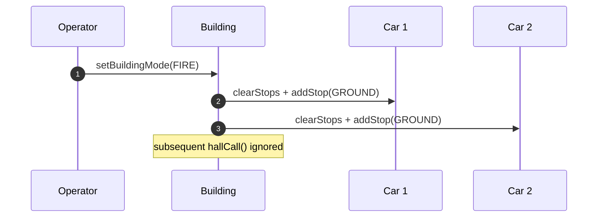
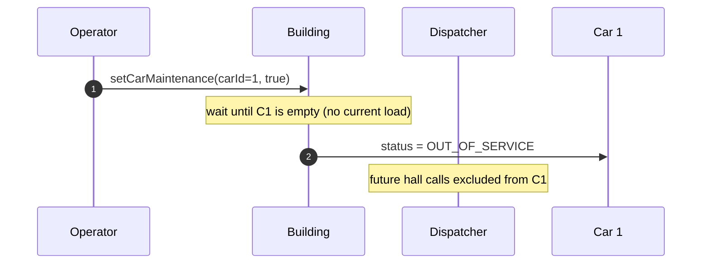

# 08 · Elevator System — Sequence Diagrams

## 1. Hall call (UP from floor 5)



## 2. Car arriving and serving



## 3. Hall call pressed mid-journey (in same direction)



## 4. Car becomes overloaded



## 5. Fire mode



## 6. Car maintenance



## Output

```
Hall flow:    press → dispatcher cost → pick car → addStop → car ticks → arrive → open door
LOOK:         car traverses stops in current direction; reverse only at last stop
Overload:     keep doors open, alarm
Fire:         all cars to ground; ignore further calls
Maintenance:  drain car, then mark OUT_OF_SERVICE
```
