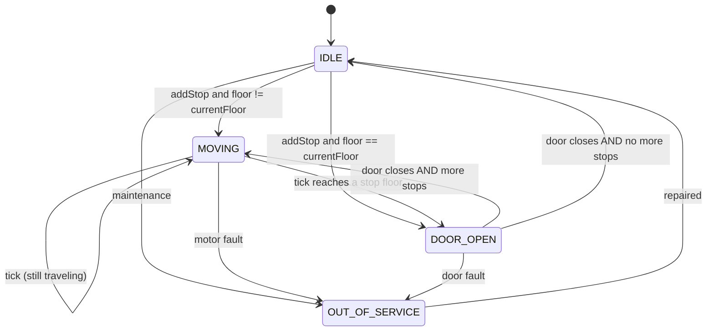
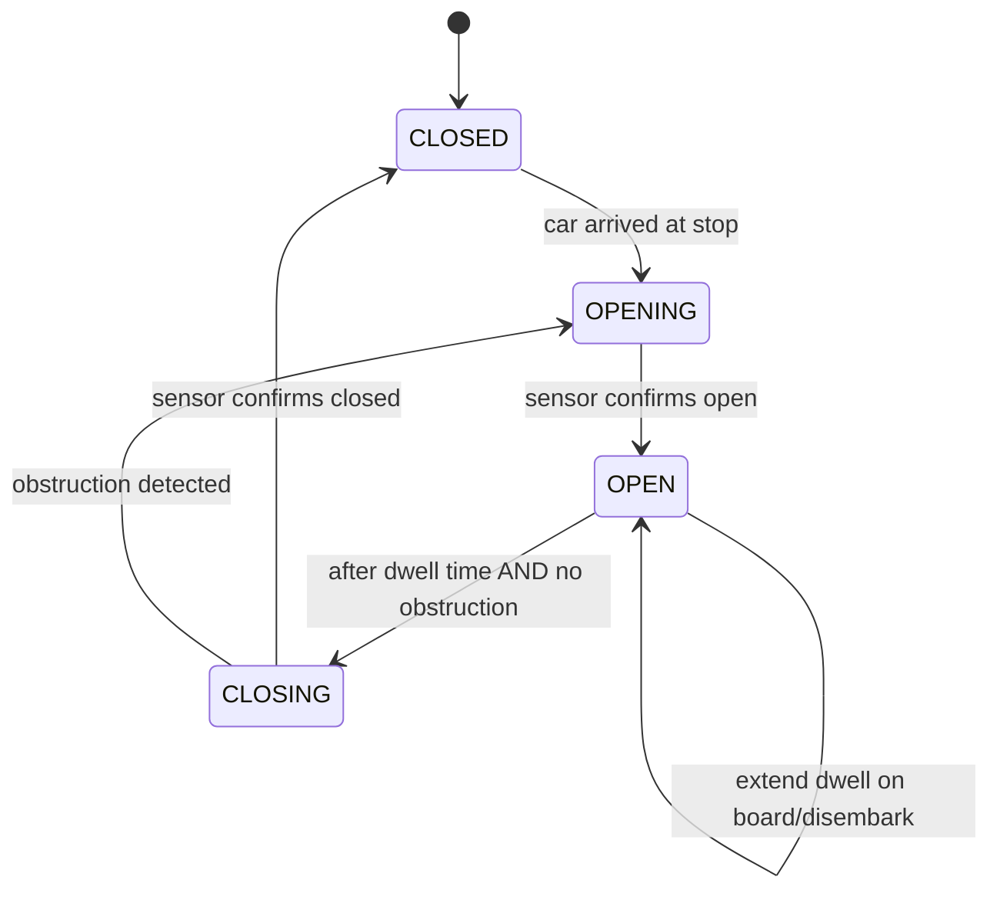
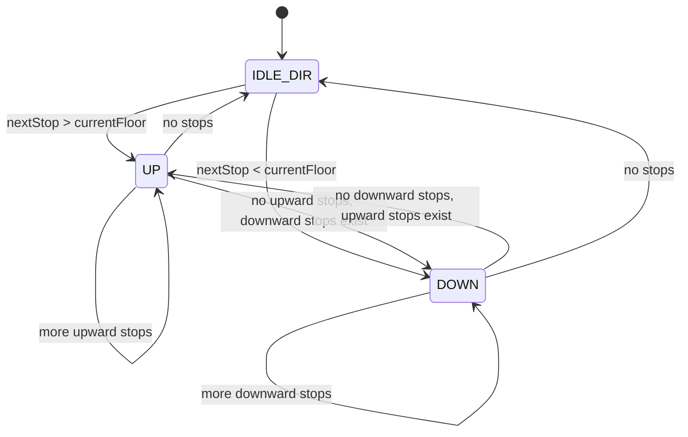
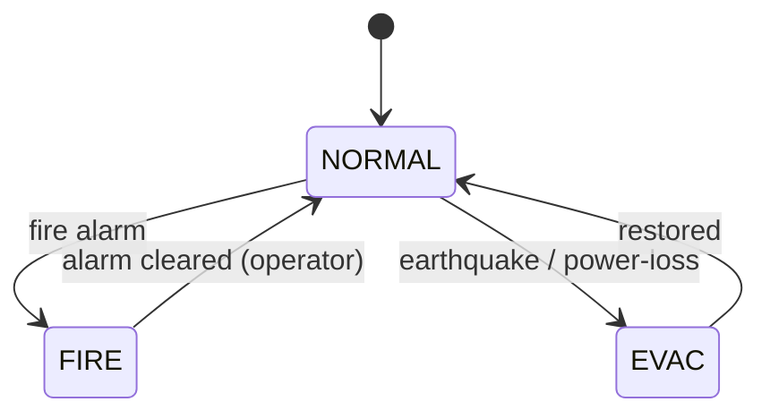

# 09 · Elevator System — State Machines

## Per-car state machine



## Door substates



## Direction changes (LOOK invariant)



LOOK forbids reversing direction in the middle — the car commits to "finish all stops in this direction" before turning around.

## Building mode



In FIRE / EVAC, hall calls are dropped; cars head to GROUND with doors held open.

## Output

```
Car:        IDLE → MOVING ↔ DOOR_OPEN → IDLE; OUT_OF_SERVICE branch
Door:       CLOSED → OPENING → OPEN → CLOSING → CLOSED (with obstruction handling)
Direction:  LOOK invariant — finish current direction first
Building:   NORMAL ↔ FIRE/EVAC
```
