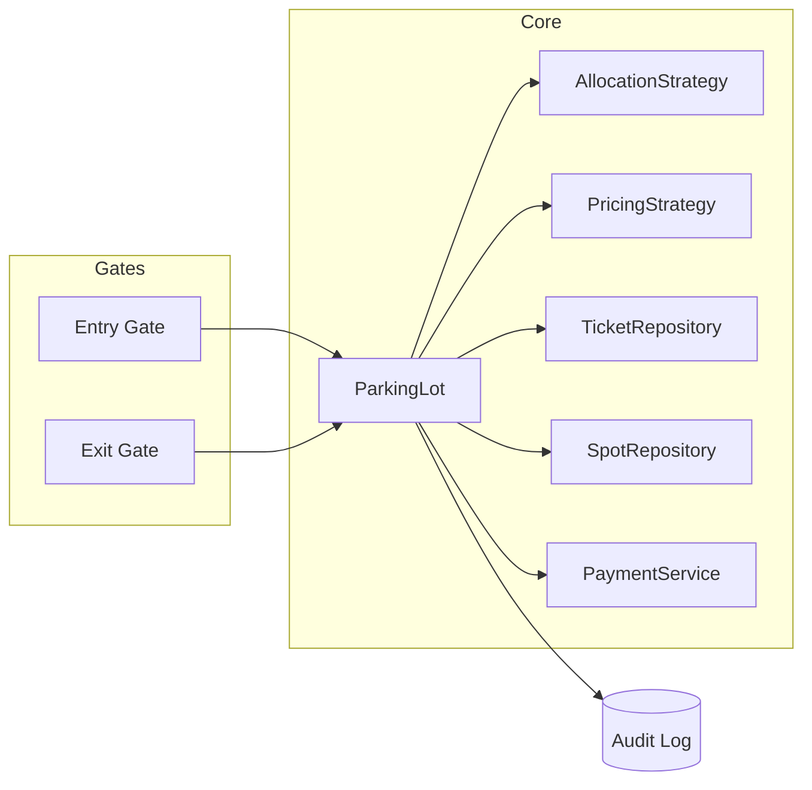

# 03 · Parking Lot — High Level Architecture

## Diagram



## Components

| Component | Responsibility |
| --- | --- |
| `ParkingLot` | Domain root. Owns floors, spots, active tickets. |
| `EntryGate` | Receives arrival event; calls lot to allocate; prints ticket. |
| `ExitGate` | Validates ticket; computes fee; takes payment; releases spot. |
| `AllocationStrategy` | Picks a free spot for a vehicle. |
| `PricingStrategy` | Computes fee given a ticket's duration + spot type. |
| `SpotRepository` | Persists spot occupancy. |
| `TicketRepository` | Persists tickets (active + closed). |
| `PaymentService` | Adapter to gateway. |
| `AuditLog` | Durable log. |

## Two phases

1. **Entry**: `gate.requestEntry(plate, vehicleType)` →
   1. Allocation strategy proposes a spot.
   2. Atomic claim — set `spot.occupied = true` only if it was free.
   3. Persist `Ticket(plate, spotId, entryTime)`.
   4. Open barrier.
2. **Exit**: `gate.requestExit(ticketId)` →
   1. Load ticket, compute fee via pricing strategy.
   2. Charge via PaymentService.
   3. Free the spot atomically.
   4. Persist closed ticket.
   5. Open barrier.

## Atomic claim

The classic concurrency problem. With Postgres:

```sql
UPDATE spots
SET    occupied = TRUE, ticket_id = $1
WHERE  id = $2 AND occupied = FALSE
RETURNING id;
```

If 0 rows returned → spot was claimed by another gate. Strategy returns next candidate.

In V1 / in-memory, we use a `ConcurrentHashMap<SpotId, AtomicBoolean>` — `compareAndSet(false, true)`.

## Why allocation as Strategy

Different lots want different policies:
- A mall: nearest to entrance (UX).
- An airport: balance across floors (avoid "everyone parks on floor 1").
- A factory: by section (employees grouped).

Same engine; different policy.

## Why pricing as Strategy

Different operators charge differently:
- ₹50 flat for 4 hours, ₹10/hour after.
- Free for the first 15 minutes.
- Different by vehicle type.
- Surge during peak hours.

Same engine; different policy.

## Failure modes

| Failure | Mitigation |
| --- | --- |
| Concurrent claims of same spot | Atomic claim returns 0; strategy picks next |
| Lost ticket | Lookup by license plate (V2) or charge max-day flat |
| Payment timeout | Retry; if persistent, manual override |
| Spot allocator returns spot but barrier fails | Spot stays claimed; manual override; refund or re-allocate |
| Power loss | Tickets durable in DB; lot rehydrates on restart |
| LPR misread plate | Manual entry by attendant |

## Output

```
Components:    ParkingLot, EntryGate, ExitGate, AllocationStrategy, PricingStrategy, repos, payment
Entry:         allocate → atomic claim → persist ticket → open barrier
Exit:          load ticket → price → pay → free spot → open barrier
Concurrency:   atomic claim via DB UPDATE … WHERE occupied=FALSE
Strategies:    allocation (mall vs airport) + pricing (flat vs tiered)
```
