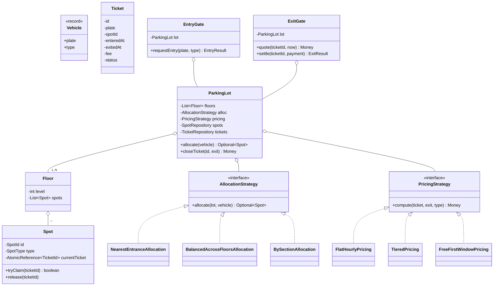

# 07 · Parking Lot — Class Diagrams

## Aggregated class diagram

A single view of every class, interface, and enum in the system — fields and methods included. Source of truth: the Java skeleton under `12_machine_coding_skeleton/`.

```mermaid
classDiagram
    %% ===== Enums & ID value objects =====
    class VehicleType {
      <<enumeration>>
      BIKE
      CAR
      EV_CAR
      TRUCK
    }
    class SpotType {
      <<enumeration>>
      BIKE
      COMPACT
      LARGE
      EV
    }
    class Status {
      <<enumeration>>
      ACTIVE
      PAID
      CLOSED
    }
    class SpotId {
      <<value type>>
      -int floor
      -int row
      -int col
      +of(floor, row, col) SpotId$
    }
    class TicketId {
      <<value type>>
      -UUID id
      +newId() TicketId$
    }
    class Money {
      <<value type>>
      -long minor
      -String currency
      +inr(rupees) Money$
      +zero(currency) Money$
      +plus(other) Money
      +times(n) Money
      +amountMinor() long
    }
    class Vehicle {
      <<record>>
      -String plate
      -VehicleType type
      -boolean handicapPermit
      +of(plate, type) Vehicle$
    }

    %% ===== Compatibility helpers =====
    class Compatibility {
      <<utility>>
      +canFit(spotType, vehicleType) boolean$
      +preferred(vehicleType) List~SpotType~$
    }

    %% ===== Domain mutables =====
    class Spot {
      -SpotId id
      -int floor
      -int row
      -int col
      -SpotType type
      -AtomicReference~TicketId~ currentTicket
      -boolean outOfService
      +tryClaim(ticketId) boolean
      +release(ticketId) boolean
      +isOccupied() boolean
      +isOutOfService() boolean
      +setOutOfService(v)
      +id() SpotId
      +type() SpotType
      +floor() int
      +row() int
      +col() int
    }
    class Ticket {
      -TicketId id
      -String plate
      -VehicleType vehicleType
      -SpotId spot
      -Instant enteredAt
      -Instant exitedAt
      -Money feeCharged
      -String paymentRef
      -Status status
      +close(exit, fee, paymentRef)
      +id() TicketId
      +plate() String
      +spot() SpotId
      +enteredAt() Instant
      +status() Status
    }

    %% ===== Strategy: Allocation =====
    class AllocationStrategy {
      <<interface>>
      +allocate(spots, vehicle, ticketId) Optional~Spot~
    }
    class NearestEntranceAllocation {
      +allocate(spots, vehicle, ticketId) Optional~Spot~
    }
    AllocationStrategy <|.. NearestEntranceAllocation

    %% ===== Strategy: Pricing =====
    class PricingStrategy {
      <<interface>>
      +compute(ticket, exit, spotType) Money
    }
    class FlatHourlyPricing {
      -Map~SpotType,Money~ ratePerHour
      +compute(ticket, exit, spotType) Money
    }
    class FreeFirstWindowPricing {
      -int freeMinutes
      -PricingStrategy underlying
      +compute(ticket, exit, spotType) Money
    }
    PricingStrategy <|.. FlatHourlyPricing
    PricingStrategy <|.. FreeFirstWindowPricing
    FreeFirstWindowPricing o-- "1" PricingStrategy : decorates

    %% ===== Repositories =====
    class SpotRepository {
      <<interface>>
      +add(spot)
      +get(id) Optional~Spot~
      +allByType(type) List~Spot~
      +all() List~Spot~
    }
    class InMemorySpotRepository {
      -ConcurrentMap~SpotId,Spot~ spots
      +add(spot)
      +get(id) Optional~Spot~
      +allByType(type) List~Spot~
      +all() List~Spot~
    }
    class TicketRepository {
      <<interface>>
      +save(ticket)
      +get(id) Optional~Ticket~
    }
    class InMemoryTicketRepository {
      -ConcurrentMap~TicketId,Ticket~ tickets
      +save(ticket)
      +get(id) Optional~Ticket~
    }
    SpotRepository <|.. InMemorySpotRepository
    TicketRepository <|.. InMemoryTicketRepository

    %% ===== Gateway result (sealed) =====
    class EntryResult {
      <<sealed interface>>
    }
    class Admitted {
      <<record>>
      +TicketId ticketId
      +SpotId spot
    }
    class LotFull {
      <<record>>
      +VehicleType vehicleType
    }
    EntryResult <|-- Admitted
    EntryResult <|-- LotFull

    %% ===== Listener (Observer) =====
    class LotListener {
      <<interface>>
      +onAdmitted(vehicle, spot, ticket)
      +onRejected(vehicle, reason)
      +onClosed(ticket, fee)
    }
    class ConsoleLogger {
      -PrintStream out
      +onAdmitted(vehicle, spot, ticket)
      +onRejected(vehicle, reason)
      +onClosed(ticket, fee)
    }
    LotListener <|.. ConsoleLogger

    %% ===== Top-level orchestrator =====
    class ParkingLot {
      -SpotRepository spots
      -TicketRepository tickets
      -AllocationStrategy allocation
      -PricingStrategy pricing
      -LotListener listener
      -Clock clock
      +requestEntry(vehicle) EntryResult
      +quote(ticketId) Money
      +settle(ticketId, paymentRef)
    }
    ParkingLot o-- "1" SpotRepository
    ParkingLot o-- "1" TicketRepository
    ParkingLot o-- "1" AllocationStrategy
    ParkingLot o-- "1" PricingStrategy
    ParkingLot o-- "1" LotListener
    ParkingLot ..> EntryResult
    Spot o-- TicketId
    Ticket ..> SpotId
```



---

## Class diagram



## Package layout

```
com.parking
├── domain/        VehicleType, SpotType, SpotId, TicketId, Vehicle, Spot, Ticket, Money, Compatibility
├── allocation/    AllocationStrategy + impls
├── pricing/       PricingStrategy + impls
├── gateway/       EntryGate, ExitGate, EntryResult
├── repository/    SpotRepository (+InMemory), TicketRepository (+InMemory)
├── listener/      LotListener, ConsoleLogger
├── ParkingLot.java
└── Main.java
```

## Why `Compatibility` is a function, not an interface

We could write:

```java
interface CanPark { boolean accepts(SpotType s); }
class CarVehicleType implements CanPark { ... }
class TruckVehicleType implements CanPark { ... }
```

But this scatters the matrix across N classes. A single function with a switch concentrates it where it can be reviewed and changed. **The "where" of compatibility logic matters more than the "how."**

## Output

A graph: `ParkingLot` aggregates floors and strategies; gates expose external API; spots are atomic-claim resources.
