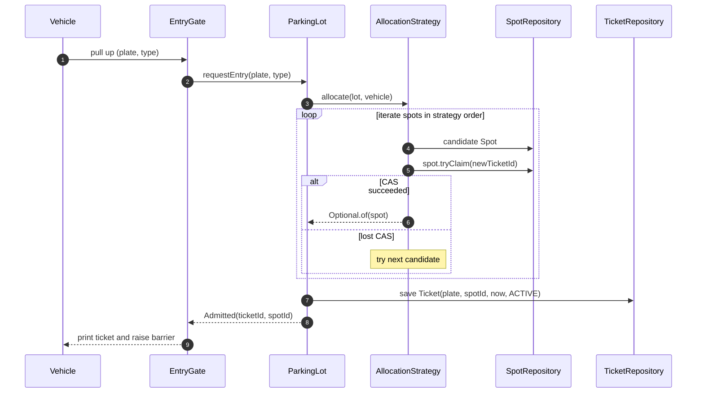
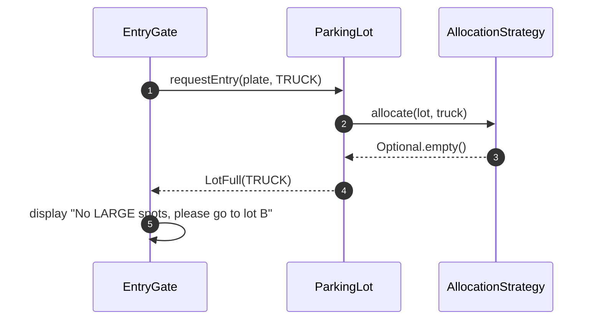
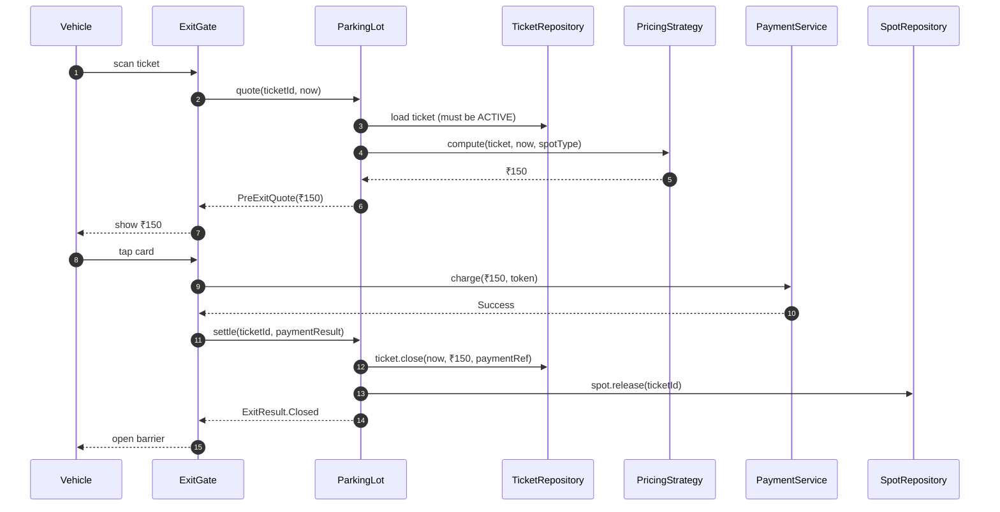
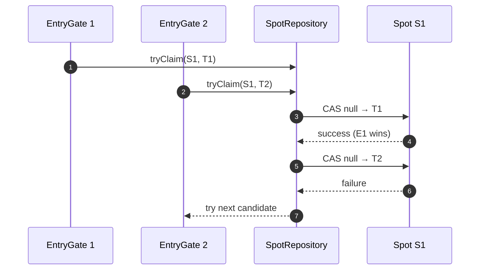
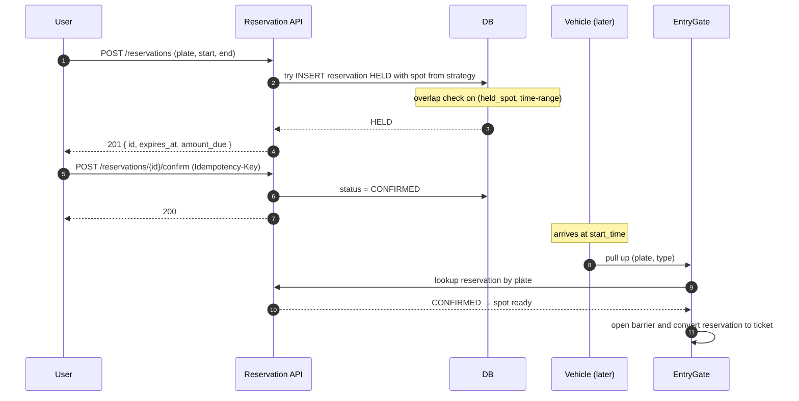

# 08 · Parking Lot — Sequence Diagrams

## 1. Entry — happy path



## 2. Entry — lot full for type



## 3. Exit — happy path



## 4. Concurrent claim (two gates, same spot)



Atomic-claim guarantees only one gate gets each spot.

## 5. Reservation flow (V2)



## Output

```
Entry:    allocate via strategy → atomic CAS claim → ticket persisted → barrier opens
Exit:     quote → pay → close ticket → release spot → barrier opens
Concurrent: only one gate wins each spot via CAS
V2 reservation: HOLD then CONFIRM with overlap check
```
