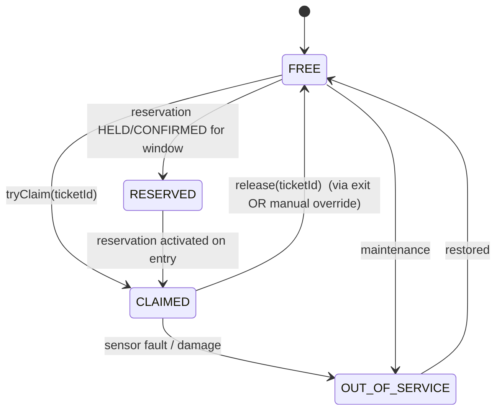
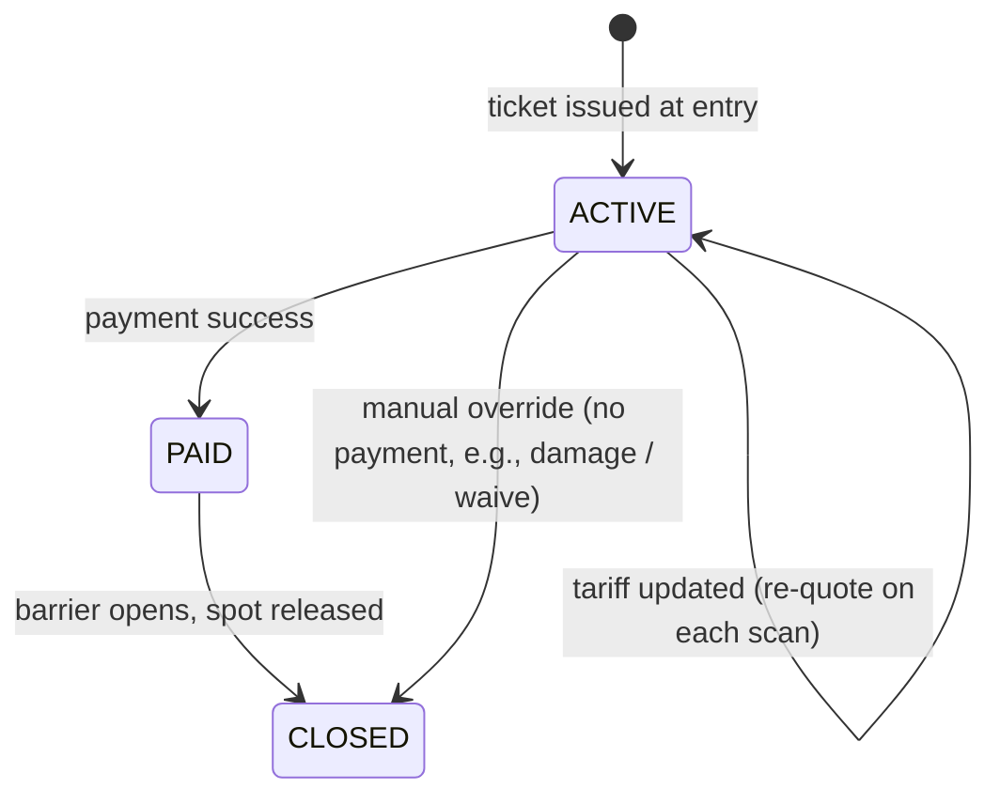
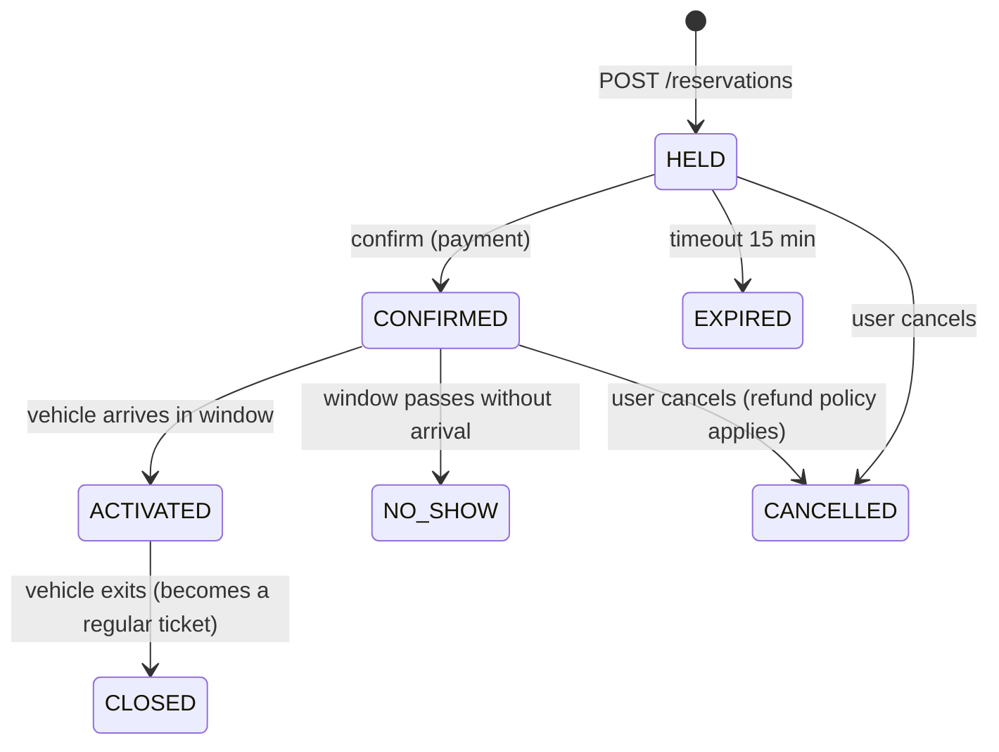
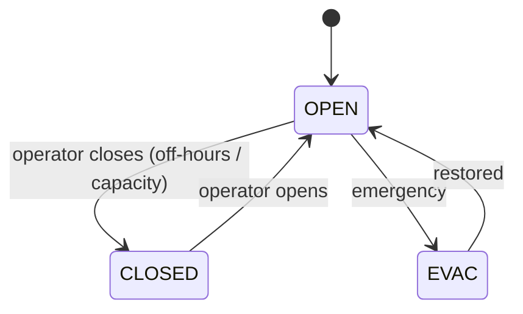

# 09 · Parking Lot — State Machines

## Spot lifecycle



For V1 we only have FREE ↔ CLAIMED (+ OUT_OF_SERVICE). Reservations are V2.

## Ticket lifecycle



`PAID → CLOSED` is the boundary where the barrier physically opens. Up to that point, the customer can refuse and walk away (rare); on `PAID` we hold the spot and refund only via operator.

## Reservation lifecycle (V2)



Note the parallel with hotel booking — same shape.

## Lot mode



In CLOSED / EVAC, gates refuse new entries; existing tickets can still exit.

## Output

```
Spot:         FREE → CLAIMED ↔ FREE; OUT_OF_SERVICE branch
Ticket:       ACTIVE → PAID → CLOSED (or ACTIVE → CLOSED via override)
Reservation:  HELD → CONFIRMED → ACTIVATED/NO_SHOW; (HELD → EXPIRED) is the auto-collapse
Lot:          OPEN ↔ CLOSED ↔ EVAC
```
