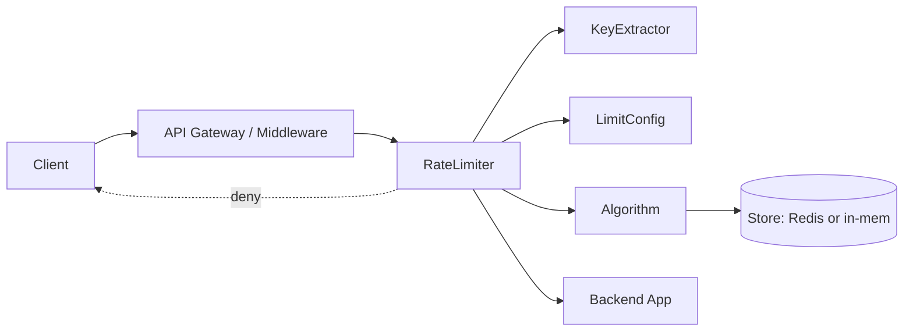

# 03 · Rate Limiter — High Level Architecture

## Diagram



## Components

| Component | Responsibility |
| --- | --- |
| `RateLimiter` | Orchestrator. For each scope, asks Algorithm + Store. |
| `KeyExtractor` | Inspects request → produces one or more keys (IP, user, route, composite). |
| `LimitConfig` | For a key family, the rate + burst + algorithm choice. |
| `Algorithm` | The math. Token Bucket / Leaky Bucket / Fixed / Sliding Log / Sliding Counter. |
| `Store` | Per-key state. In-memory or Redis. |
| `Decision` | `Allow(remaining, resetAt)` \| `Deny(retryAfter, limit, scope)` |

## Two deploy modes

### Mode A — In-process middleware

The limiter runs inside each app/pod with an in-memory store.

Pros: zero network, microsecond latency.
Cons: each pod has its own counters → caller hitting M pods sees M× the limit.

Useful for: per-pod CPU-protection, very-high-RPS services where Redis hop is costly.

### Mode B — Centralized Redis

All pods share one Redis cluster. Lua script is atomic per key.

Pros: globally accurate; one config; one place to monitor.
Cons: 1 ms hop; Redis is a critical dependency.

Useful for: API gateway with strict global limits per API key.

We **support both** via the `Store` abstraction.

## Multi-scope composite

Most APIs need multiple limits at once:
- 1000/min per IP (defense against bots).
- 100/min per user (per-account limit).
- 10/sec per (user, expensive-route) (specific endpoints).

The orchestrator extracts all keys, runs all checks, and **denies on the first failing check**. To remain fair, we should deny atomically — **but** rolling back tokens already deducted on previous scopes is hard. Two pragmatic strategies:

**A. Sequential check, deny on first fail (no rollback).**
Some tokens were deducted from earlier scopes for a request that ultimately got denied. Accept this small unfairness; it's only the boundary cases.

**B. Quota check first, then deduct.**
Lua script checks all keys *without* mutating, then if all pass, deducts atomically. More complex, more network.

V1: **A** with a clear comment. V2: **B** for revenue-critical APIs.

## Failure modes

| Failure | Mitigation |
| --- | --- |
| Redis down | Fail-open; alert; in-memory fallback per pod |
| Redis slow (ms-level latency) | Circuit-breaker → fail-open after N consecutive timeouts |
| Clock skew | Use Redis server time; or NTP-synced |
| Key cardinality blowup | TTL on keys; eviction policy |
| Lua script bug | Versioned script SHAs; hot-swap |

## Why "fail-open"

Rate limiting is a **defense in depth** layer. If the limiter dies, the API still works (slightly more vulnerable to abuse, briefly). Fail-closed turns a Redis outage into an API outage — far worse.

The exception: **billing-grade** rate limits (you must not exceed paid quota). Those fail-closed; document explicitly.

## Output

```
Components:    RateLimiter, KeyExtractor, LimitConfig, Algorithm, Store, Decision
Modes:         in-process (per-pod, fast) and centralized (Redis, accurate)
Multi-scope:   sequential check with deny-on-first-fail (V1)
Failure:       fail-open by default; fail-closed for billing-grade
```
