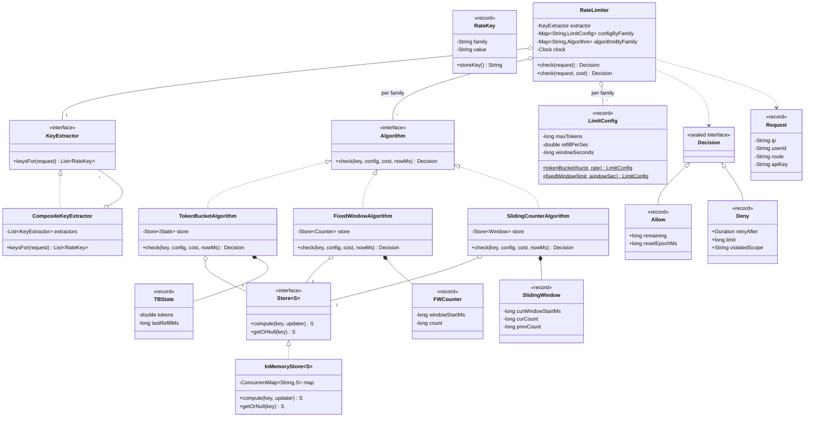
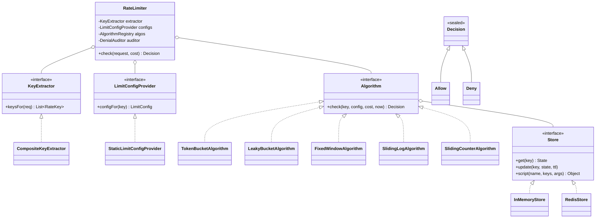

# 07 · Rate Limiter — Class Diagrams

## Aggregated class diagram

A single view of every class, interface, and enum in the system — fields and methods included. Source of truth: the Java skeleton under `12_machine_coding_skeleton/`.



---

## Class diagram



## Package layout

```
com.ratelimit
├── domain/         RateKey, LimitConfig, AlgorithmType, Decision (sealed)
├── algorithm/      Algorithm + impls (TokenBucket etc.)
├── store/          Store + InMemoryStore + RedisStore (interface only here; Lua lives as resource)
├── middleware/     KeyExtractor + CompositeKeyExtractor; HttpRateLimiterFilter (sketch)
├── RateLimiter.java
└── Main.java
```

## How algorithms talk to store

We could let each Algorithm own its own Store accesses (more flexible), or push state I/O into a generic `Store.compareAndUpdate` (simpler).

V1: each algorithm does its own store access (flexible — Token Bucket reads/writes a Hash; Sliding Log reads/writes a ZSET).

For Redis, the algorithm calls a **named Lua script** with KEYS+ARGS; the script encapsulates the whole algorithm. This is the **production pattern**.

## Output

A small graph: `RateLimiter` orchestrates Extractor + Config + Algorithm. Each Algorithm owns its store interactions. Decisions are sealed.
