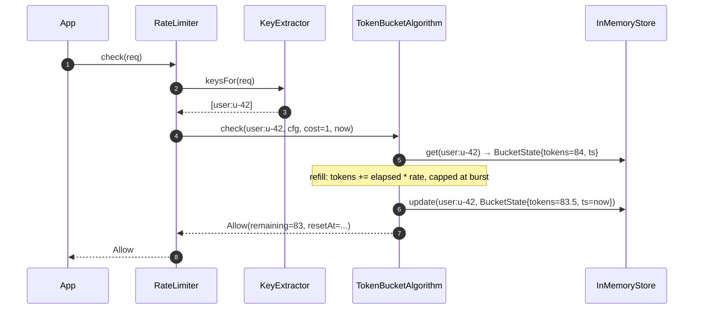
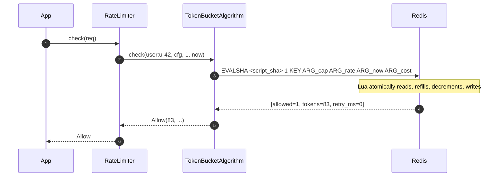
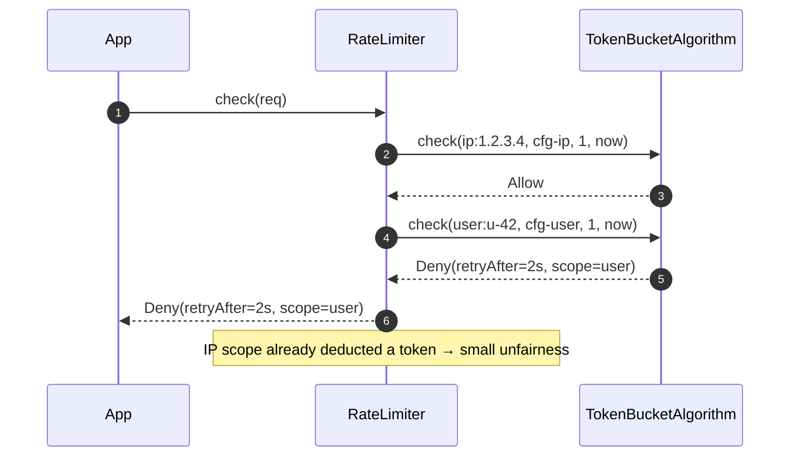
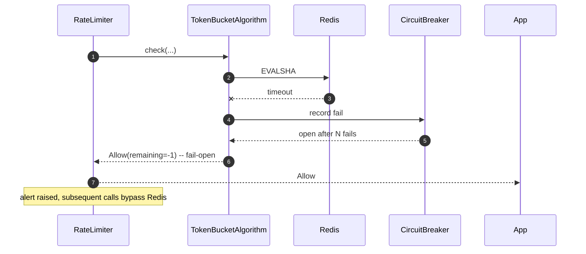
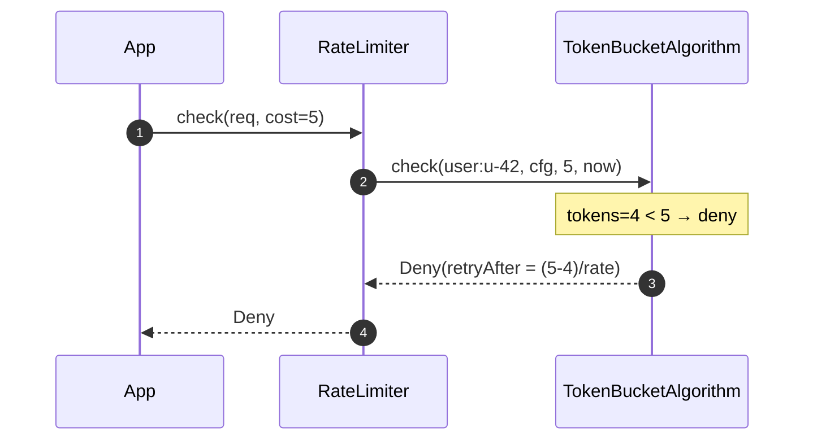

# 08 · Rate Limiter — Sequence Diagrams

## 1. Single-key in-memory check (Token Bucket)



## 2. Distributed check via Redis Lua



The whole check is **one network round-trip**.

## 3. Multi-scope check, deny on second scope



V2 with two-phase check would do:
1. Quote: read both buckets without mutating.
2. If both pass: atomic deduct on both via a multi-key Lua script.

## 4. Failure: Redis times out



When the breaker is OPEN, we skip Redis entirely and return Allow. After a probe interval, try once; restore on success.

## 5. Cost-weighted check (heavy endpoint)



The cost factor allows weighting heavy endpoints without requiring per-endpoint configs.

## Output

```
Single-key:    one Lua call (Redis) or one Map op (in-memory)
Multi-scope:   sequential checks; deny on first fail
Failure:       circuit breaker → fail-open
Cost-weighted: pass cost > 1 to algorithm
```
