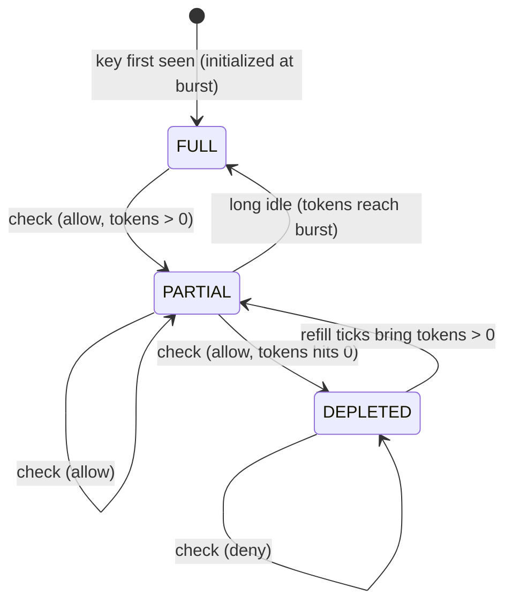
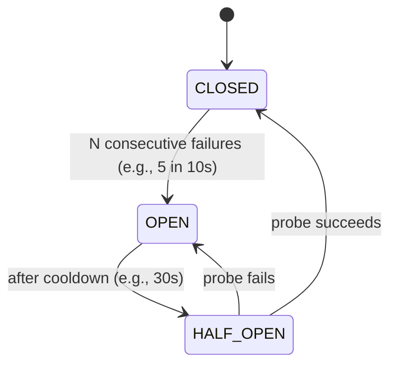
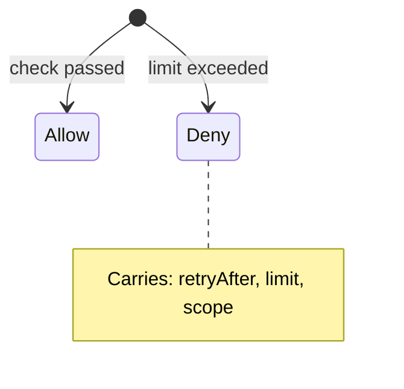

# 09 · Rate Limiter — State Machines

## Per-key Token Bucket (logical)



States are *informational*; the actual data is `tokens: double`. Useful for debugging dashboards.

## Circuit breaker for Redis dependency



When OPEN, the limiter fails-open without hitting Redis.

## Decision discriminated union



Caller exhaustively pattern-matches.

## Output

```
Token Bucket:    FULL ↔ PARTIAL ↔ DEPLETED (logical view of tokens)
Breaker:         CLOSED → OPEN → HALF_OPEN → CLOSED
Decision:        sealed Allow | Deny
```
