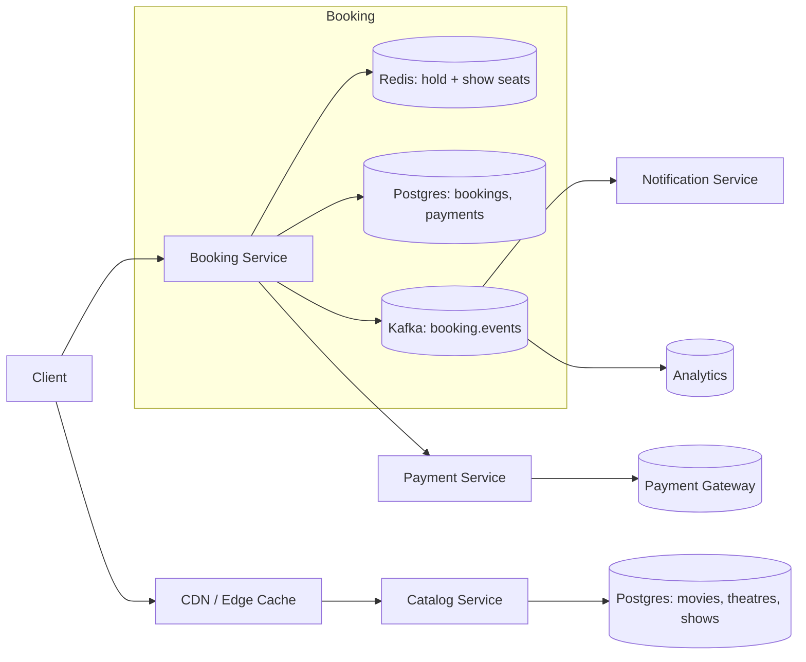

# 03 · BookMyShow — High Level Architecture

## Diagram



## Components

| Component | Responsibility |
| --- | --- |
| `Catalog Service` | Cities → movies → theatres → shows. Read-heavy, CDN cacheable. |
| `Booking Service` | Hold + Confirm flow. Owns inventory. |
| `Redis` | Hot seat state (`available` set per show), holds (TTL'd keys). |
| `Postgres (booking)` | Truth for confirmed bookings + payments. Partitioned by show. |
| `Payment Service` | Adapter to external gateway with idempotency. |
| `Kafka` | Booking events (CONFIRMED, CANCELLED) for downstream. |
| `Notification Service` | SMS/email/push consumer. |
| `Analytics` | Dashboards, occupancy tracking. |

## Hold + Confirm flow (the critical path)

### Hold (1)
```
POST /shows/{id}/hold { seat_ids: [A1, A2] }
  Redis: SET NX hold:{showId}:A1 = userId, EX = TTL
         SET NX hold:{showId}:A2 = userId, EX = TTL
  if any SETNX failed → release the held one(s); return 409
  else: write Postgres `holds` row (auditable)
       return holdId + price quote
```

### Confirm (2)
```
POST /holds/{id}/confirm { payment_token, idempotency_key }
  Postgres TX:
    SELECT hold WHERE id = $1 AND status = HELD AND expires > now()
    INSERT booking, booking_seats[] (with PK on (show_id, seat_id))
    UPDATE hold.status = CONFIRMED
  COMMIT
  publish booking.confirmed event
  return booking_id, ticket
```

The `PRIMARY KEY (show_id, seat_id)` on `booking_seats` is the **last line of defense** — if Redis somehow lets two holds slip through, the unique constraint will fail one of them at confirm time. **Defense in depth.**

## Why Redis SETNX for hold

- TTL is automatic (no cron).
- Atomic. SETNX is the canonical "test-and-set."
- Sub-millisecond.

If the user confirms in time, we `DEL` the Redis key and write the row to Postgres. If TTL expires, the seat just becomes available again.

## Why Postgres transaction for confirm

- ACID across booking + payment.
- Unique constraint enforces no-double-book.
- Audit and reporting use the same schema.

## Read path (browse / show layout)

CDN → Catalog Service → Postgres (with Redis cache).
Show layout (which seats are available) is cached in Redis with version invalidation:
- On any successful hold/release/confirm, increment `version:show:{id}`.
- Layout cache key is `layout:show:{id}:v{version}`.
- Reads hit the cache first; on miss, fetch from Postgres + Redis live state, populate cache.

## Failure modes

| Failure | Mitigation |
| --- | --- |
| Redis down for hold | Fall back to direct Postgres `INSERT` with optimistic lock; degraded latency |
| Postgres down for confirm | Refund payment after retry; alert |
| Payment gateway timeout | Idempotency-keyed retry; if persistent, refund |
| Kafka down | Outbox pattern: write event row in same TX, separate process publishes |
| Hold expired during payment | Atomic check on confirm (`expires > now()`); if expired, refund |
| User refreshes / loses connection | `holdId` carries state; UI rehydrates |

## Output

```
Components:    Catalog (read-heavy), Booking (write-hot), Redis (holds), Postgres (truth),
               Payment, Kafka, Notification
Hold:          Redis SETNX + audit row, TTL
Confirm:       Postgres TX with PK(show_id, seat_id) as final guard
Reads:         CDN + Redis layout cache + version invalidation
Failure:       fall-back paths; outbox for Kafka; gateway idempotency
```
