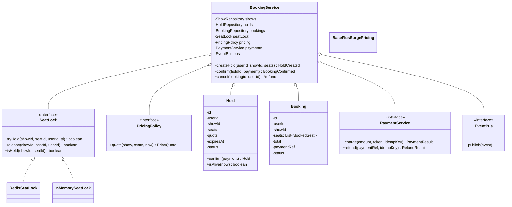

# 07 · BookMyShow — Class Diagrams

## Aggregated class diagram

A single view of every class, interface, and enum in the system — fields and methods included. Source of truth: the Java skeleton under `12_machine_coding_skeleton/`.

```mermaid
classDiagram
    %% ===== Value objects, ID types & enums =====
    class Money {
      <<value type>>
      -long minor
      -String currency
      +inr(rupees) Money$
      +zero(currency) Money$
      +plus(other) Money
      +times(n) Money
      +amountMinor() long
    }
    class SeatId {
      <<value type>>
      -String row
      -int number
      +of(row, number) SeatId$
      +toString() String
    }
    class SeatCategory {
      <<enumeration>>
      SILVER
      GOLD
      PLATINUM
    }
    class ShowStatus {
      <<enumeration>>
      OPEN
      SOLD_OUT
      CANCELLED
      CLOSED
    }
    class HoldStatus {
      <<enumeration>>
      HELD
      CONFIRMED
      EXPIRED
      CANCELLED
    }
    class BookingStatus {
      <<enumeration>>
      CONFIRMED
      CANCELLED
      REFUNDED
    }

    %% ===== Domain records =====
    class Seat {
      <<record>>
      -SeatId id
      -SeatCategory category
    }
    class BookedSeat {
      <<record>>
      -SeatId id
      -SeatCategory category
      -Money price
    }
    class PriceQuote {
      <<record>>
      -Money subtotal
      -Money fees
      -Money total
      -double surgeMultiplier
    }

    %% ===== Domain mutables =====
    class Show {
      -String id
      -String movieTitle
      -Map~SeatId,Seat~ seats
      -Map~SeatCategory,Money~ basePrice
      -Instant startsAt
      -ShowStatus status
      +basePriceFor(category) Money
      +totalSeats() int
      +setStatus(status)
      +seats() Map~SeatId,Seat~
      +id() String
      +movieTitle() String
      +startsAt() Instant
      +status() ShowStatus
    }
    class Hold {
      -String id
      -String userId
      -String showId
      -List~SeatId~ seats
      -PriceQuote quote
      -Instant createdAt
      -Instant expiresAt
      -HoldStatus status
      -String confirmedBookingId
      +isAlive(now) boolean
      +confirm(bookingId)
      +expire()
      +cancel()
      +id() String
      +userId() String
      +seats() List~SeatId~
      +quote() PriceQuote
      +status() HoldStatus
    }
    class Booking {
      -String id
      -String userId
      -String showId
      -String holdId
      -List~BookedSeat~ seats
      -Money total
      -String paymentRef
      -Instant createdAt
      -BookingStatus status
      +cancel()
      +refund()
      +status() BookingStatus
    }
    Show o-- "*" Seat
    Hold ..> SeatId
    Hold *-- PriceQuote
    Booking o-- "*" BookedSeat

    %% ===== Sealed result types =====
    class HoldResult {
      <<sealed interface>>
    }
    class HoldCreated {
      <<record>>
      +Hold hold
    }
    class HoldConflict {
      <<record>>
      +List~SeatId~ conflicting
    }
    class ShowClosed {
      <<record>>
      +String reason
    }
    HoldResult <|-- HoldCreated
    HoldResult <|-- HoldConflict
    HoldResult <|-- ShowClosed

    class ConfirmResult {
      <<sealed interface>>
    }
    class Confirmed {
      <<record>>
      +Booking booking
    }
    class Expired {
      <<record>>
    }
    class PaymentFailed {
      <<record>>
      +String reason
    }
    class SeatConflict {
      <<record>>
    }
    ConfirmResult <|-- Confirmed
    ConfirmResult <|-- Expired
    ConfirmResult <|-- PaymentFailed
    ConfirmResult <|-- SeatConflict

    %% ===== Inventory: SeatLock (atomic) =====
    class SeatLock {
      <<interface>>
      +tryHold(showId, seat, owner, ttl) boolean
      +release(showId, seat, owner) boolean
      +isHeld(showId, seat) boolean
      +isHeldBy(showId, seat, owner) boolean
    }
    class InMemorySeatLock {
      -ConcurrentMap~Key,Entry~ map
      -Clock clock
      +tryHold(...) boolean
      +release(...) boolean
      +isHeld(...) boolean
      +isHeldBy(...) boolean
    }
    SeatLock <|.. InMemorySeatLock

    %% ===== Strategy: Pricing =====
    class PricingPolicy {
      <<interface>>
      +quote(show, seats, currentlyBookedCount) PriceQuote
    }
    class BasePlusSurgePricing {
      -double surgeStartFraction
      -double surgePerStep
      +quote(show, seats, currentlyBookedCount) PriceQuote
    }
    PricingPolicy <|.. BasePlusSurgePricing

    %% ===== Payment =====
    class PaymentService {
      <<interface>>
      +charge(amount, paymentToken, idempotencyKey) Result
      +refund(paymentRef, idempotencyKey) Result
    }
    class PaymentResult {
      <<sealed interface>>
    }
    class PaymentSuccess {
      <<record>>
      +String paymentRef
    }
    class PaymentFailure {
      <<record>>
      +String reason
    }
    class StubPaymentService {
      -Predicate~Money~ shouldFail
      +charge(...) Result
      +refund(...) Result
    }
    PaymentResult <|-- PaymentSuccess
    PaymentResult <|-- PaymentFailure
    PaymentService <|.. StubPaymentService

    %% ===== Repositories =====
    class ShowRepository {
      <<interface>>
      +save(show)
      +get(id) Optional~Show~
    }
    class HoldRepository {
      <<interface>>
      +save(hold)
      +get(id) Optional~Hold~
      +findActiveByUser(userId) List~Hold~
    }
    class BookingRepository {
      <<interface>>
      +save(booking)
      +get(id) Optional~Booking~
      +findByUser(userId) List~Booking~
    }

    %% ===== Top-level orchestrator =====
    class BookingService {
      -ShowRepository showRepo
      -HoldRepository holdRepo
      -BookingRepository bookingRepo
      -SeatLock seatLock
      -PricingPolicy pricing
      -PaymentService payments
      -Clock clock
      -Duration holdTtl
      +createHold(userId, showId, seats) HoldResult
      +confirmHold(holdId, paymentToken, idempotencyKey) ConfirmResult
      +cancelHold(holdId) boolean
      +cancelBooking(bookingId) boolean
      +sweepExpiredHolds()
    }
    BookingService o-- "1" ShowRepository
    BookingService o-- "1" HoldRepository
    BookingService o-- "1" BookingRepository
    BookingService o-- "1" SeatLock
    BookingService o-- "1" PricingPolicy
    BookingService o-- "1" PaymentService
    BookingService ..> HoldResult
    BookingService ..> ConfirmResult
```



---


## Class diagram (booking core)



## Package layout

```
com.bookmyshow
├── domain/         Movie, Theatre, Screen, Seat, Show, SeatCategory, SeatStatus,
│                   Hold, Booking, BookedSeat, PriceQuote, Money, ShowStatus
├── inventory/      SeatLock (interface) + InMemorySeatLock + RedisSeatLock (sketch)
├── pricing/        PricingPolicy + BasePlusSurgePricing
├── booking/        BookingService (the orchestrator)
├── payment/        PaymentService + StubPaymentService
├── repository/     ShowRepository, HoldRepository, BookingRepository (in-memory impls)
├── listener/       BookingEventListener, ConsoleLogger
├── BookingEvents.java
└── Main.java
```

## Why `SeatLock` is its own interface

The hold mechanism varies by environment:
- V1 in-memory: `ConcurrentHashMap.putIfAbsent`.
- V2 production: Redis `SET NX EX`.
- Tests: deterministic stub.

The Booking core depends only on `SeatLock`. Swapping implementations is a config change.

## Why `PricingPolicy` is its own interface

Surge models change frequently. A new "weekend multiplier" is a new policy class — no edits to BookingService.

## Output

The two strategy interfaces — `SeatLock` and `PricingPolicy` — and the Booking orchestrator do all the work. Storage is behind repositories; payment is behind an adapter.
