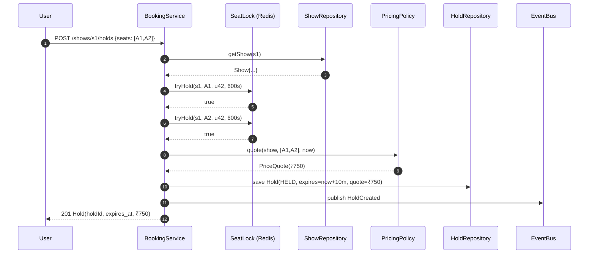
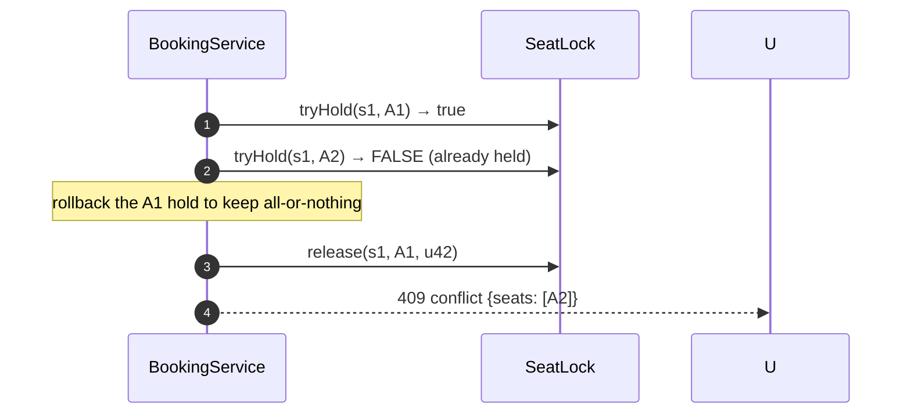
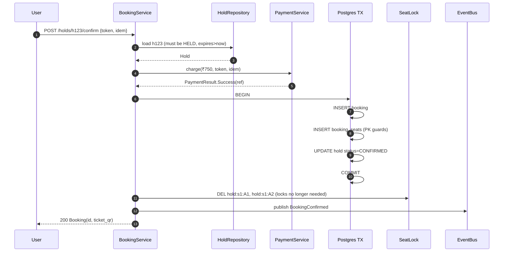
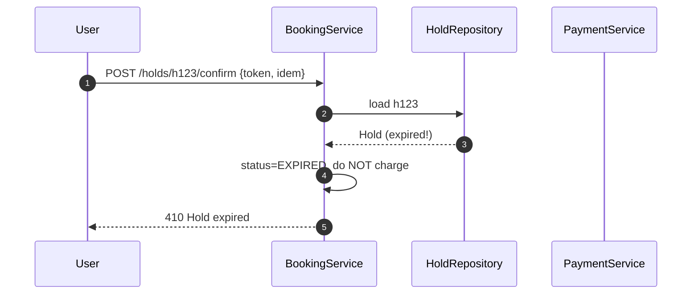
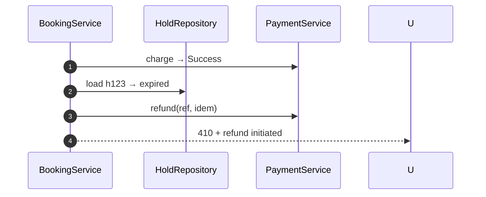
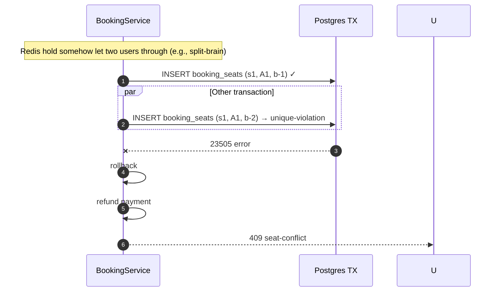
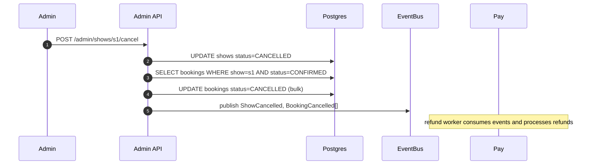

# 08 · BookMyShow — Sequence Diagrams

## 1. Hold flow (happy path)



## 2. Hold conflict (one of the seats taken)



## 3. Confirm (happy path)



## 4. Hold expires before payment lands



If we already charged the user before checking, refund:



The order in the implementation matters: **load + lock-check before charge**.

## 5. PK guard catches Redis miss



## 6. Show cancellation (admin)



## Output

```
Hold:        SETNX per seat with TTL; quote; persist Hold row
Confirm:     load → charge → Postgres TX (insert booking + seats + update hold) → DEL Redis → publish
Expired:     reject before charge; if charged, refund
Defense:     PK on (show, seat) catches any leak
Cancel:      bulk admin path; downstream consumers handle refunds
```
