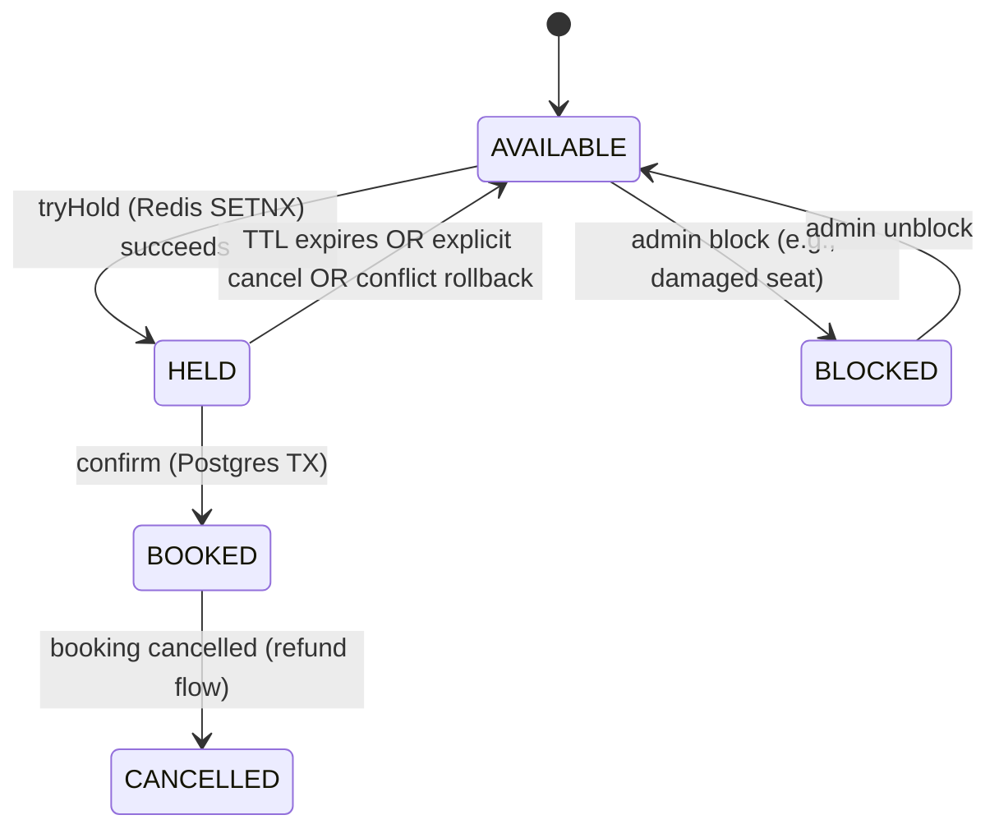
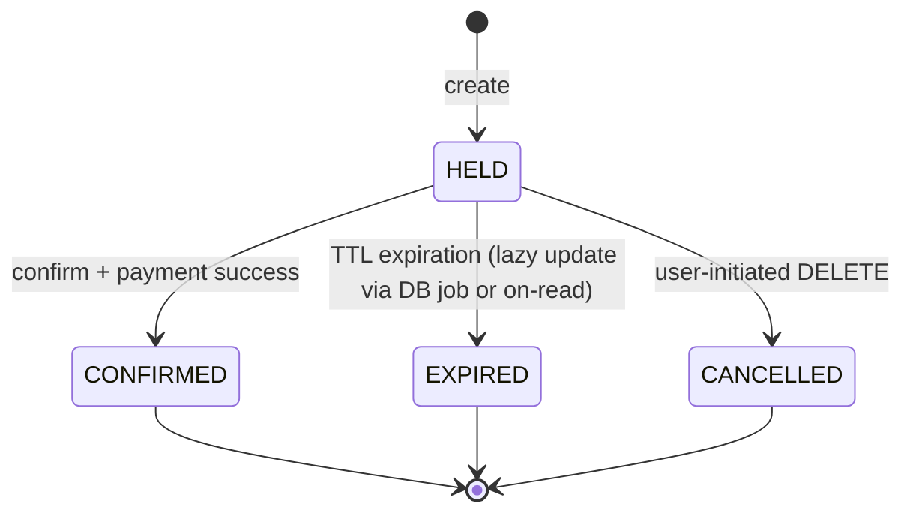
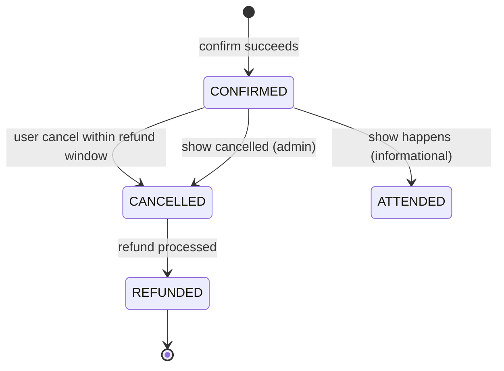
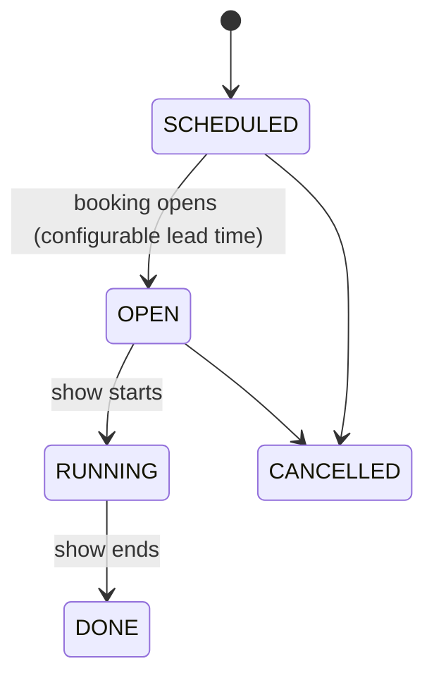

# 09 · BookMyShow — State Machines

## Seat (per-show) state



`HELD` is **transient** — Redis owns the truth via TTL.
`BOOKED` is **durable** — Postgres + PK constraint owns the truth.

## Hold lifecycle



The `HELD → EXPIRED` transition has a subtle aspect: the Redis key auto-expires, but the row in the `holds` table needs status updates for analytics. We update on-read (when someone tries to confirm an expired hold) or via a low-priority sweeper.

## Booking lifecycle



## Show lifecycle (admin)



When a show transitions to `RUNNING`, no new bookings are accepted (server-side guard).

## Output

```
Seat:      AVAILABLE ↔ HELD → BOOKED (or back to AVAILABLE on TTL/cancel)
Hold:      HELD → CONFIRMED | EXPIRED | CANCELLED
Booking:   CONFIRMED → CANCELLED → REFUNDED
Show:      SCHEDULED → OPEN → RUNNING → DONE; CANCELLED at any pre-RUNNING state
```
