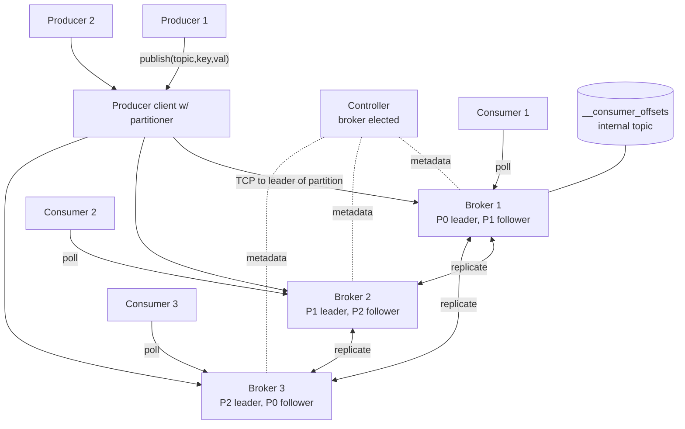
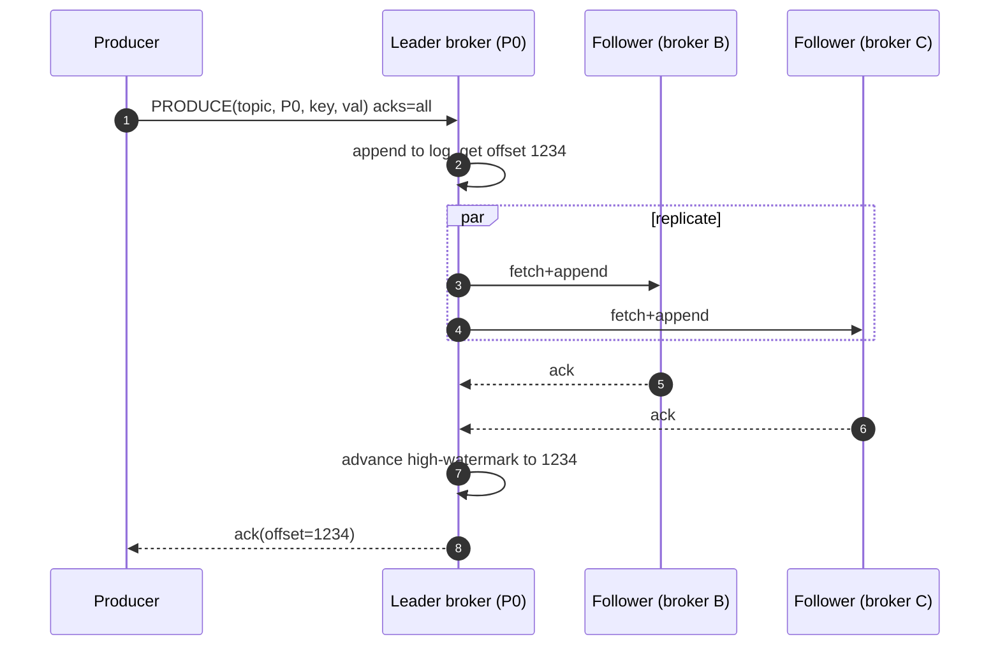
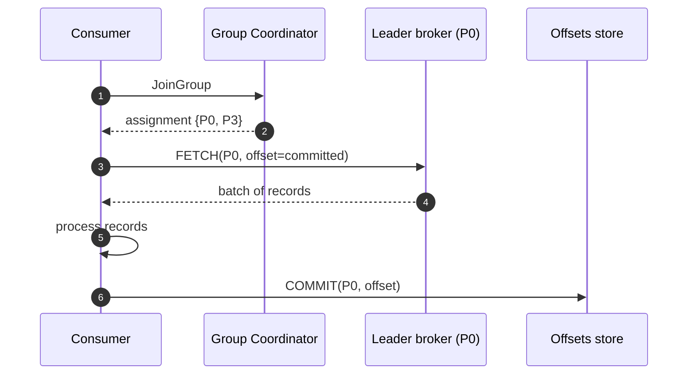

# 03 · Pub/Sub — High-Level Design

## Architecture



## Roles

| Role | Responsibility |
| --- | --- |
| **Producer client** | Resolves leader for partition; batches; compresses; sends; retries |
| **Broker** | Serves a set of partition leaders + followers; persists log; replicates |
| **Controller** | One broker elected as controller; manages metadata, leader elections, ISR changes |
| **Consumer client** | Subscribes to topic; gets assignment from group coordinator; polls; commits offset |
| **Group coordinator** | A broker per consumer group; tracks members; orchestrates rebalance |

## Storage layout (per partition)

```
/data/topics/orders/partition-0/
   ├── 00000000000000000000.log         (segment 1, oldest)
   ├── 00000000000000000000.index       (sparse: offset → byte pos)
   ├── 00000000000000000000.timeindex
   ├── 00000000000000523412.log         (segment 2, current writable)
   ├── 00000000000000523412.index
   └── 00000000000000523412.timeindex
```

- **Log segment** = file capped at e.g. 1 GB or 7 days.
- **Index** = sparse offset→byte-position map (every Nth message).
- **Append**: writes only to current segment; sequential IO.
- **Read**: binary search index → seek to byte → read forward.
- **Retention**: delete entire segments older than threshold.

## Hot paths

### Publish flow



### Consume flow



## Replication & ISR

- **ISR (in-sync replicas)** = followers caught up within `replica.lag.time.max.ms`.
- A message is **committed** when written to all ISR.
- The **high-watermark** is the highest committed offset; consumers can only read up to HW.
- If a follower falls behind, it's removed from ISR. If it catches up, it rejoins.
- Leader election: pick the next ISR member.

## Failure modes

| Failure | Handling |
| --- | --- |
| Leader broker dies | Controller picks new leader from ISR; producers retry |
| Follower lags | Removed from ISR; alert |
| All ISR die | Block writes (CP) OR allow unclean election (AP, data loss) |
| Controller dies | Brokers elect a new controller via Raft (KRaft) or ZK |
| Network split | Minority side becomes unavailable (CP) |

## Output

```
Cluster:    Producer client → Leader broker → Followers (replication)
                            ↓
                     append-only log (segmented)
                            ↓
                Consumer client (in group) ← Coordinator
Storage:    segmented files + sparse index per partition
Replication: leader-follower; ISR; HW; quorum-style commit
Failure:    controller-driven leader election; unclean election as escape hatch
```
