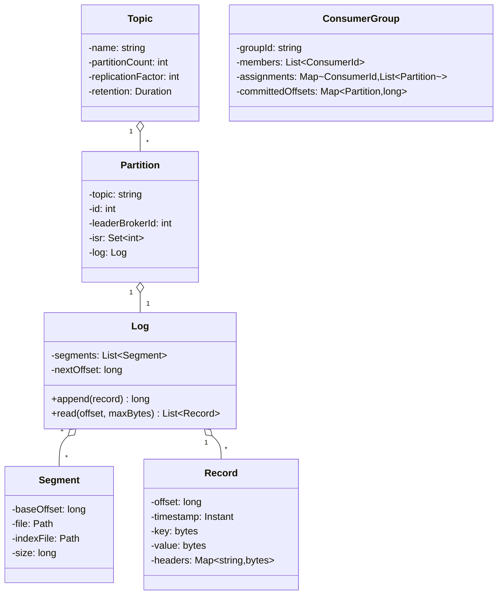

# 04 · Pub/Sub — Domain Model

## Core entities



## Aggregates

| Aggregate root | Why root |
| --- | --- |
| **Topic** | Configuration owner. Creates partitions. |
| **Partition (Log)** | Owns the append-only sequence. Single writer = leader broker. |
| **ConsumerGroup** | Owns membership and committed offsets for the group. |

## Value objects

| Type | Notes |
| --- | --- |
| `Record` | Immutable. `(offset, ts, key, value, headers)` |
| `OffsetAndMetadata` | Committed offset for a (group, partition) |
| `RecordBatch` | Group of records produced together; on the wire as one unit |

## Key concepts

### Append-only log
The fundamental data structure. New messages append at the end with a monotonically increasing offset. Old messages are immutable. This is **the** reason Kafka can hit 100 K msg/s — sequential disk IO is much faster than random.

### Partitions
A topic is divided into N partitions. Each partition is an independent log. Partition assignment for a record is determined by:
- Explicit `partition` field, OR
- Hash of `key` modulo N (preserves per-key ordering), OR
- Round-robin if key is null.

**Ordering guarantee**: only within a partition. Cross-partition order is not preserved.

### Offsets
Within a partition, every record has a unique long offset. The consumer remembers its position via committed offset. Crash and restart resumes from the committed offset.

### Consumer groups
Multiple consumers share a topic by joining a group. The group coordinator assigns partitions to consumers; each partition belongs to exactly one consumer at a time. This is how you scale consumption: more consumers (up to partition count) → more parallelism.

### Replication
Each partition has a leader and followers. Producers write only to leader. Followers replicate the log. ISR = followers caught up. A message is "committed" when all ISR have it. Consumers see only committed messages.

### High-watermark (HW)
The highest offset known to be replicated to all ISR. Consumers cannot read beyond HW. This prevents consumers from seeing data that might be lost if the leader dies before replication completed.

### Idempotent producer
Producer assigns a `(producer_id, sequence_number)` per partition. Broker tracks the last seen sequence number. If a producer retries the same record (duplicate ack lost), the broker detects and ignores it. This makes producer-side retries safe.

### Transactions (V2)
Producer can group writes across partitions in an atomic transaction. Combined with idempotency, gives **exactly-once semantics** for stream processing.

## Domain events

| Event | When |
| --- | --- |
| `TopicCreated` | Topic created |
| `PartitionLeaderChanged` | Leader election |
| `RecordsAppended(partition, offset, n)` | Records committed |
| `ConsumerJoined / Left` | Membership change |
| `RebalanceCompleted(group, assignments)` | After rebalance |
| `OffsetCommitted(group, partition, offset)` | Consumer commit |

## Output

```
Aggregates:    Topic, Partition (Log), ConsumerGroup
Value objects: Record, OffsetAndMetadata, RecordBatch
Key idea 1:    log = append-only + monotonic offset
Key idea 2:    partition = unit of parallelism, ordering, replication
Key idea 3:    HW = "safe to read"; ISR = "caught-up replicas"
Key idea 4:    consumer group = members split partitions exclusively
```
