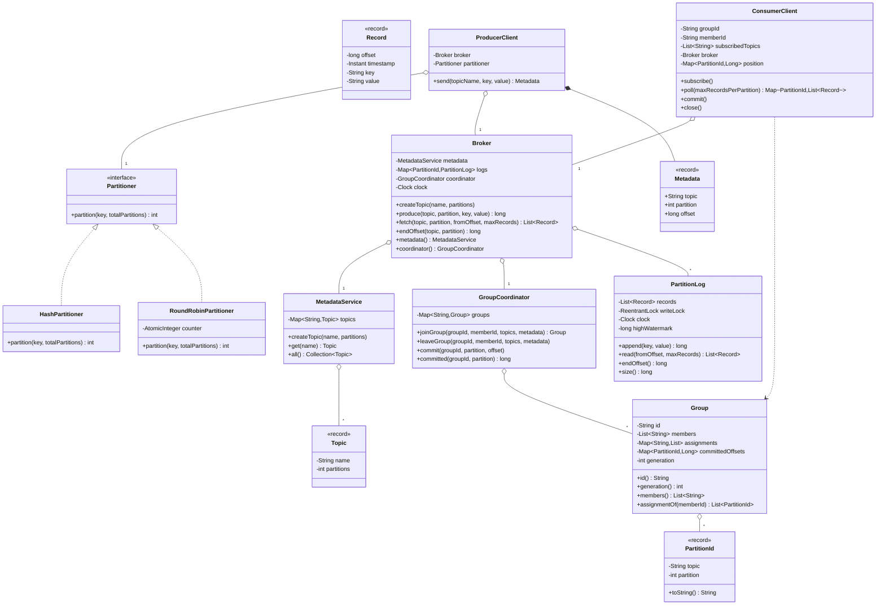
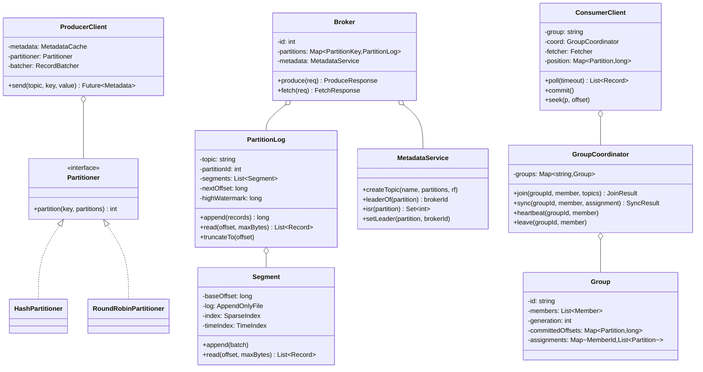

# 07 · Pub/Sub — Class Diagrams

## Aggregated class diagram

A single view of every class, interface, and enum in the system — fields and methods included. Source of truth: the Java skeleton under `12_machine_coding_skeleton/`.



---


## Core class diagram



## Package layout (`com.pubsub`)

```
domain/         Record, RecordBatch, Topic, Partition, Offset
broker/         Broker, PartitionLog, Segment, MetadataService
storage/        AppendOnlyFile, SparseIndex (or InMemoryLog for the skeleton)
consumer/       ConsumerClient, GroupCoordinator, Group
producer/       ProducerClient, Partitioner (Hash/RoundRobin), RecordBatcher
```

## Why these abstractions

### `Partitioner` as a Strategy
Producer needs pluggable partition assignment. Hash for keyed messages; round-robin for null keys; custom (geo-aware, sticky) for advanced cases. Strategy pattern is a perfect fit.

### `PartitionLog` separated from `Broker`
A broker hosts many partitions. Each `PartitionLog` is a **single-writer** structure (the leader). Locking and concurrency are per-partition, not per-broker. This is the key to Kafka's parallelism: separate locks per partition.

### `Segment` as a unit
Retention deletes whole segments. Replication ships whole segments efficiently. Compaction merges segments. Many policies operate at segment granularity, so it's its own class.

### `GroupCoordinator` as a separate abstraction
Coordination logic (join, sync, heartbeat, rebalance) is complex enough to deserve its own class, separate from the broker's storage logic. In real Kafka, the coordinator runs as a special broker role.

### `MetadataService` as an interface
Real Kafka uses KRaft (Raft-backed) for metadata. We abstract it so our skeleton can use an in-memory implementation; production swaps in KRaft.

## Output

```
Strategy:    Partitioner (hash, round-robin, custom)
Aggregate:   PartitionLog (single-writer; sequenced appends; replicated)
Component:   Segment (atomic unit for retention / replication / compaction)
Service:     GroupCoordinator (join/sync/heartbeat)
Service:     MetadataService (Raft-backed in production)
Layered:     Broker → PartitionLog → Segment
```
