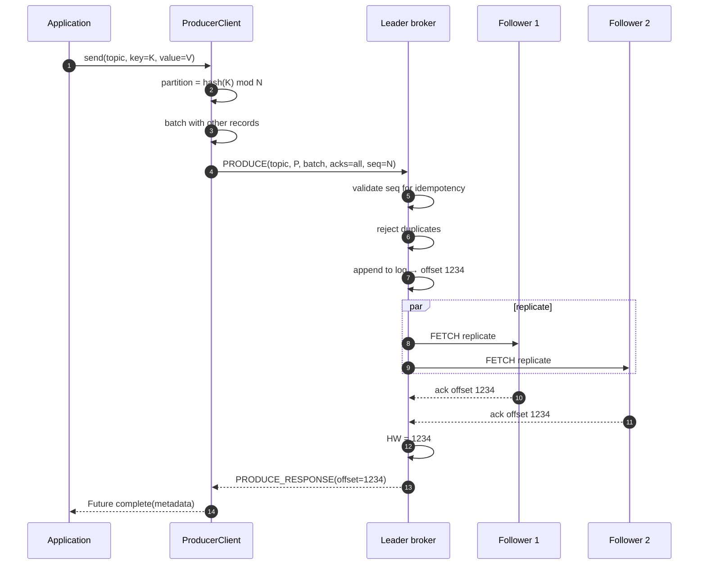
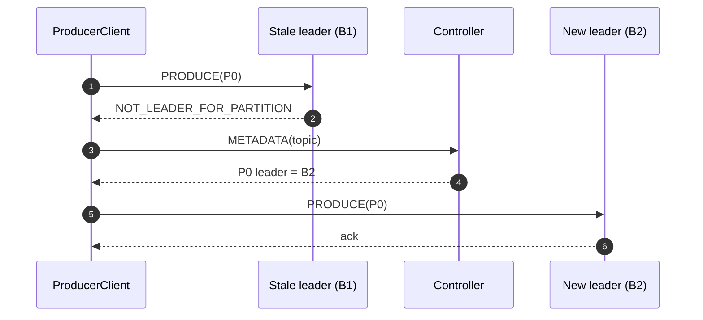
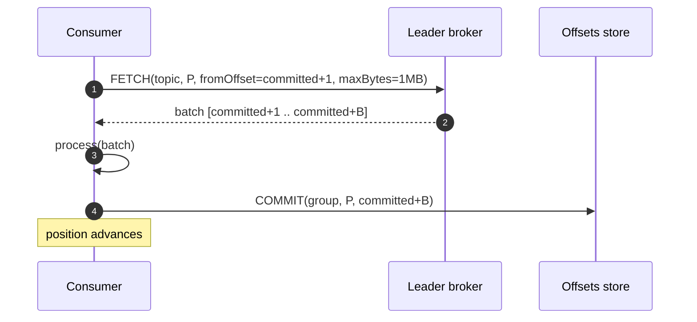
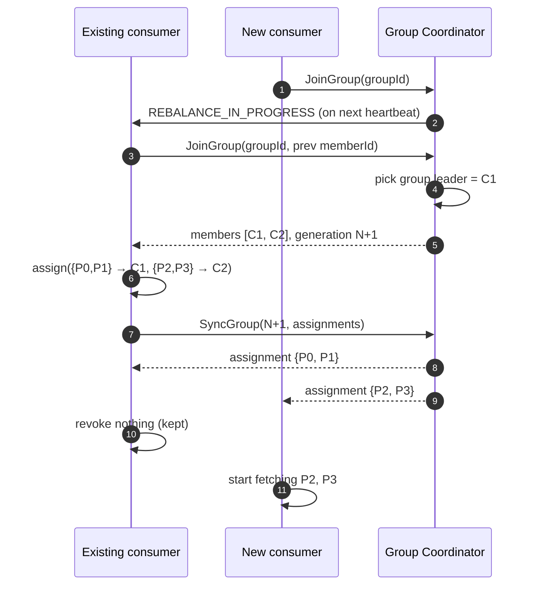
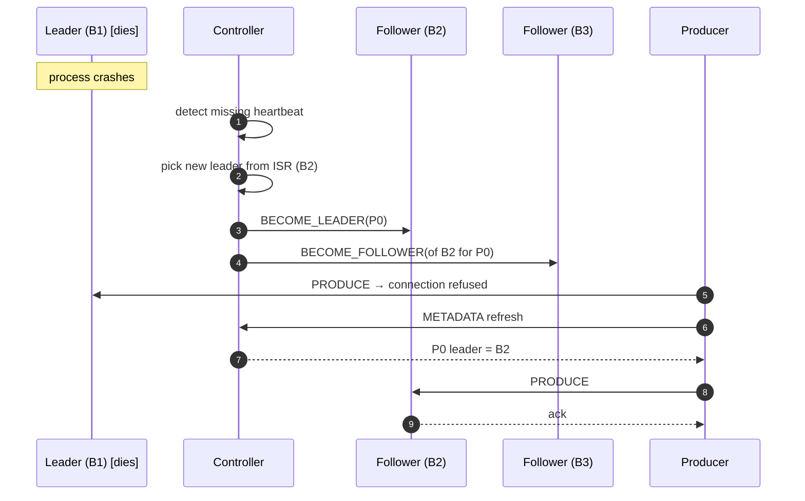
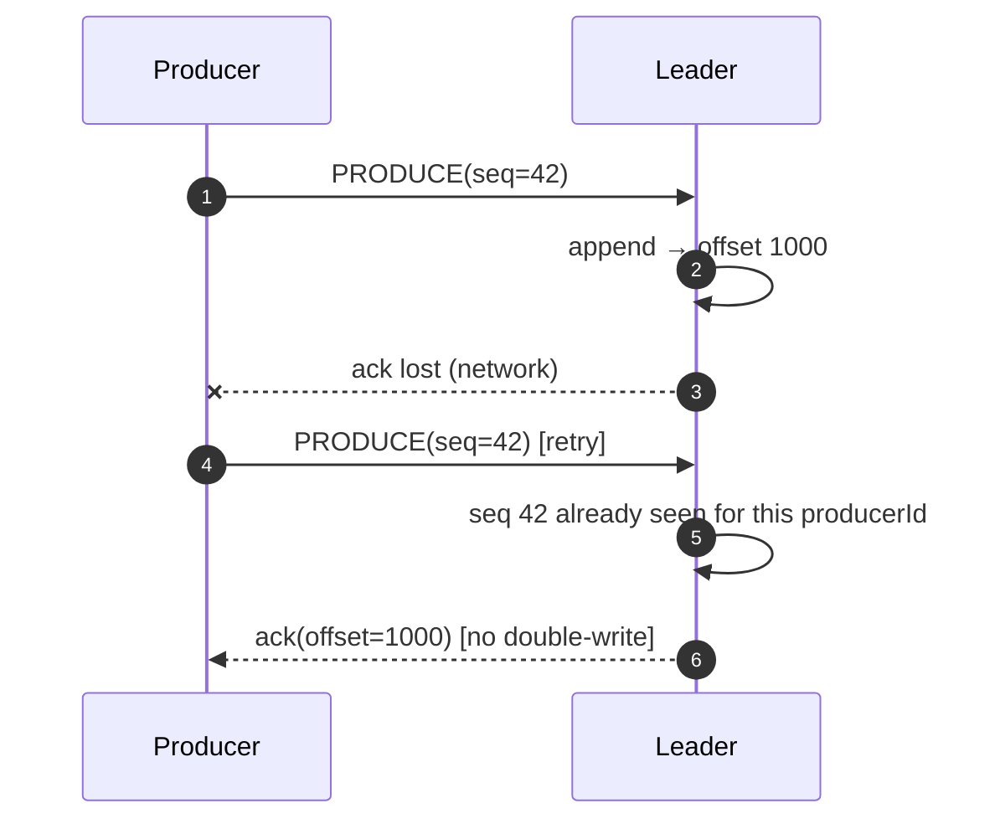

# 08 · Pub/Sub — Sequence Diagrams

## 1. Produce flow (acks=all)



## 2. Producer leader-not-found (metadata refresh)



## 3. Consumer poll (steady state)



## 4. Consumer rebalance on member join



## 5. Leader failover



## 6. Idempotent retry (duplicate produce)



## Output

```
Produce:   batch → leader → replicate to ISR → HW advance → ack
Consume:   poll batch → process → commit offset
Rebalance: JoinGroup → SyncGroup; cooperative (sticky) keeps assignments stable
Failover: controller-driven; producer retries with metadata refresh
Idempot.: producerId + sequence dedup at broker
```
