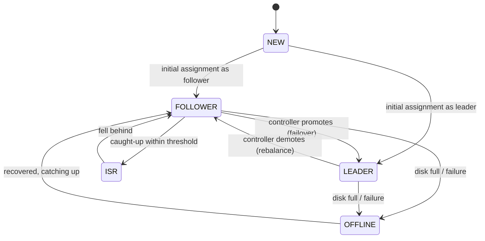
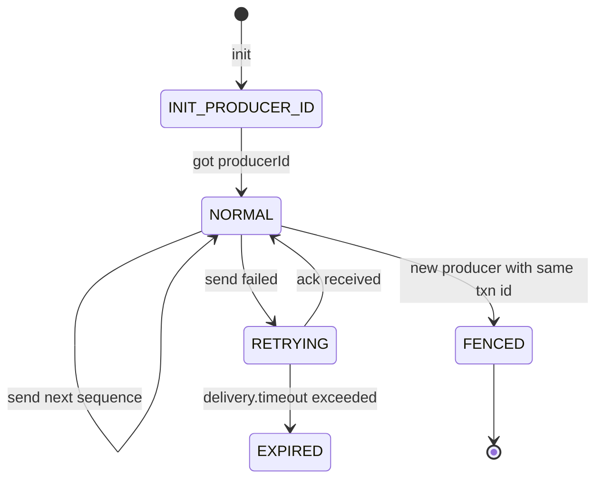
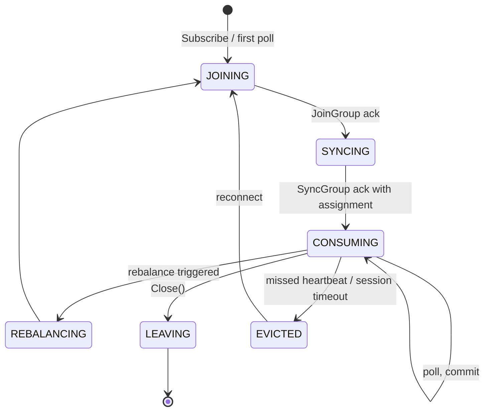
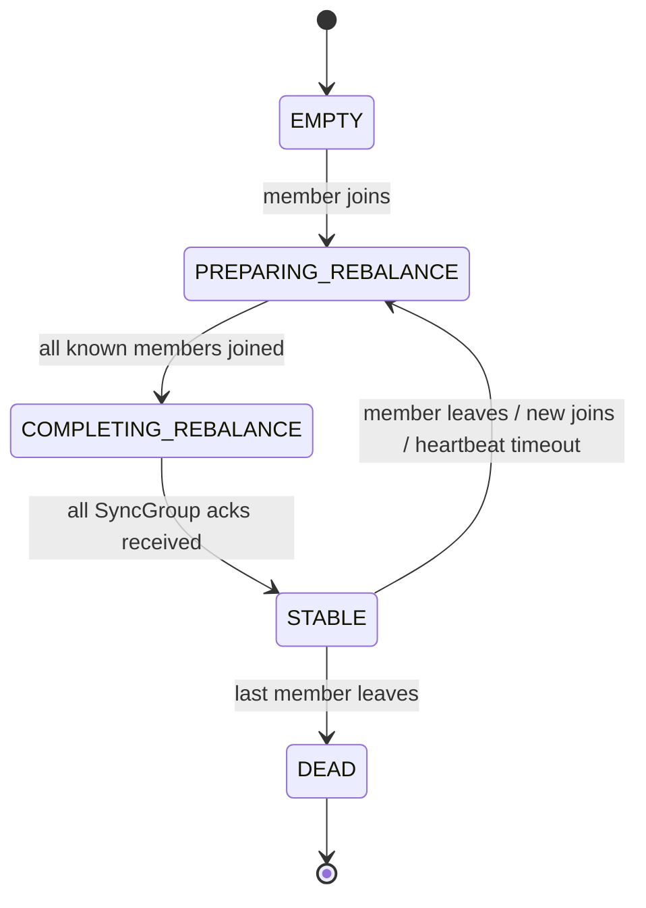
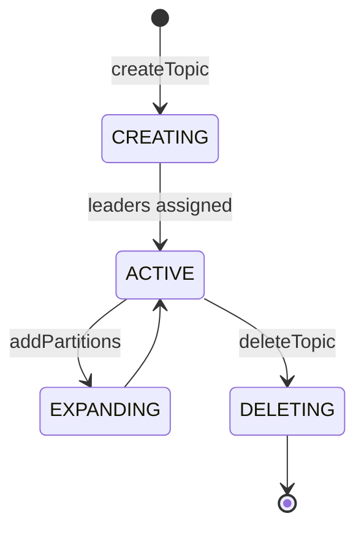
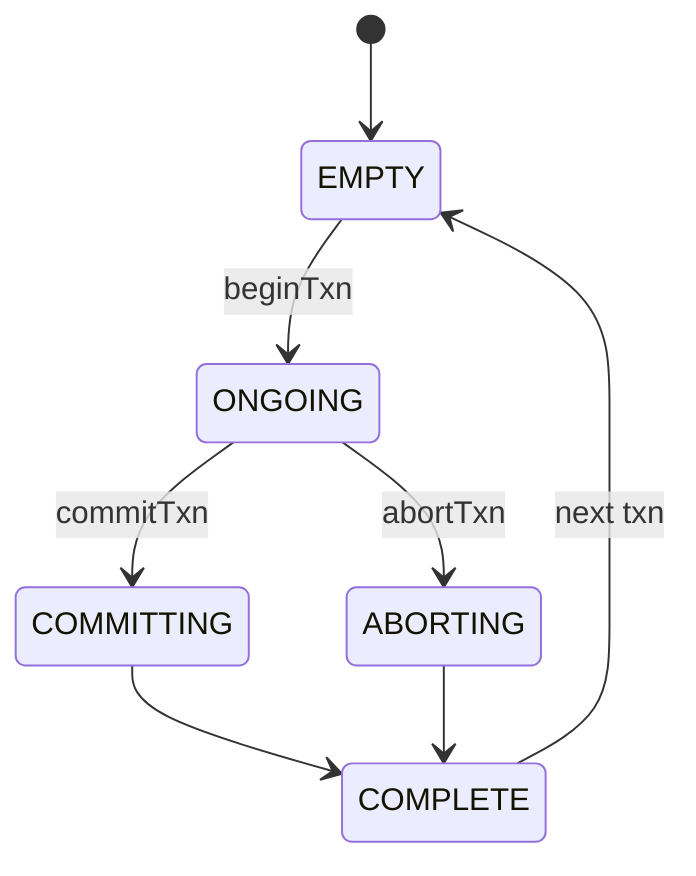

# 09 · Pub/Sub — State Machines

## Partition replica state (per broker holding it)



`ISR` is a substate of `FOLLOWER` that means "caught up enough to acknowledge writes."

## Producer (idempotent) state per partition



## Consumer state in a group



## Group state (coordinator's view)



## Topic / partition lifecycle (admin)



Note: adding partitions changes the partitioner output for new keys but **does not rebalance existing data**. Old keys may now go to a different partition. This is a known caveat.

## Transaction state (V2)



## Output

```
Replica:   FOLLOWER ↔ ISR; FOLLOWER ↔ LEADER on failover; OFFLINE on failure
Producer:  INIT → NORMAL → RETRY → fenced/expired
Consumer:  JOIN → SYNC → CONSUME → REBALANCE on changes
Group:     EMPTY → PREPARING → COMPLETING → STABLE
Topic:     CREATING → ACTIVE → DELETING
```
