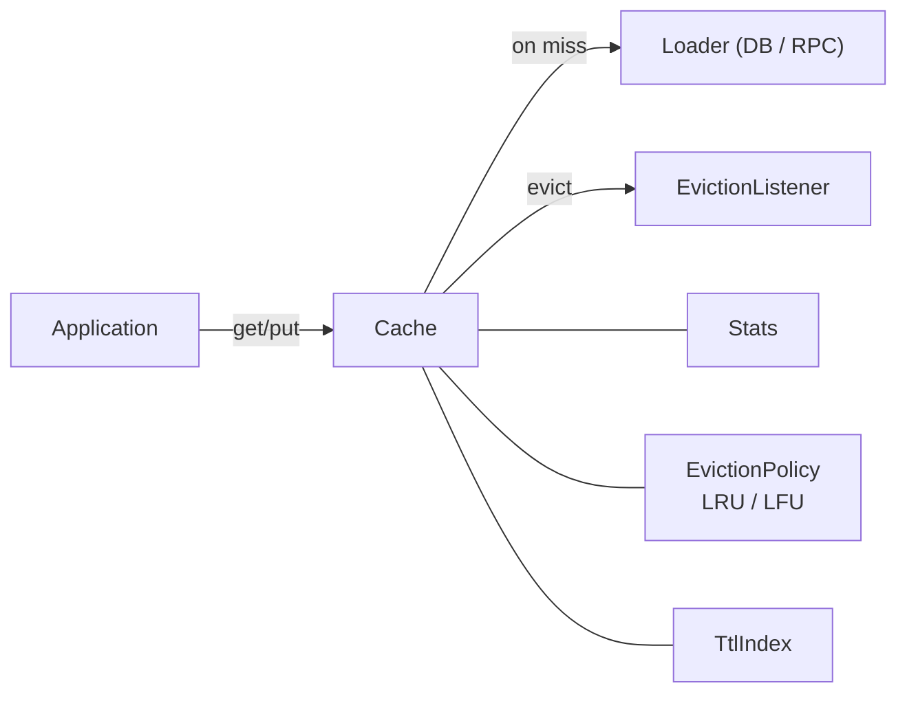
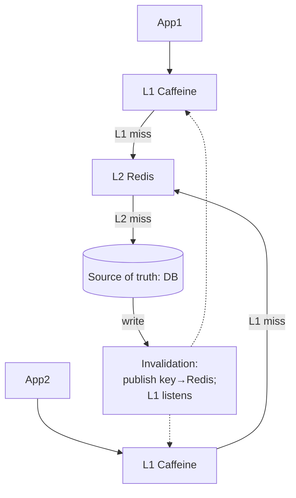
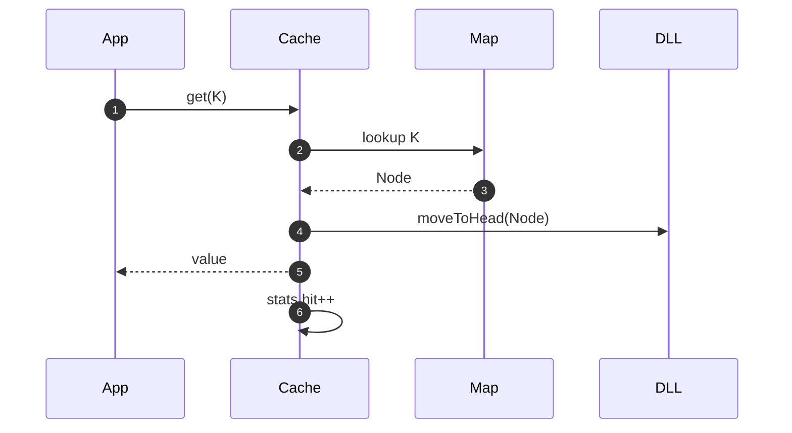
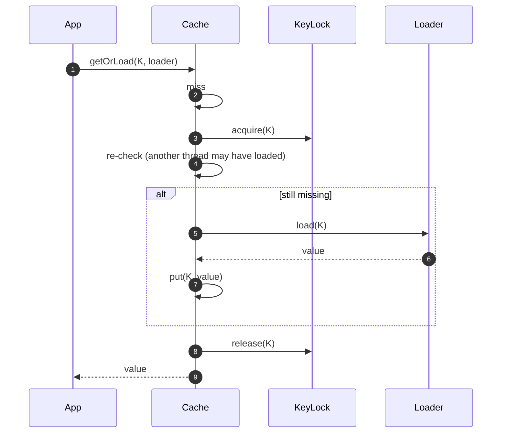
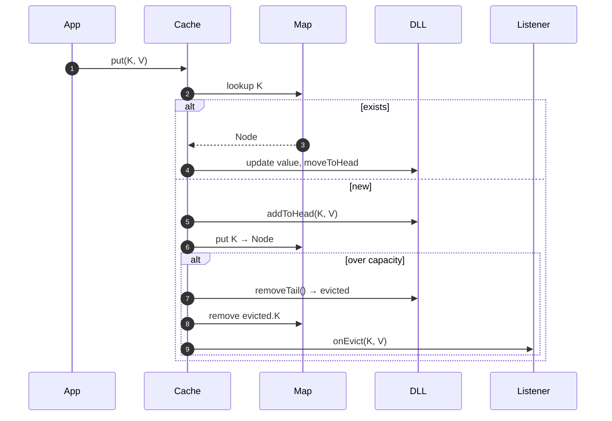

# 03 · LRU Cache — High-Level Design

## In-process cache



## Distributed cache hierarchy



L1 (in-process) is the fastest layer: <1 µs hits.
L2 (Redis) is shared, cross-process: ~100 µs hits.
DB is the truth: 1–10 ms.

A miss at L1 falls to L2; miss at L2 falls to DB; the value is populated up the chain.

## Cache types

| Type | Use case |
| --- | --- |
| Local (in-process) | Hot path, no cross-process consistency required |
| Distributed (Redis) | Cross-app coherency, large capacity |
| Hierarchical (L1 + L2) | Best of both: speed + coherency |

## Internal structure (in-process LRU)

```
+--------------------------+
| HashMap<K, Node>         |
|   K1 → ●─────────┐       |
|   K2 → ●─────┐   |       |
|   K3 → ●─┐   |   |       |
+----------|---|---|-------+
           |   |   |
   tail ←  ●─→ ● ←→ ● ←→ ● → head
   (LRU)               (MRU)
```

- Map points to nodes in the doubly linked list.
- `get`: lookup in map (O(1)); move node to head (O(1) via prev/next pointers).
- `put`: insert or update; move to head; if size > capacity, evict tail.

## Hot operations

### get(key) hit



### get(key) miss with loader



The "re-check after acquiring lock" pattern (double-checked locking on lookup) avoids redundant loads.

### put(key, value)



## Failure modes

| Failure | Mitigation |
| --- | --- |
| Loader throws | Propagate; don't cache exception (or cache briefly: "negative TTL") |
| Listener throws | Catch and log; don't break cache state |
| OOM during put | Trigger emergency eviction; reduce capacity dynamically |
| Concurrent eviction during read | Atomic via stripe lock or CAS |
| Distributed L2 down | Fall through to DB; degrade gracefully |

## Output

```
Layout:    HashMap<K, Node> + DoublyLinkedList for LRU order
Hierarchy: L1 in-process + L2 Redis + DB; populate up on miss
Get:       lookup + moveToHead, O(1)
Put:       insert/update + moveToHead + evict-if-over-cap, O(1)
Loader:    single-flight (per-key lock + double-check)
```
