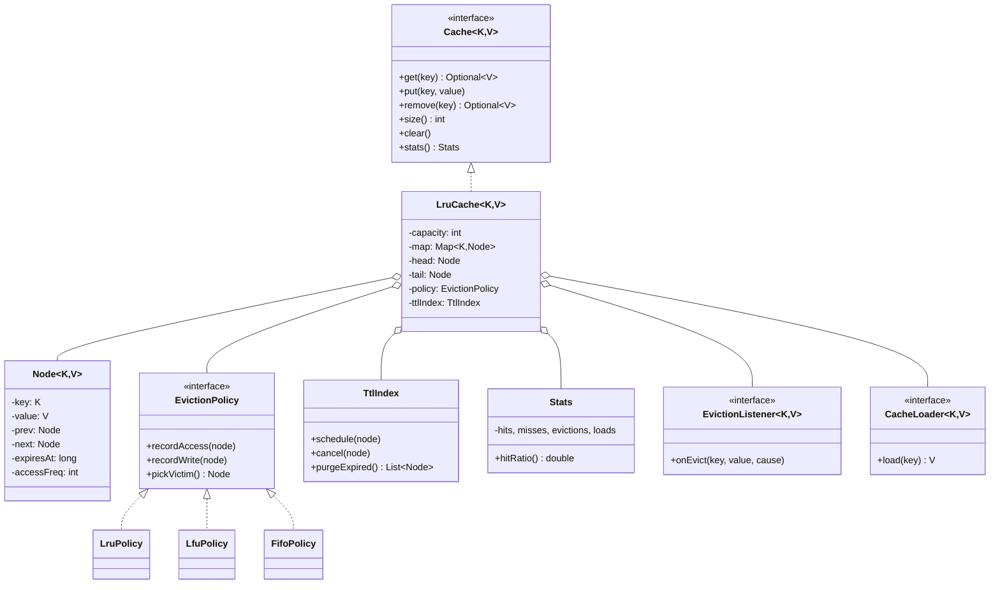

# 04 · LRU Cache — Domain Model

## Core entities



## Key concepts

### Why HashMap + Doubly Linked List?
- HashMap: O(1) lookup by key.
- Doubly linked list: O(1) move-to-head or remove-tail given a node reference.

The HashMap stores `(key → Node)`; the Node has prev/next pointers and the value. With both, `get` becomes:
1. `Node n = map.get(key)` — O(1)
2. `n.unlink(); insertAtHead(n)` — O(1)

A singly linked list would force O(N) to find the previous node. A list alone (no map) would force O(N) to find the key. Both are required.

### Why move on `get`?
LRU = least-recently-used. A successful `get` makes that key the most recently used. We move it to the head. The tail thus drifts toward "least used" naturally.

### Why evict tail?
The tail is the least-recently-used by construction. When over capacity, evict the tail.

### Eviction policy as Strategy
LRU is one of many policies. Make `EvictionPolicy` an interface so we can plug in:
- **LRU**: discussed.
- **LFU**: counts accesses; least-frequent first. Requires a frequency counter and possibly a min-heap or buckets-of-DLLs.
- **FIFO**: order of insertion; never reorders on access.
- **MRU**: most-recently-used (rare; useful for streaming).
- **ARC** (Adaptive Replacement Cache): adapts between LRU and LFU.
- **W-TinyLFU**: window LRU + frequency sketch + main SLRU. Used in Caffeine; outperforms LRU significantly.

### TTL
Two flavors:
1. **Lazy**: on `get`, check `expiresAt < now`; if expired, evict and return miss.
2. **Proactive**: a sweeper thread periodically scans and removes expired entries.

Lazy is sufficient for most workloads; proactive only if expired entries occupy meaningful memory.

### Loader (cache-aside vs read-through)
- **Cache-aside** (caller does it): `get` returns miss; caller queries DB; caller `put`s the value.
- **Read-through**: cache itself owns the loader; `getOrLoad` populates internally.

Read-through with single-flight (per-key lock) is the production pattern.

### Single-flight (loader stampede protection)
On a miss, we want only **one** thread to call the loader for a given key. Other threads wait, then read the populated value.

```
synchronized (perKeyLock(K)) {
    re-check map; if value present, return it
    value = loader.load(K)
    put(K, value)
    return value
}
```

Per-key lock can be implemented with `ConcurrentHashMap<K, Object>` of lock objects, or with `ConcurrentHashMap.compute(K, mappingFn)` itself.

### Eviction listener
Called when an entry is removed (LRU evict, TTL expire, explicit remove). Useful for write-back caches that need to flush dirty entries.

Run **asynchronously** if the listener can be slow — never block the cache write path.

### Stats
Hits, misses, evictions, loads, load-failure count, total load time. Used to compute hit ratio, average load latency. Counter atomicity matters; use `LongAdder`.

## Domain events

| Event | When |
| --- | --- |
| `EntryAdded` | New key inserted |
| `EntryUpdated` | Existing key's value replaced |
| `EntryEvicted(cause)` | Removed; cause = SIZE / EXPIRED / EXPLICIT |
| `LoadStarted/LoadCompleted` | Loader invocations |
| `Cleared` | Whole cache flushed |

## Output

```
Aggregate: Cache (composes Map + DLL)
Strategy:  EvictionPolicy (LRU / LFU / FIFO / ARC / W-TinyLFU)
Service:   TtlIndex; lazy or proactive expiry
Service:   CacheLoader with single-flight
Service:   EvictionListener (async)
```
