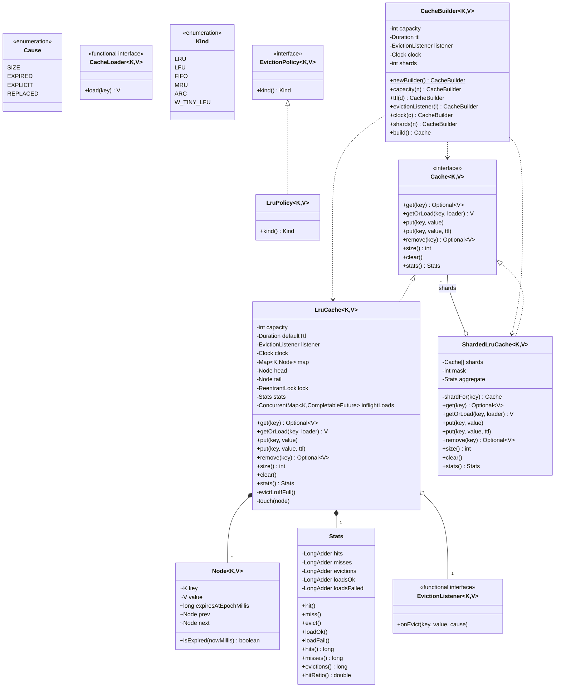
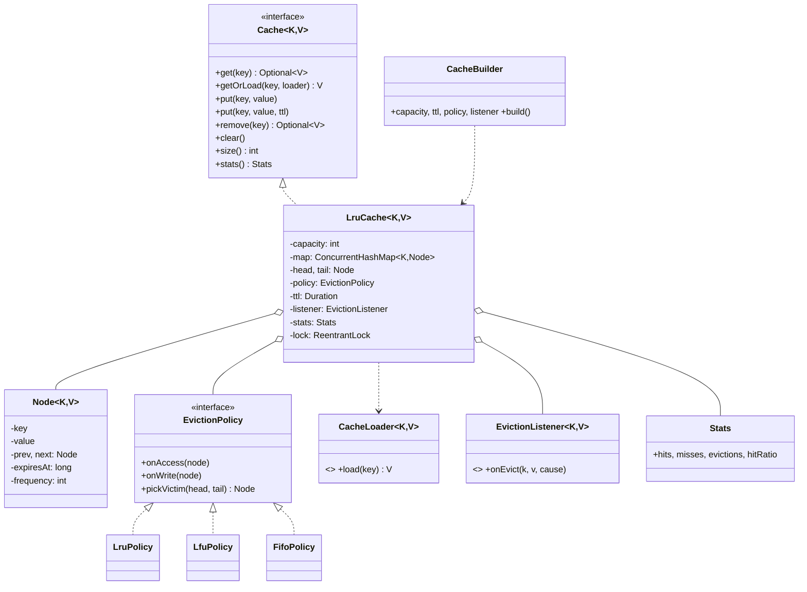
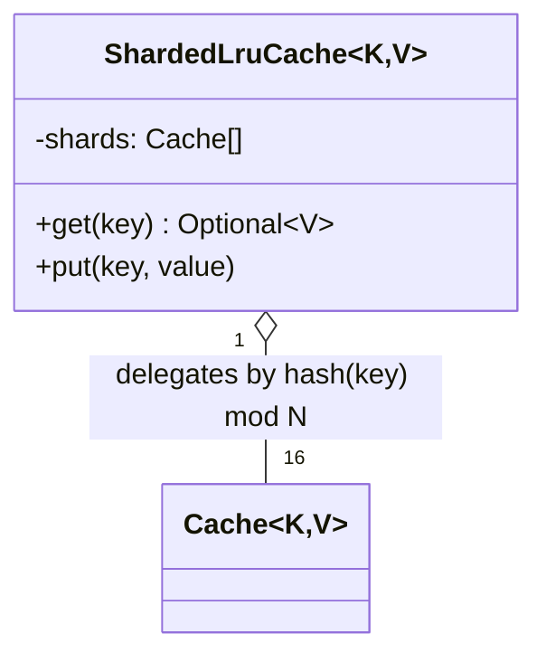
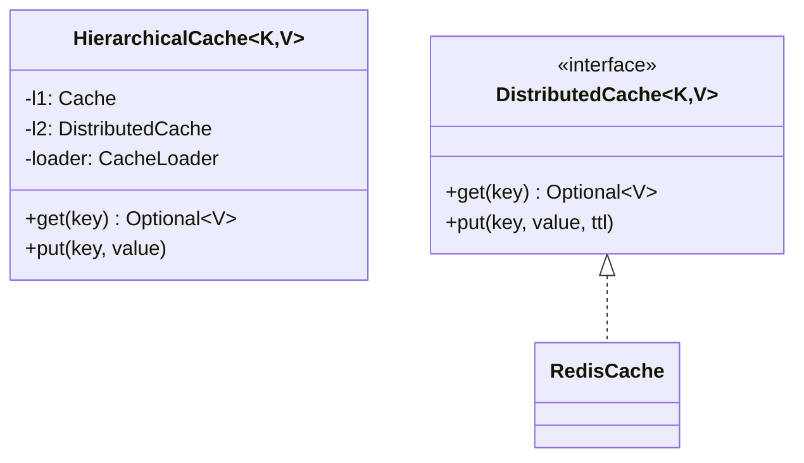

# 07 · LRU Cache — Class Diagrams

## Aggregated class diagram

A single view of every class, interface, and enum in the system — fields and methods included. Source of truth: the Java skeleton under `12_machine_coding_skeleton/`.



---


## Core class diagram



## Sharded cache (production-grade)



Each shard is a self-contained LRU with its own lock. Distinct keys → distinct shards → no contention.

## L1 + L2 hierarchy



## Package layout (`com.lru`)

```
cache/         Cache, LruCache, Node, CacheBuilder, ShardedLruCache, HierarchicalCache, Stats
policy/        EvictionPolicy, LruPolicy, LfuPolicy, FifoPolicy
store/         CacheLoader, EvictionListener
distributed/   DistributedCache, RedisCache (stub)
```

## Why these abstractions

### Cache as an interface
Lets users program against the contract. Tests can use a no-op cache. Wrappers (instrumented cache, sharded cache, hierarchical cache) implement the same interface.

### EvictionPolicy as Strategy
The LRU/LFU split runs deep — different data structures internally. Hiding it behind one method (`pickVictim`) lets the cache class stay simple while supporting any policy.

### CacheLoader as a functional interface
Caller supplies behavior at call site. Encourages closure-based loaders.

### EvictionListener as a functional interface
Same story; runs callbacks without coupling.

### Sharding as composition
A `ShardedLruCache` *contains* N `LruCache` instances and dispatches by hash. The DLL inside each shard is small (capacity / N), so eviction is efficient and locks are short.

### Hierarchical as composition
An `HierarchicalCache` composes an L1 + L2. Reads cascade. Writes propagate. Misses populate up.

## Output

```
Library hierarchy:
  Cache (interface)
    ↳ LruCache (basic)
    ↳ ShardedLruCache (concurrency)
    ↳ HierarchicalCache (L1 + L2)
Strategy:        EvictionPolicy
Functional:      CacheLoader, EvictionListener
Builder:         CacheBuilder for rich config
```
