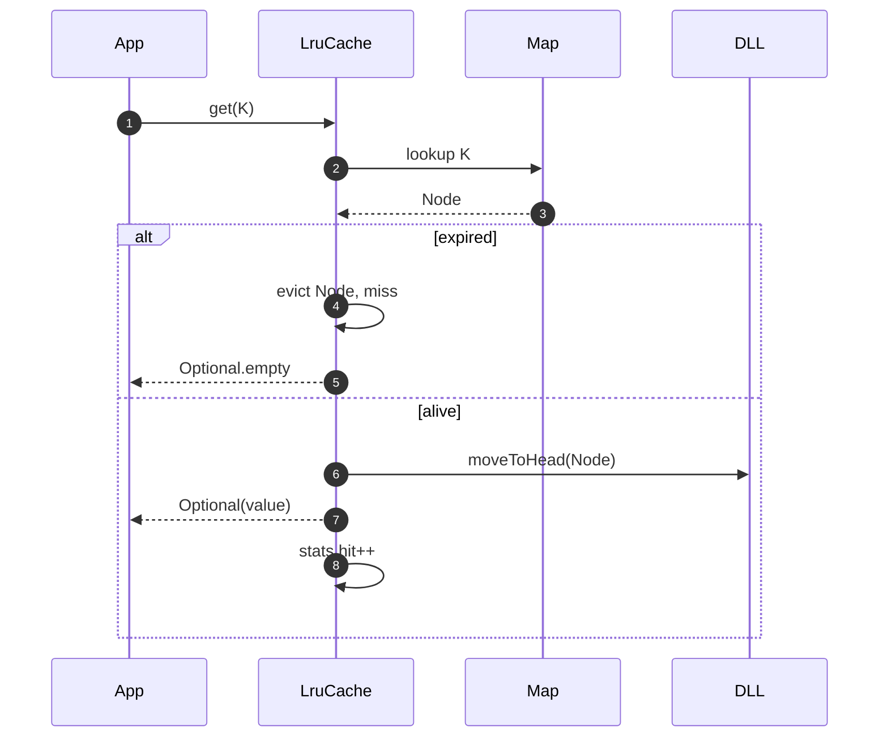
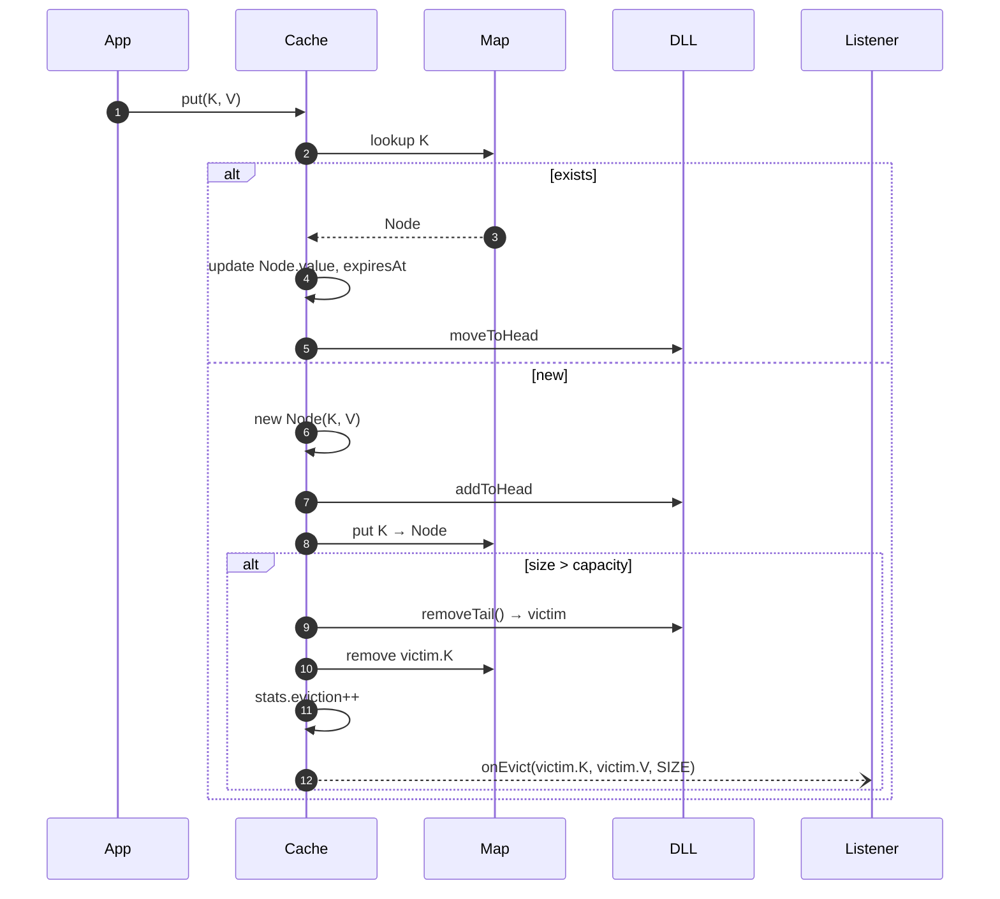
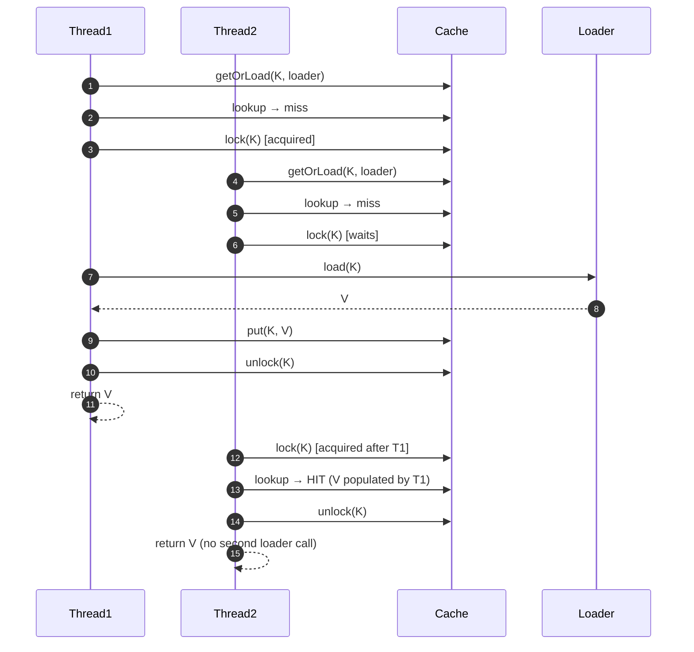
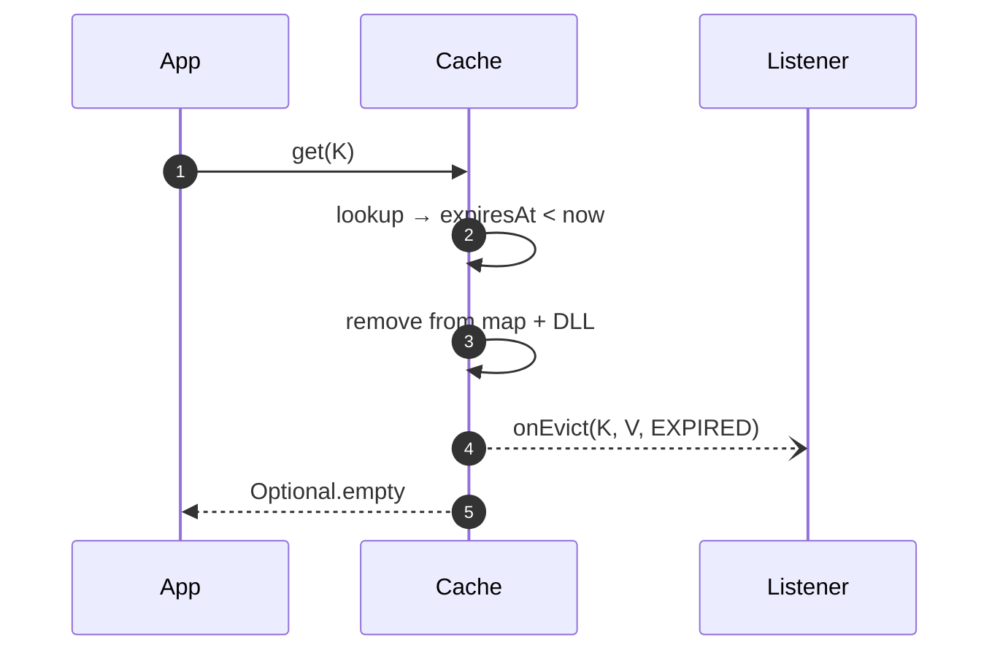
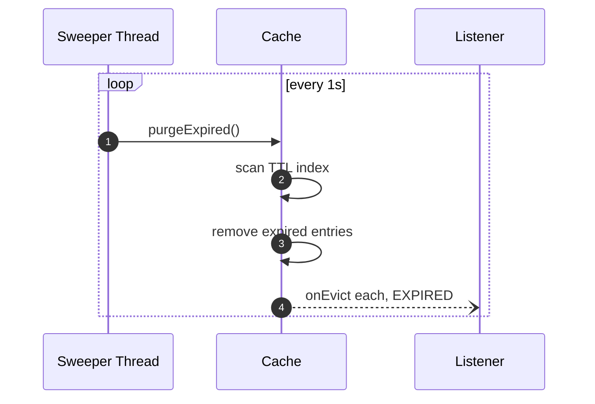
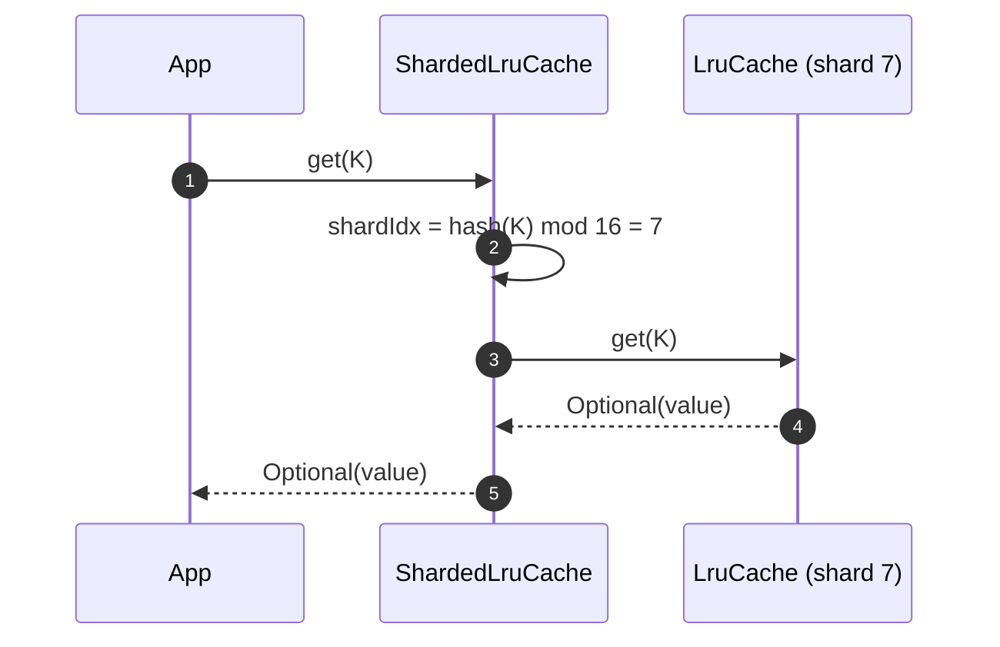
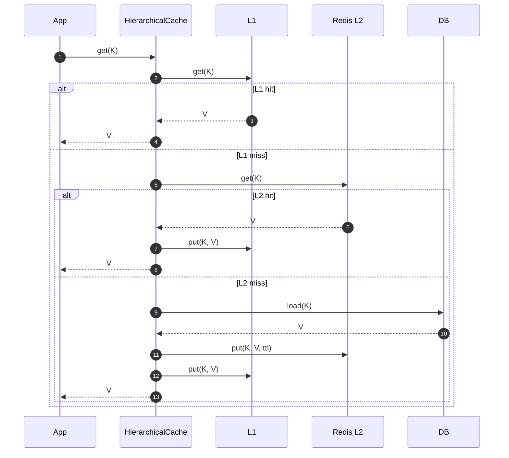
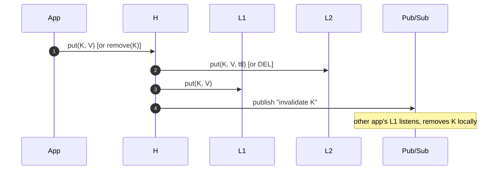

# 08 · LRU Cache — Sequence Diagrams

## 1. get(key) — hit path (single-threaded view)



## 2. put(key, value)



## 3. getOrLoad — miss + single-flight



## 4. TTL eviction (lazy)



## 5. TTL eviction (proactive sweeper)



## 6. ShardedLruCache — get path



## 7. Hierarchical L1 + L2 — get path



## 8. Hierarchical write — propagate invalidation



## Output

```
Get hit:        lookup → moveToHead, O(1)
Put new:        addToHead → if over-cap, removeTail + listener
getOrLoad:      double-checked locking; only one loader runs
TTL:            lazy on-read; proactive sweeper for memory pressure
Sharded:        hash-route to inner cache; per-shard locks
Hierarchical:   L1 → L2 → DB; populate up; invalidate down via Pub/Sub
```
