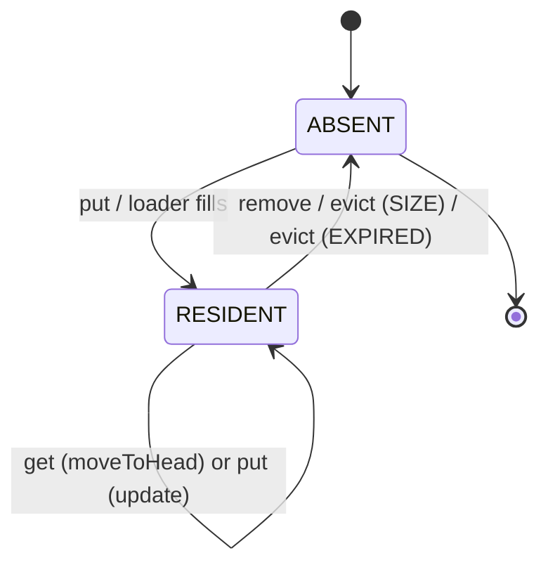
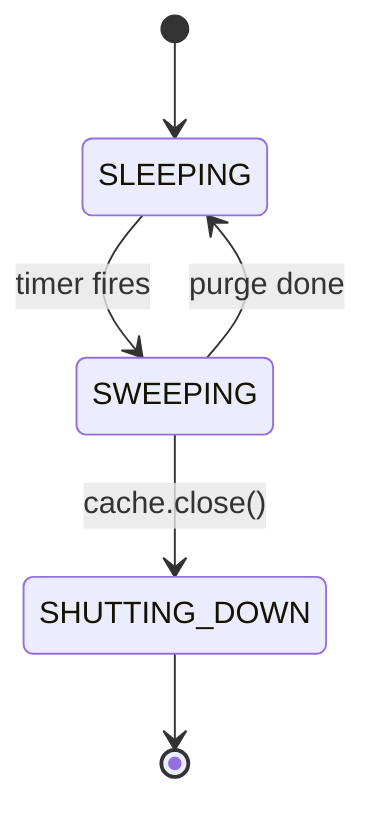
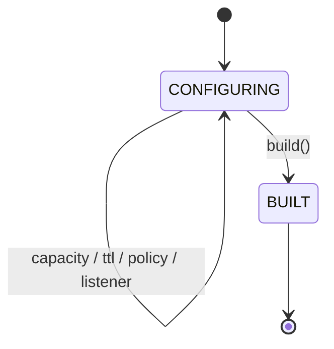

# 09 · LRU Cache — State Machines

## Entry lifecycle



States are deliberately simple; the cache is a high-throughput data plane.

## Loader state per key (single-flight)

```mermaid
stateDiagram-v2
    [*] --> IDLE
    IDLE --> LOADING : first thread begins loader
    LOADING --> IDLE : loader completes; value cached
    LOADING --> FAILED : loader throws
    FAILED --> IDLE : caller observes; lock released
```



In practice the "lock" is an entry in a `ConcurrentHashMap<K, Object>` or a `compute()` lambda; the FSM is implicit.

## TTL sweeper state



## Cache builder state



## Stats counters (informational, not really FSM)

```
hits, misses (LongAdder-backed)
evictions per cause: SIZE, EXPIRED, EXPLICIT, REPLACED
loadsSuccessful, loadsFailed
totalLoadTimeNs (for averages)
```

## Output

```
Entry:   ABSENT ↔ RESIDENT (move/update on get/put; evict on size/expired/explicit)
Loader:  IDLE → LOADING → IDLE | FAILED (single-flight invariant)
Sweeper: SLEEPING ↔ SWEEPING; SHUTTING_DOWN on close
```
