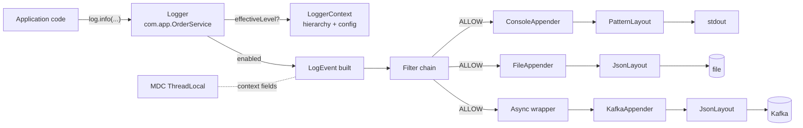

# 03 · Logger Framework — High-Level Design

## Architecture



## Roles

| Role | Responsibility |
| --- | --- |
| **Logger** | Front-end: cheap level check, build `LogEvent` if enabled, hand off to appenders |
| **LoggerContext** | Owns the hierarchy + configuration; gives each logger its effective level/appenders |
| **LogEvent** | Immutable record: timestamp, level, name, thread, MDC snapshot, message, args, throwable |
| **Filter** | Allow / deny / neutral on a `LogEvent` |
| **Appender** | Sink: takes a `LogEvent`, writes it via a `Layout` |
| **Layout** | Formats `LogEvent` → bytes / string |
| **MDC** | Per-thread context map (key → value strings) |

## The hot path (sync)

```
log.info("user={} order={}", userId, orderId)
   │
   1. is INFO enabled? (compare cached effective level)
   │     no  → return immediately (5ns)
   │     yes ↓
   2. build LogEvent (timestamp, snapshot MDC)
   3. for each appender (walking up the hierarchy if additive):
        run filter chain
        if ALLOW: appender.append(evt)
                    layout.format(evt) → bytes
                    write to sink (file / console / queue)
```

## The hot path (async)

```
log.info(...)
   │
   level check
   build LogEvent
   asyncAppender.append(evt)
        ↓
   ringBuffer.publish(evt)   ← caller returns
        ↓
   (background drain thread)
        ringBuffer.consume() in batch
          for each evt:
            for each underlying appender:
              filter / layout / write
```

The caller pays nanoseconds. The drain thread amortizes I/O across the batch.

## Hierarchy

```
                root (level=INFO)
                  │
            com.app (level=DEBUG)
            /              \
   com.app.dao          com.app.web
   (level=DEBUG)        (level=INFO)  ← inherited from root
```

Effective level resolution:
1. If logger has explicit level, use it.
2. Else walk up parent chain until you hit one.
3. Falls back to root's level.

Cached at the logger level; invalidated on config change.

## Failure modes

| Failure | Mitigation |
| --- | --- |
| Disk full | Appender catches IOException, logs to internal status logger, continues |
| Async queue full | Configured: BLOCK (lossless, slows app) or DROP (lossy, fast) |
| Layout bug throws | Caught; replaced with safe error string; status log |
| Recursive log (appender that triggers a log) | Detect via thread-local guard; break recursion |
| Config reload mid-event | Old config used for events already in flight; new config for events after |
| JVM crash | Shutdown hook drains async queue best-effort |

## Configuration model

```yaml
loggers:
  root:        { level: INFO,  appenders: [console] }
  com.app:     { level: DEBUG, appenders: [file] }      # additive: also writes to root's console
  com.app.web: { level: WARN,  additive: false, appenders: [warnFile] }

appenders:
  console:  { type: ConsoleAppender, layout: { type: pattern, pattern: "%d %-5p [%t] %c - %m%n" } }
  file:     { type: FileAppender,    file: "/var/log/app.log", layout: { type: json } }
  warnFile: { type: AsyncAppender, queueSize: 8192, dropOnFull: false,
              wrapped: { type: FileAppender, file: "/var/log/warn.log", layout: { type: pattern, pattern: "%d %-5p %c - %m%n" } } }
```

## Output

```
Front:    Logger (level check + LogEvent build, very cheap if level disabled)
Middle:   Hierarchy + Filter chain + Appender list (additive walk to root)
Sink:     Appender + Layout (Console / File / Async / Network)
Hot:      Disabled call ~5ns; sync enabled ~1µs; async enqueue ~100ns
Failure:  Internal status logger; queue overflow policy; recursive guard
```
