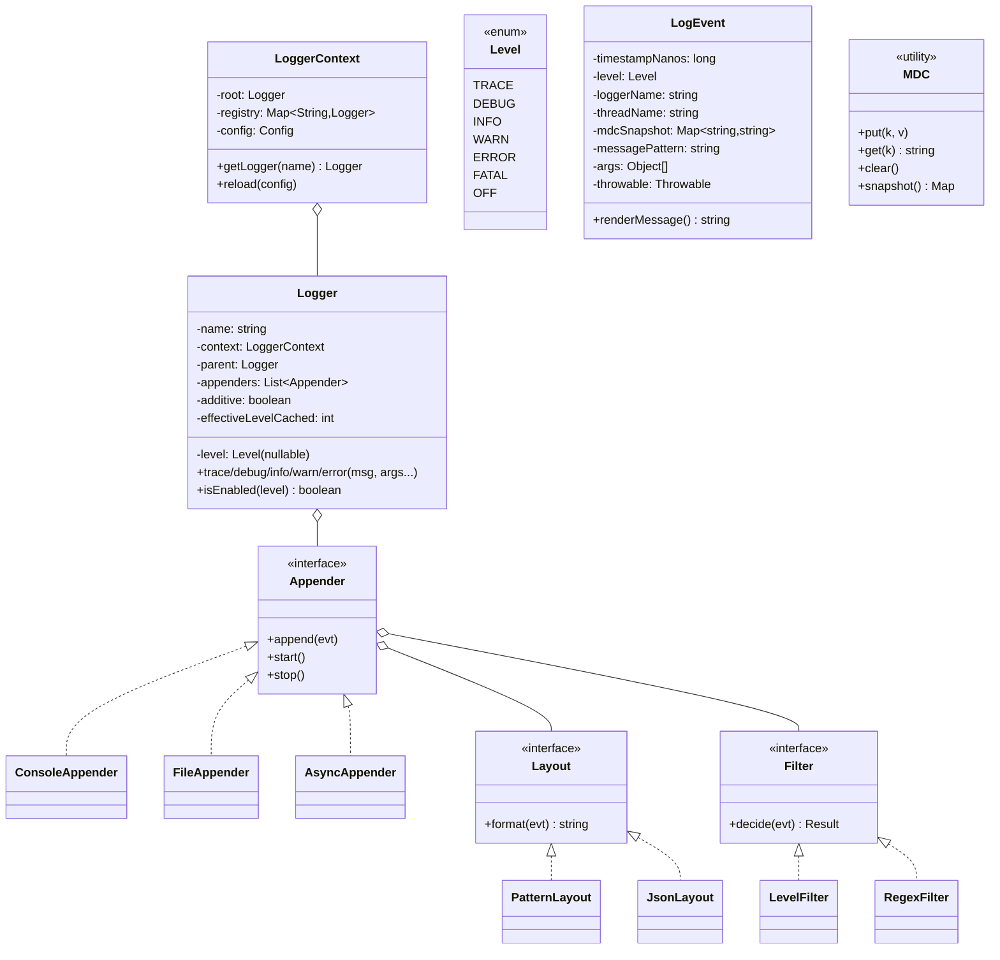

# 04 · Logger Framework — Domain Model

## Core entities



## Aggregates

| Aggregate root | Why root |
| --- | --- |
| **LoggerContext** | Owns the tree of loggers and the active config |
| **Logger** | Each instance is a small leaf; context manages identity |
| **Appender** | Owns its layout, filter chain, and lifecycle (start/stop, file handles, threads) |

## Value objects

| Type | Notes |
| --- | --- |
| `Level` | Ordered enum with int rank; comparison is integer compare |
| `LogEvent` | Immutable; built once, passed to many appenders |
| `MdcSnapshot` | Captured at event creation; immutable copy of the thread's MDC |
| `MessagePattern` | The string with `{}` placeholders; not yet rendered |

## Key concepts

### Hierarchy by name dot-separation
Logger names are dot-separated paths: `com.app.web.OrderController`. The framework treats `com.app.web` as the parent of `com.app.web.OrderController`. The "root" logger is the parent of every logger with no dots, by convention.

This mirrors how packages are structured. Set `com.app.web` to DEBUG and every controller logger inherits it.

### Effective level
A logger's *effective* level is the first non-null level walking up the parent chain. We cache it to make `isEnabled(level)` an integer compare.

When config changes, we walk the tree and invalidate caches.

### Additive appenders
By default, a logger's event goes to **its appenders** *and* **all ancestor appenders**. This lets you set a single console appender on root and every logger writes to it.

`additive=false` opts out — the logger writes only to its own appenders. Useful when a specific logger needs to be isolated (e.g., audit log goes only to a tamper-proof appender).

### Parameterized messages
The API takes a message *pattern* and *args*. The pattern is `"user={} order={}"`; the args are filled in only if the level is enabled.

This is **lazy formatting**, the single biggest perf win.

### MDC
MDC = Mapped Diagnostic Context. A `ThreadLocal<Map<String,String>>`. Apps put context (`MDC.put("requestId", "r-123")`) at request start, clear at end. Every log event captures the MDC snapshot, so the layout can include `requestId` automatically.

Without MDC, you'd have to thread context through every method or pass it to every log call. MDC makes it implicit.

### Filters
Filters return one of three: ALLOW, DENY, NEUTRAL. The chain is short-circuit:
- DENY → drop, stop chain.
- ALLOW → write, stop chain.
- NEUTRAL → continue.
- End of chain with all NEUTRAL → default ALLOW.

This lets you have rules like "drop all logs from package X" or "always allow ERROR even if package would normally be filtered."

### Layout
Converts `LogEvent` → bytes. Pattern layout uses a printf-like pattern. JSON layout serializes as a JSON object suitable for log aggregators.

### Async wrapper
Wraps any underlying appender. Caller's `append(evt)` enqueues to a ring buffer; a single drain thread polls and calls the wrapped appender.

## Domain events

| Event | When |
| --- | --- |
| `LoggerCreated(name)` | First `getLogger(name)` |
| `LevelChanged(name, level)` | Config update |
| `AppenderStarted/Stopped` | Lifecycle |
| `LogEventDropped(reason)` | Async queue full + drop policy |
| `ConfigReloaded` | Hot-reload completed |

## Output

```
Aggregates:    LoggerContext, Logger, Appender
Value objects: Level, LogEvent, MdcSnapshot, MessagePattern
Key idea 1:    hierarchy by name dot-separation; effective level cached
Key idea 2:    additive appenders walk up the parent chain
Key idea 3:    parameterized messages enable lazy formatting
Key idea 4:    MDC carries context implicitly via ThreadLocal
Key idea 5:    Async wrapper is composition (decorates any appender)
```
