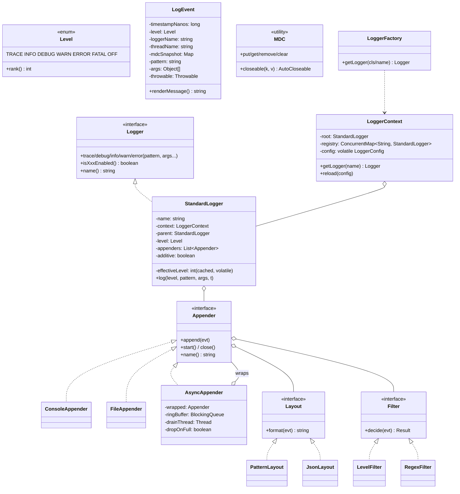

# 07 · Logger Framework — Class Diagrams

## Core class diagram



## Package layout (`com.logger`)

```
api/        Logger, LoggerFactory, MDC, Level
core/       LoggerContext, StandardLogger, LogEvent, LoggerConfig, LoggerConfigBuilder
appender/   Appender, ConsoleAppender, FileAppender, AsyncAppender
layout/     Layout, PatternLayout, JsonLayout
filter/     Filter, LevelFilter, RegexFilter
async/      RingBuffer (or BlockingQueue based)
config/     ConfigLoader (V2: YAML/XML)
```

## Why these abstractions

### `Logger` as an interface
Different implementations: `StandardLogger`, `NopLogger` (for tests), `BridgeLogger` (delegates to another framework). All compile-time interchangeable.

### `LoggerContext` as the registry
Centralizes the tree, the config, and the lookup cache. `getLogger(name)` returns the same instance for the same name (via `ConcurrentMap.computeIfAbsent`).

### `Appender` as a Strategy
Plug different sinks. The same `LogEvent` can be appended by N appenders.

### `Layout` separate from `Appender`
A `FileAppender` can use any `Layout`. A `PatternLayout` can be used by any appender. This Cartesian product is exactly what Strategy is for.

### `Filter` chain
Allows fine-grained policies without subclassing. Order matters; first non-NEUTRAL decision wins.

### `AsyncAppender` as a Decorator
Wraps any appender to make it async. The user sees the same `Appender` interface; behavior is buffered.

### `LogEvent` as a value object
Immutable; built once on the calling thread; consumed by many appenders. Critical to avoid races when async appenders share the same event reference across threads.

## Output

```
Layered:    LoggerFactory → LoggerContext → Logger → Appenders → Layouts → Filters
Strategy:   Appender, Layout, Filter
Decorator:  AsyncAppender wraps any Appender
Utility:    MDC ThreadLocal, LoggerFactory
Immutable:  LogEvent (built once, shared safely across appenders)
```
