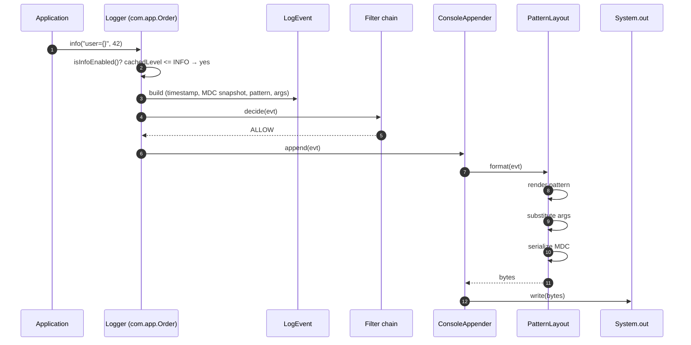
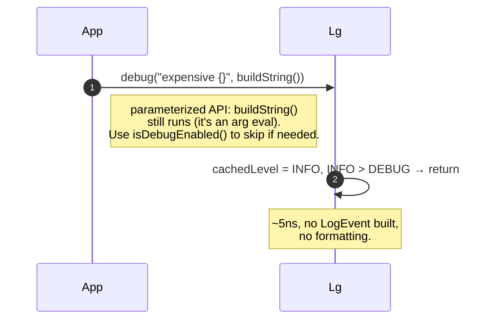
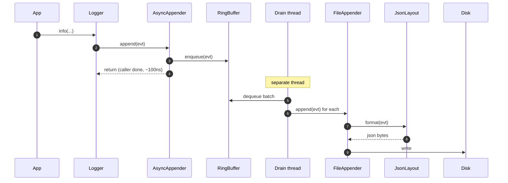
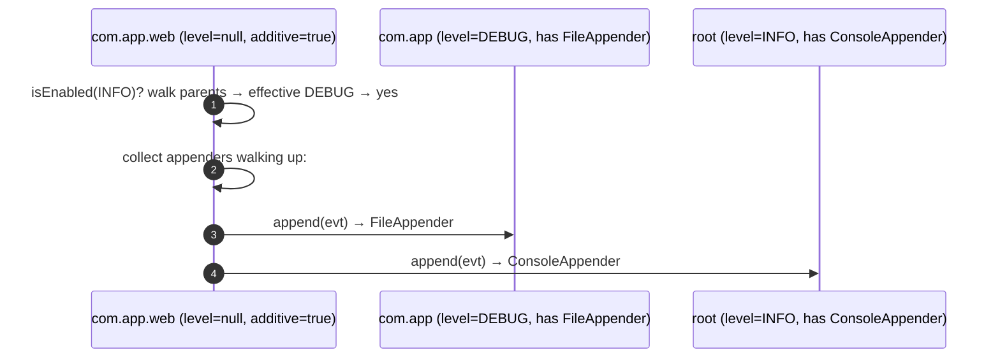
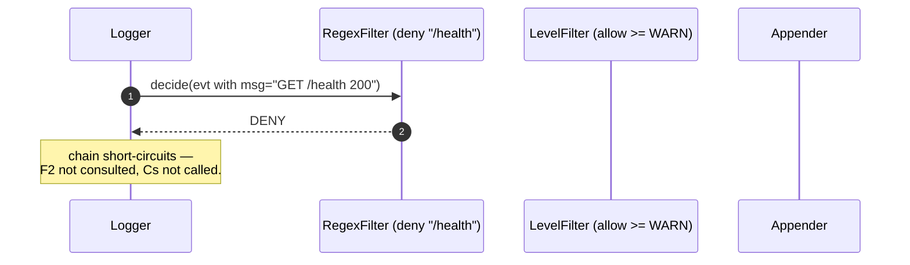
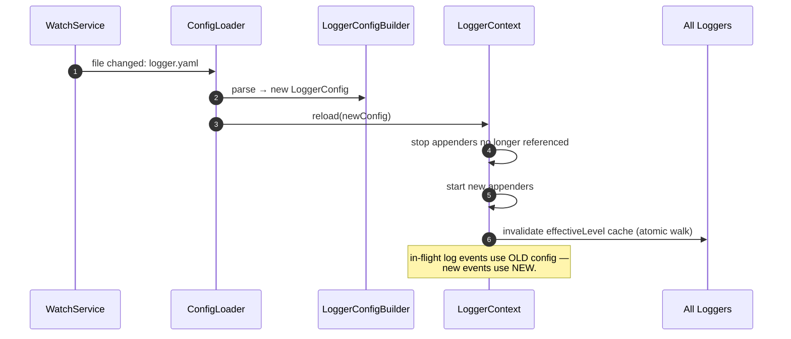
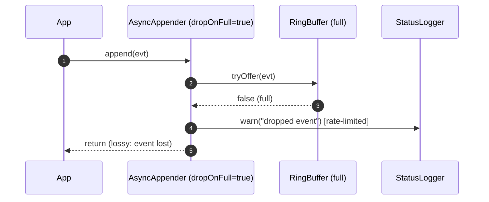

# 08 · Logger Framework — Sequence Diagrams

## 1. log.info("user={}", userId) — synchronous, level enabled



## 2. log.debug(...) — level disabled (the fast path)



## 3. Async append flow



## 4. Hierarchy: log to com.app.web; root has console appender (additive)



If `additive=false` was set on `com.app.web`, the walk stops at it: only its own appenders.

## 5. Filter chain: deny



## 6. Configuration hot-reload



## 7. Async queue full — drop policy



In **block-on-full** mode the producer blocks on `put` instead. Lossless but slows the app.

## Output

```
Sync enabled:    level check → build LogEvent → filter → appenders → layout → write
Sync disabled:   level check → return (no work)
Async:           caller enqueues; drain thread does I/O
Hierarchy:       walk parents collecting appenders unless additive=false
Filter:          short-circuit on first non-NEUTRAL
Hot-reload:      build new tree off-thread; atomic volatile swap
Queue full:      drop (lossy) or block (lossless), configured per appender
```
