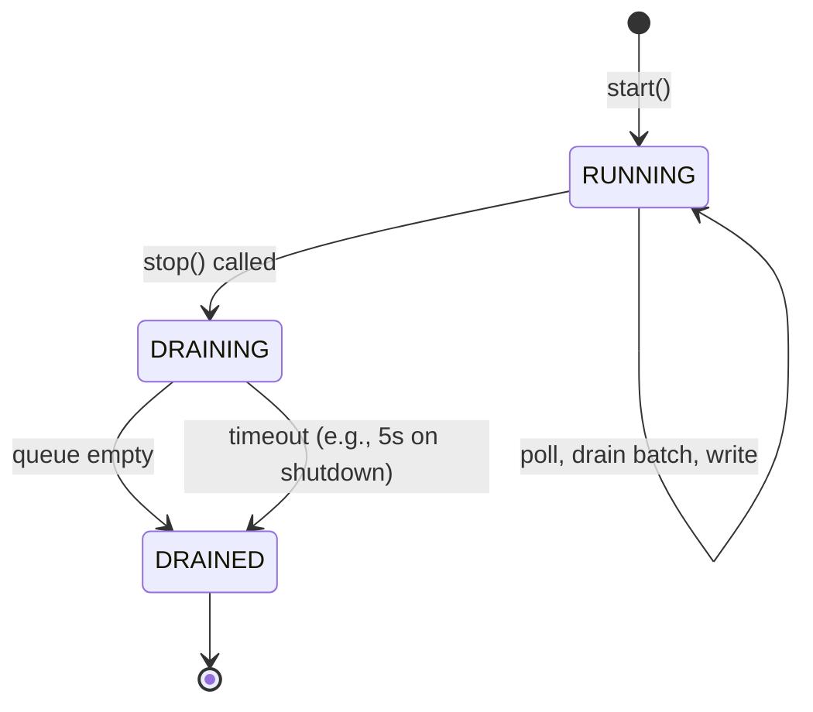
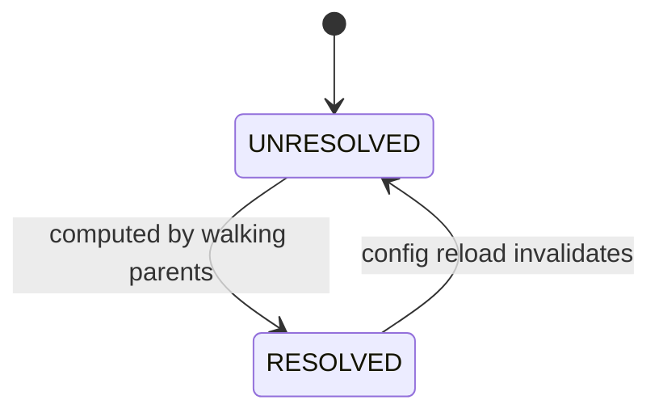

# 09 · Logger Framework — State Machines

## Appender lifecycle

```mermaid
stateDiagram-v2
    [*] --> CREATED
    CREATED --> STARTING : start()
    STARTING --> STARTED : open file / thread / socket
    STARTING --> FAILED  : couldn't open resource
    STARTED --> STOPPING : close()
    STOPPING --> STOPPED : flush + close resource
    STARTED --> ERROR    : append() catches IOException
    ERROR --> STARTED    : transient; resumes on next append
    ERROR --> STOPPED    : repeated failures → give up
    FAILED --> [*]
    STOPPED --> [*]
```



The `ERROR` state lets us tolerate transient failures (e.g., disk briefly slow) without crashing.

## Async appender drain thread



Shutdown hook calls `stop()`; the drain finishes the queue best-effort within a deadline.

## Logger config lifecycle

```mermaid
stateDiagram-v2
    [*] --> LOADING : ConfigLoader.parse()
    LOADING --> ACTIVE : reload(config) installs
    ACTIVE --> LOADING : file changed, reload
    LOADING --> ACTIVE : new config installed; old released
```



Each `reload` is atomic: build the entire new tree off-thread; swap the volatile `config` reference; old appenders that are no longer referenced get `close()`d.

## Effective level cache



Resolution and invalidation are both volatile reads/writes; no locks needed.

## Output

```
Appender:  CREATED → STARTING → STARTED ↔ ERROR → STOPPING → STOPPED
Drain:     RUNNING → DRAINING (on stop) → DRAINED with deadline
Config:    LOADING → ACTIVE; reload triggers a new LOADING cycle
Cache:     UNRESOLVED → RESOLVED; invalidated on config reload
```
