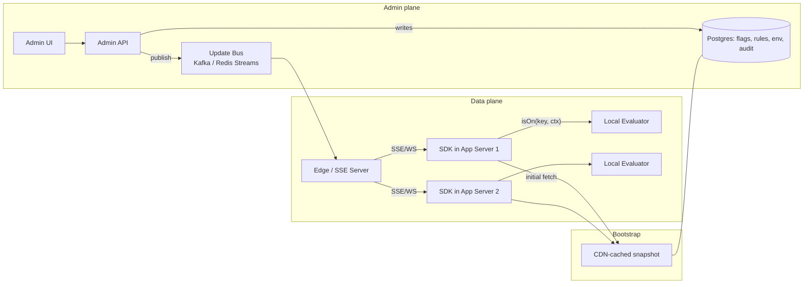
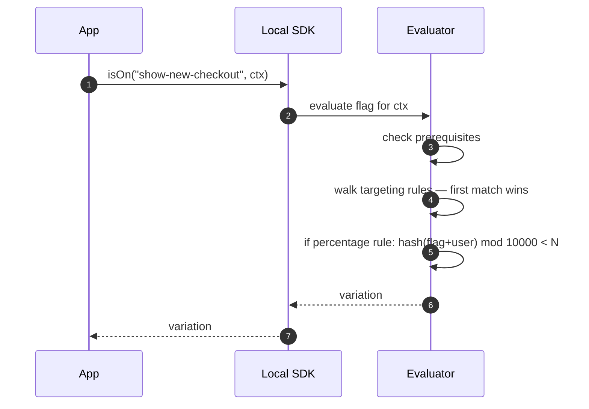
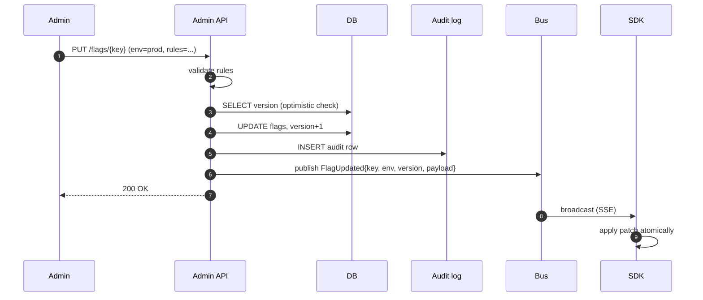

# 03 · Feature Flag System — High-Level Design

## Architecture



## Roles

| Component | Responsibility |
| --- | --- |
| **Admin API** | CRUD on flags + rules + envs; validate; persist; publish update |
| **Postgres** | Source of truth for flag config + audit log |
| **Update Bus** | Kafka or Redis Streams; carries flag-change events |
| **Edge / SSE Server** | Maintains long-lived connections to SDKs; broadcasts updates |
| **SDK** | Pulls initial snapshot; subscribes to updates; evaluates locally |
| **CDN snapshot** | Static-ish daily/hourly snapshot of flag config; bootstraps cold SDKs |

## Hot paths

### Read path (the only one that matters for performance)



Sub-microsecond. No network.

### Write path (admin)



### SDK bootstrap

1. SDK starts; fetches `/sdk/v1/flags?env=prod&etag=...` from CDN.
2. Loads config into memory; sets a flag-store version.
3. Connects to SSE: `/sdk/v1/stream?env=prod&since=version`.
4. Receives any catch-up events; subscribes to live stream.

This is **the** pattern: bulk pull + delta stream.

## Flag evaluation algorithm

```
function evaluate(flag, context, default):
    if flag is OFF:                       return flag.offVariation
    for prereq in flag.prerequisites:
        if not evaluate(prereq, context, prereq.default).matches(prereq.expected):
            return flag.offVariation
    for rule in flag.targetingRules:      # ordered, first match wins
        if rule.matches(context):
            if rule.kind == FIXED:
                return rule.variation
            if rule.kind == PERCENTAGE:
                bucket = hash(flag.key + ":" + context.userId) mod 10000
                if bucket < rule.percentage * 100:
                    return rule.variation
                else:
                    continue   # rule didn't apply for this user
    return flag.fallthroughVariation     # the "everyone else" default
```

## Failure modes

| Failure | Mitigation |
| --- | --- |
| Bus down | SDK evaluates with last known config; alert; no eval errors |
| DB down | Admin API serves reads from Redis cache; writes fail fast |
| Edge / SSE down | SDK falls back to long polling |
| Network split | SDK keeps last config; eventually reconnects and catches up |
| Flag doesn't exist on SDK | Return default (passed by caller) |
| SDK can't even reach CDN snapshot at boot | Use bundled defaults; alert |

## Output

```
Plane split:   Admin (Postgres truth + Bus publish) | Data (Edge + SDK local eval)
Hot path:      isOn = in-process function call (<1µs)
Cold path:     CDN snapshot for SDK bootstrap; SSE for live updates
Algorithm:     prereqs → targeting rules (first match) → fallthrough
Bucketing:     hash(flag + userId) mod 10000; subset-preserving
Failure:       SDK is always functional with cached config; fail safe to default
```
