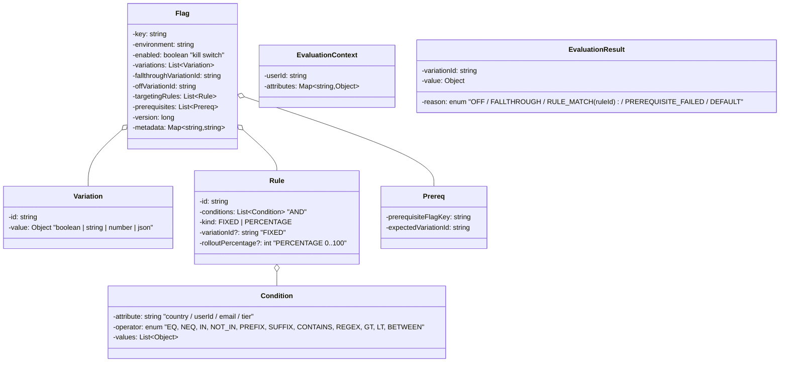

# 04 · Feature Flag System — Domain Model

## Core entities



## Aggregates

| Aggregate root | Why root |
| --- | --- |
| **Flag** | All rules, prerequisites, variations live within. Edits version the whole flag. |

## Value objects

| Type | Notes |
| --- | --- |
| `Variation` | id + value (boolean / string / number / json) |
| `Condition` | attribute + operator + values. Stateless predicate. |
| `EvaluationContext` | per-call; built from request — userId, country, tier, etc. |
| `EvaluationResult` | variation + reason for diagnostics |

## Key concepts

### Flags vs experiments vs kill switches
Same data model, different intent:
- **Flag**: short-lived (weeks to months); rolled out then removed.
- **Experiment**: A/B test with metrics; lifetime tied to data collection.
- **Kill switch**: long-lived; always present; used to disable features in incidents.

The framework treats them uniformly. Tags / metadata distinguish lifecycle.

### Variations
Every flag has at least 2 variations: usually `on` / `off`, or `control` / `treatment-A` / `treatment-B`. Variation values can be any JSON-able type — booleans, strings, numbers, objects.

The `fallthroughVariationId` is "what happens if no rule matches" — usually `off`. The `offVariationId` is what happens when the kill switch is flipped.

### Targeting rules
Ordered list. Each rule is a list of `Condition`s ANDed together. First rule whose conditions all match wins.

```
rules:
  - conditions: [country IN ['IN','BD','PK']]
    kind: FIXED, variationId: 'on'
  - conditions: [tier == 'enterprise']
    kind: FIXED, variationId: 'on'
  - conditions: [tier == 'pro']
    kind: PERCENTAGE, percentage: 25, variationId: 'on'
fallthrough: 'off'
```

### Sticky bucketing
The percentage rule needs to be **stable per user** so a user doesn't see the feature flip on every request.

```
salt = flag.key
bucket = hash(salt + ":" + userId) mod 10000      # 0..9999
include = bucket < (percentage * 100)
```

The salt is the flag key. Two flags rolling out 10% won't include the same 10% of users — desirable, otherwise correlations bias the experiment.

### Prerequisites
A flag can require another flag's variation:
```
flag B prerequisites: [{ flag: A, expected: 'on' }]
```
If A evaluates to anything other than `on`, B short-circuits to its `offVariation`.

We evaluate prerequisites in topological order. Cycles must be detected at write time.

### Environments
Same `flag.key` exists in `dev`, `staging`, `prod` with **independent rules**. The store is keyed `(environmentId, flagKey)`.

This lets engineers turn features on in dev while prod stays untouched.

### Audit log
Every write produces an audit row: `(actor, action, flagKey, env, before, after, timestamp, reason)`. Compliance + debugging + rollback rely on it.

## Domain events

| Event | When |
| --- | --- |
| `FlagCreated(key, env)` | New flag |
| `FlagUpdated(key, env, version, diff)` | Any change |
| `FlagDeleted(key, env)` | Hard delete (rare) or soft archive |
| `FlagEnabled / Disabled` | Kill switch flipped |
| `RolloutChanged(percentage)` | Convenience event for analytics |

## Output

```
Aggregate:     Flag (rules + prerequisites + variations + version)
Value objects: Variation, Condition, EvaluationContext, EvaluationResult
Key idea 1:    targeting rules ordered; first match wins
Key idea 2:    percentage rollout via hash(flag + userId) — sticky + subset-preserving
Key idea 3:    prerequisites form a DAG; evaluate in topological order
Key idea 4:    multi-env scoping; same key, independent config
Key idea 5:    every change produces an audit event
```
