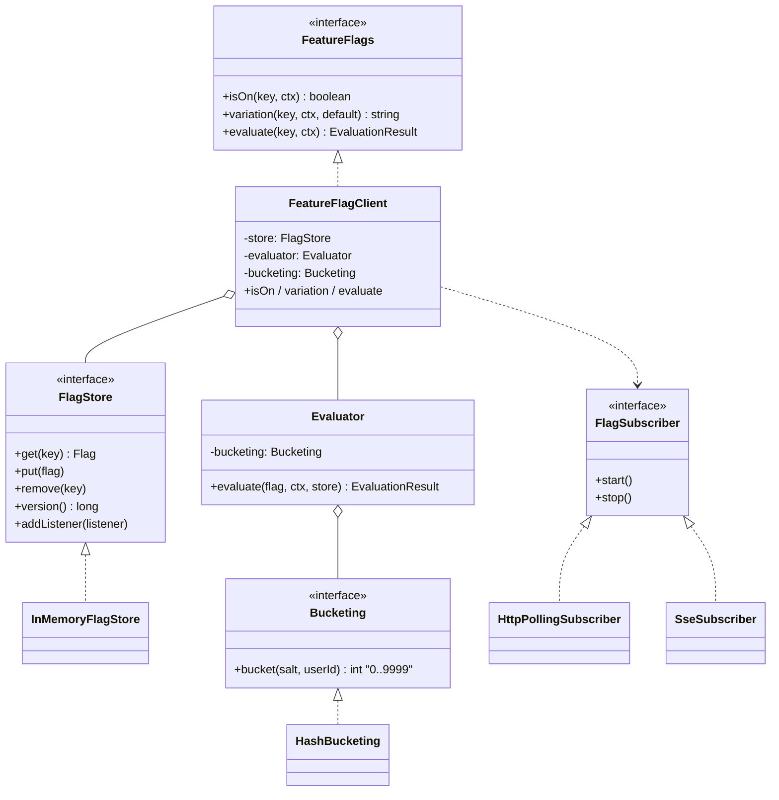
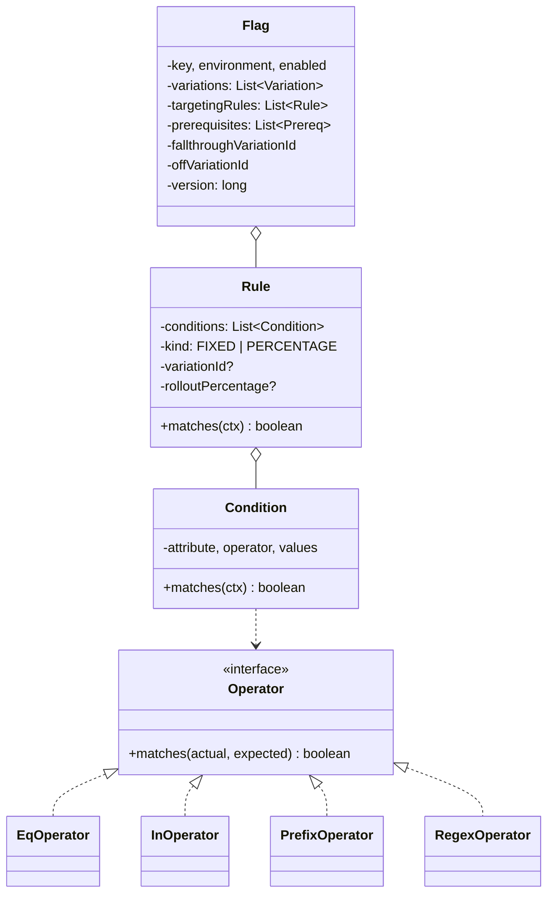
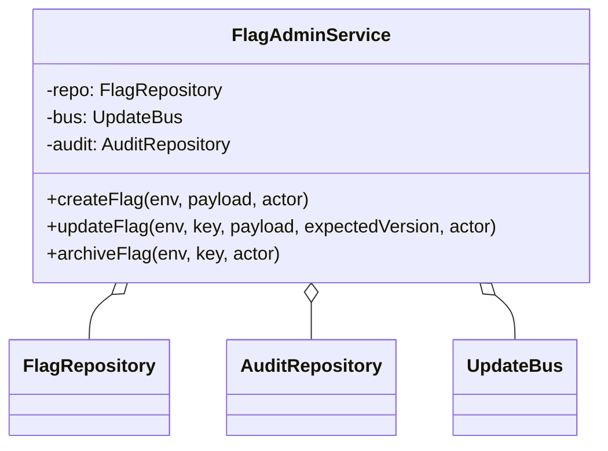

# 07 · Feature Flag System — Class Diagrams

## SDK / evaluator side (the "hot" classes)



## Domain side



## Server side



## Package layout (`com.featureflags`)

```
api/        FeatureFlags, FeatureFlagClient, EvaluationContext, EvaluationResult
core/       Flag, Variation, Rule, Condition, Prereq
rule/       Operator + EqOperator/InOperator/PrefixOperator/RegexOperator
context/    EvaluationContextBuilder
store/      FlagStore (interface) + InMemoryFlagStore
client/     FlagSubscriber + HttpPollingSubscriber/SseSubscriber (stub)
            Evaluator + Bucketing/HashBucketing
```

## Why these abstractions

### `Operator` as Strategy
New operators get added all the time (`SEMVER_GT`, `WITHIN_DISTANCE`). Plug-in interface; the framework iterates known operators by name.

### `FlagStore` as an interface
In-memory for the SDK; Postgres-backed for the server. Same evaluator works against either.

### `Bucketing` as an interface
Hash function is configurable: SHA-1 (LaunchDarkly), Murmur3, FNV. Same interface; the framework benchmarks and picks based on hot-path requirements.

### `FlagSubscriber` as a strategy
Polling for low-infra, SSE for low-latency, GRPC for advanced. Same interface; pluggable.

### `Evaluator` separated from `FeatureFlagClient`
The client manages the store + subscriber + lifecycle. The evaluator is a pure function of `(Flag, EvaluationContext)`. Easy to test in isolation.

## Output

```
SDK side:    FeatureFlagClient → FlagStore + Evaluator + Subscriber
Server side: FlagAdminService → FlagRepository + AuditRepository + UpdateBus
Strategies:  Operator (per condition type), Bucketing (hash algo), Subscriber (transport)
Pure:        Evaluator is a deterministic function of flag + context
```
