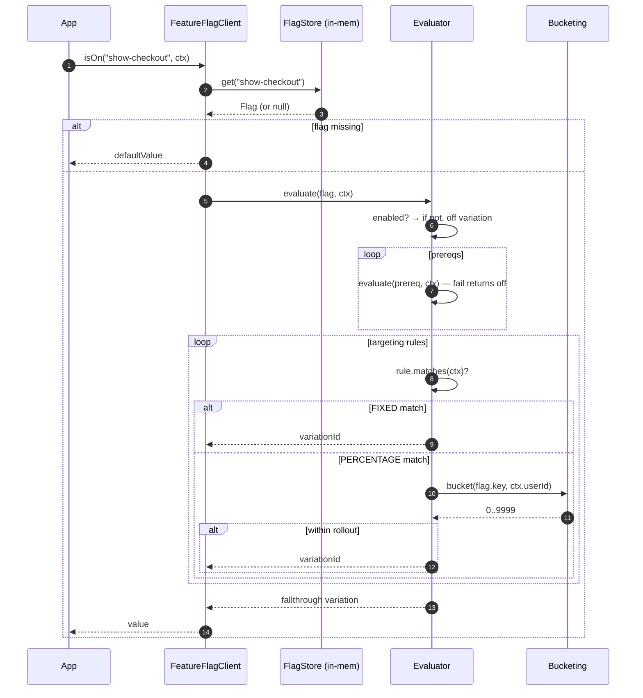
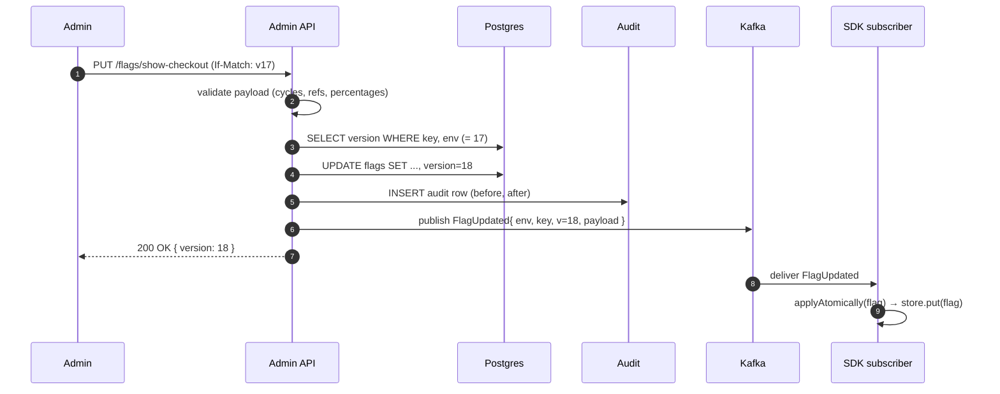
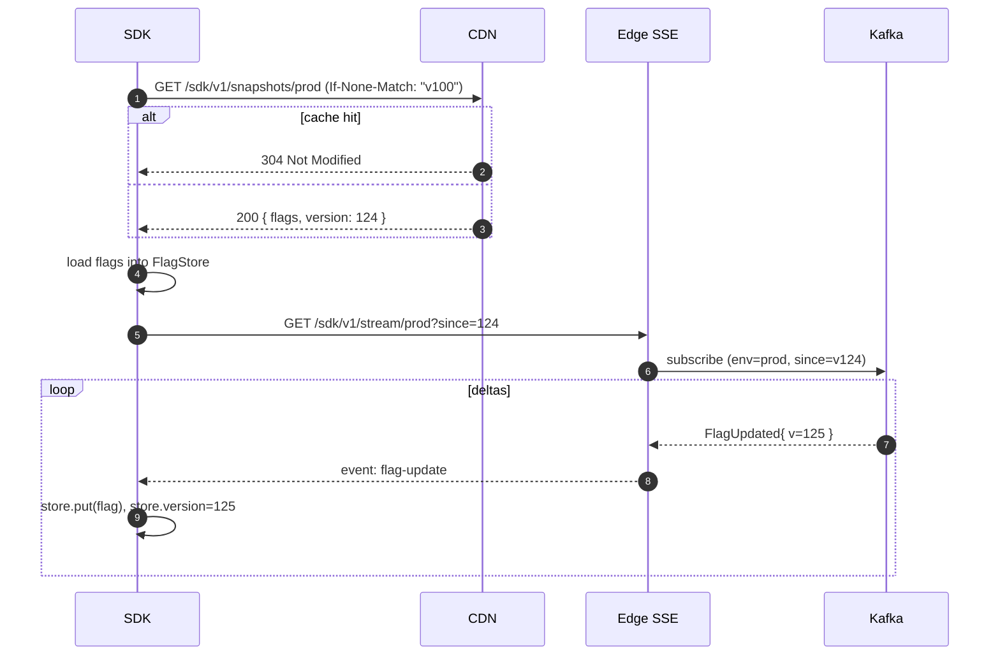
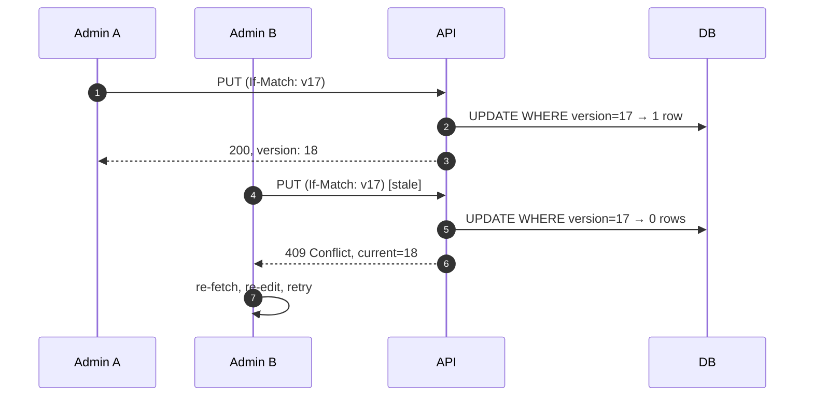
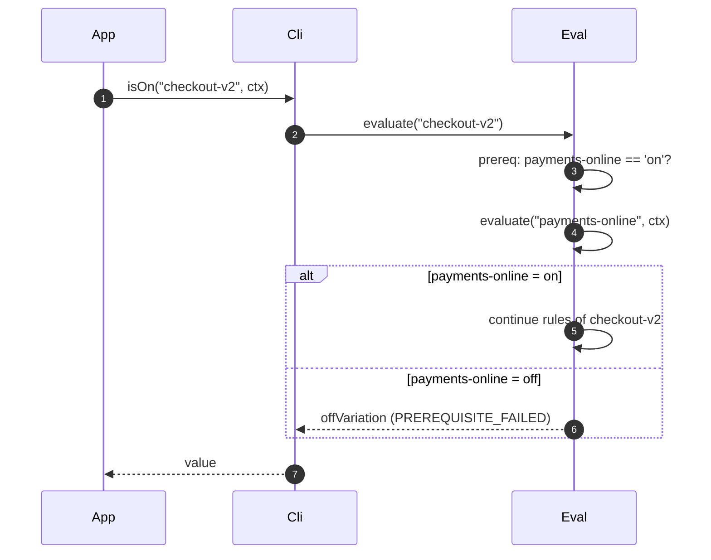
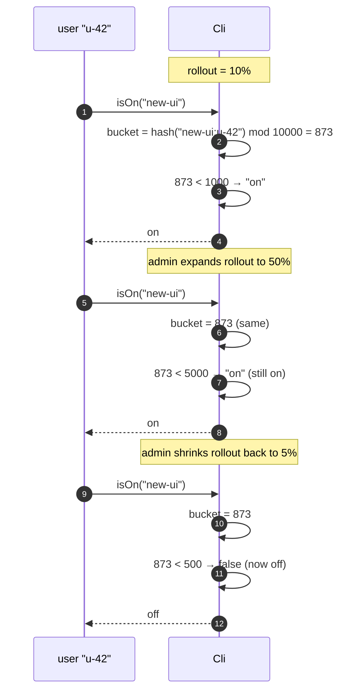
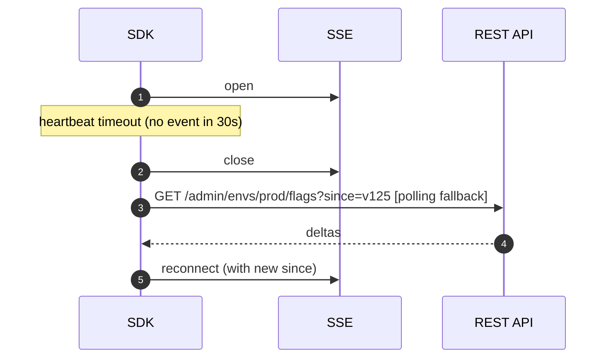

# 08 · Feature Flag System — Sequence Diagrams

## 1. Evaluation (the hot path)



## 2. Admin update — write path



## 3. SDK bootstrap



## 4. Optimistic concurrency conflict



## 5. Prerequisite chain



## 6. Sticky bucketing across rollout expansion



Subset semantics: expanding only adds users; shrinking only removes them.

## 7. SSE disconnect → fallback to polling



## Output

```
Hot path:        evaluate flag → prereqs → targeting rules → percentage bucket → fallthrough
Write path:      validate → optimistic UPDATE → audit → publish → SDKs apply patch
Bootstrap:       CDN snapshot (ETag) + SSE deltas
Concurrency:     If-Match version on PUT; SDK store updated atomically
Sticky:          hash(flag+userId); subset on expansion
Resilience:      SSE drops → poll until reconnect
```
