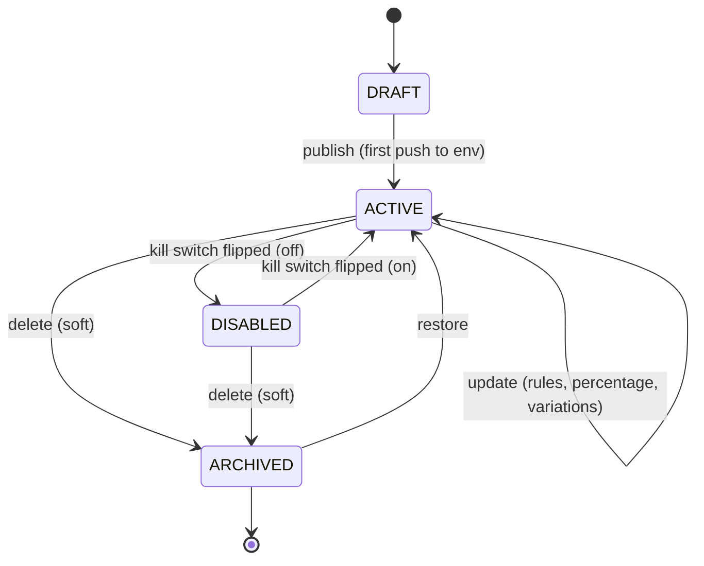
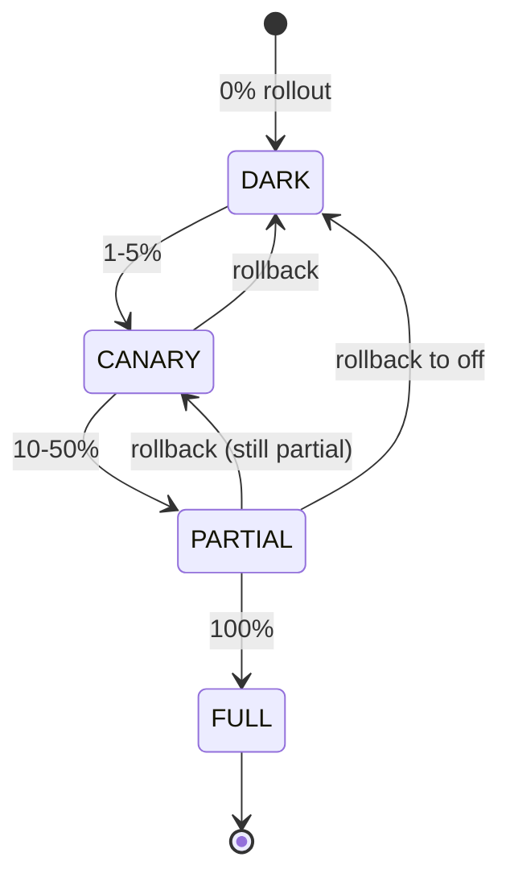
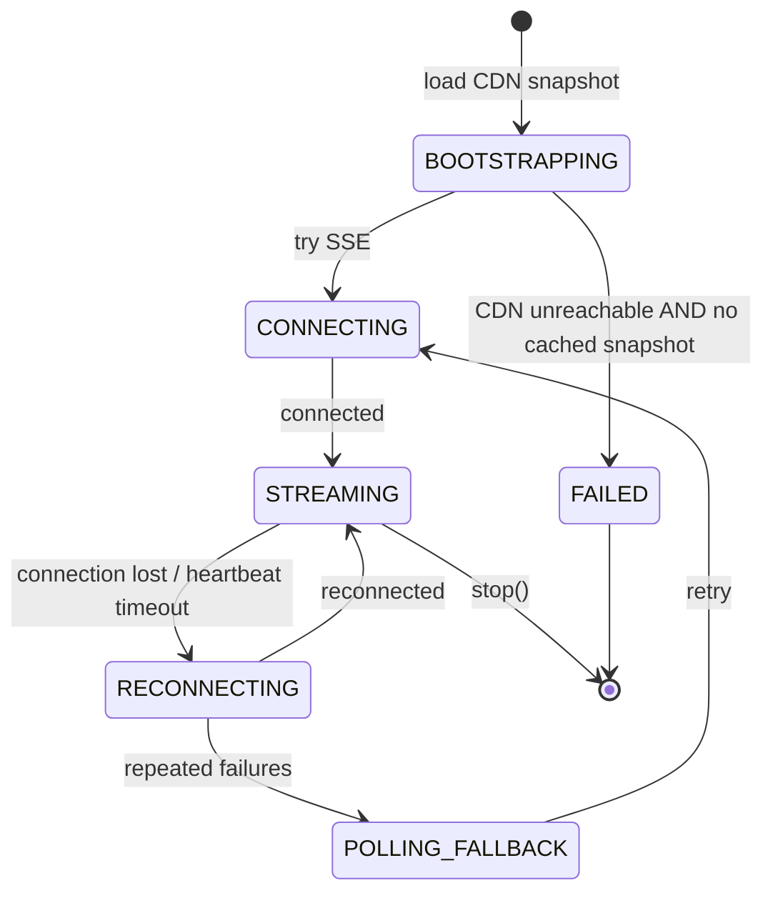

# 09 · Feature Flag System — State Machines

## Flag lifecycle (admin view)



`DISABLED` is a soft state — the kill switch — meant for incident response. `ARCHIVED` is the end-of-life state.

## Rollout lifecycle (operational view)



This is operational, not enforced by the system. The system supports any 0–100 value; teams use stages for hygiene.

## Subscriber state (SDK)



## Evaluation result reasons

```mermaid
stateDiagram-v2
    [*] --> EVALUATING
    EVALUATING --> OFF : kill switch off
    EVALUATING --> PREREQUISITE_FAILED : prereq mismatch
    EVALUATING --> RULE_MATCH : a rule matched
    EVALUATING --> FALLTHROUGH : no rule matched
    EVALUATING --> DEFAULT : flag missing / SDK error
    OFF --> [*]
    PREREQUISITE_FAILED --> [*]
    RULE_MATCH --> [*]
    FALLTHROUGH --> [*]
    DEFAULT --> [*]
```

These reasons are surfaced in `EvaluationResult.reason` for diagnostics.

## Output

```
Flag:        DRAFT → ACTIVE ↔ DISABLED → ARCHIVED ↔ restored
Rollout:     DARK → CANARY → PARTIAL → FULL (operational stages)
Subscriber:  BOOTSTRAPPING → STREAMING ↔ RECONNECTING → POLLING_FALLBACK
Eval result: OFF / PREREQUISITE_FAILED / RULE_MATCH / FALLTHROUGH / DEFAULT
```
