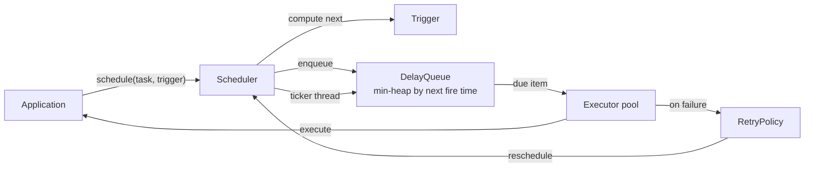
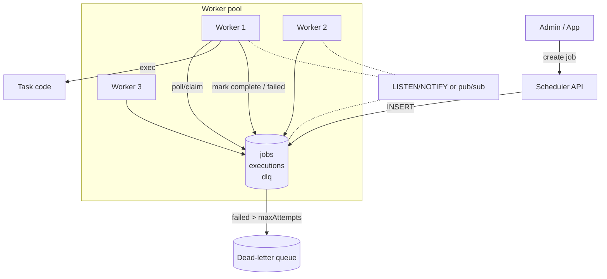
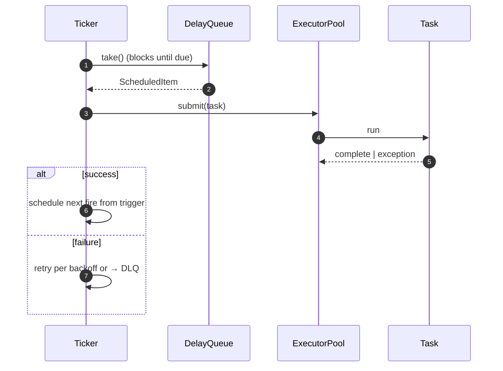
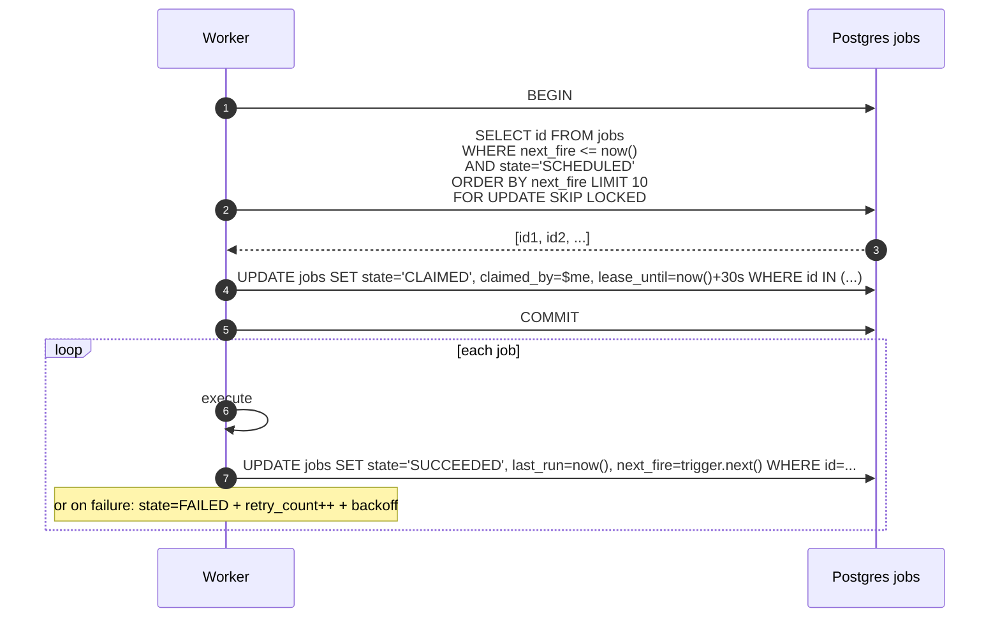
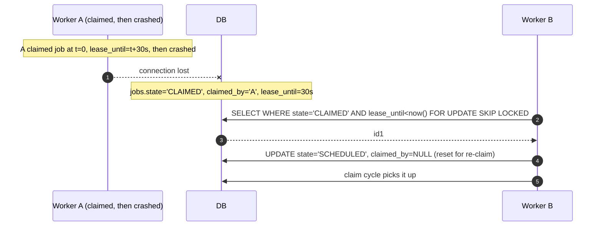
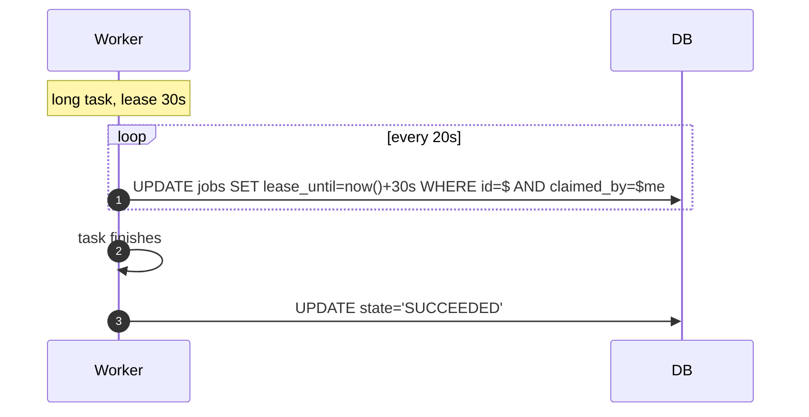

# 03 · Task Scheduler — High-Level Design

## In-process architecture



The in-process scheduler is essentially `ScheduledThreadPoolExecutor` with first-class `Trigger` abstraction.

## Distributed architecture



## Roles

| Component | Responsibility |
| --- | --- |
| **Scheduler API** | Register / cancel / pause jobs |
| **Job store** | Persist job definitions + executions; source of truth |
| **Worker** | Polls store, claims due jobs, executes, reports outcome |
| **Coordinator** (V2) | Optional leader-only role for housekeeping (misfire detection) |
| **DLQ** | Permanently failing jobs land here for human inspection |

## Hot paths

### In-process: tick → execute



### Distributed: claim + execute



### Visibility timeout (worker crashes)



Some implementations skip the explicit "reset" step: the claim query simply selects rows where `state='CLAIMED' AND lease_until<now()` directly.

### Lease extension



## Failure modes

| Failure | Mitigation |
| --- | --- |
| Worker crash mid-execution | Visibility timeout → another worker re-claims |
| DB transient error | Retry with backoff; don't burn retries |
| Task throws | Retry per policy; DLQ on exhaustion |
| Clock skew across workers | Source of truth is DB time (`now()` server-side) |
| Misfire after planned downtime | Apply misfire policy: `RUN_NOW` typical |
| Many duplicate triggers (network glitch) | Idempotency key persisted; DB unique constraint |
| Long-running task | Lease extension; or move to async pattern (publish event, await callback) |

## Output

```
In-process: DelayQueue + thread pool + Trigger abstraction
Distributed: DB-backed job store; workers claim via FOR UPDATE SKIP LOCKED
Reliability: visibility timeout + lease extension + retry + DLQ
Misfire:    policy at job level (IGNORE / RUN_NOW / RUN_ALL)
```
