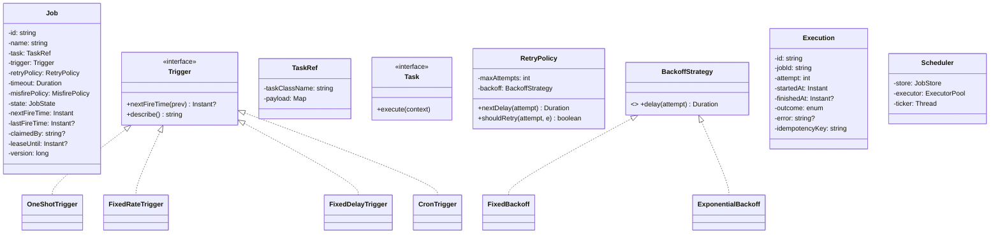

# 04 · Task Scheduler — Domain Model

## Core entities



## Aggregates

| Aggregate root | Why root |
| --- | --- |
| **Job** | Owns trigger, retry policy, current state. All edits are versioned (optimistic CAS). |
| **Execution** | One row per attempt; append-only; aggregated by job. |

## Value objects

| Type | Notes |
| --- | --- |
| `TaskRef` | Lightweight reference (class name + payload); doesn't carry the runtime closure. |
| `Trigger` | Pure function: given previous fire time, returns next. Immutable. |
| `RetryPolicy` | Immutable; clones never mutate. |
| `IdempotencyKey` | `(jobId, scheduledFireTime)` — uniquely identifies a logical execution. |

## Key concepts

### Trigger as a pure function
A trigger answers: **"given the previous fire time, when's the next?"** It's a deterministic function. The scheduler doesn't track "future fires"; it computes the next one each time.

```
oneShot.nextFireTime(prev) → fireAt if prev == null else null
fixedRate(period, start).nextFireTime(prev) → start if prev == null else prev + period
fixedDelay(delay).nextFireTime(prev=jobFinishedAt) → jobFinishedAt + delay
cron("0 0 * * *").nextFireTime(prev) → next midnight after prev
```

### Cron parsing & next-fire computation
A cron expression has 5 (or 6) fields: minute, hour, day-of-month, month, day-of-week, [optional second]. Special tokens: `*`, `,`, `-`, `/`, `?`.

Algorithm to find next-fire-after-T:
1. Start from `T+1 second`.
2. For each field (minute → hour → day → month), find the smallest value ≥ current that's allowed.
3. If a field has to advance, reset all lower fields to their first allowed value.
4. Repeat until all fields are valid; cap iterations to detect impossible expressions (e.g., `Feb 30`).

Open-source `cron-utils` exists; in interview, write a simple version supporting `*`, `*/N`, lists, and ranges.

### Misfire policy
Sometimes the scheduler wakes up and finds jobs that should have fired during downtime. What now?

| Policy | Behavior |
| --- | --- |
| `IGNORE` | Skip missed fires; just compute the next one |
| `RUN_NOW` | Fire **once** to make up; then resume |
| `RUN_ALL` | Fire once per missed instance (risky if many) |

Most jobs choose `RUN_NOW` for safety. `RUN_ALL` is for jobs where every fire matters (e.g., balance recalculation).

### Idempotency
At-least-once delivery means a job *may* run twice (worker crashed after task ran, before marking complete). The task code must be idempotent. The framework provides:
- `idempotencyKey = jobId + ":" + scheduledFireTime` per attempt.
- Pass to the task; the task uses it as a dedup key in its own DB writes (UPSERT, INSERT … ON CONFLICT, etc.).

### Retry policy
Backoff strategies:
- **Fixed**: same delay between attempts (5 s, 5 s, 5 s).
- **Linear**: 5 s, 10 s, 15 s.
- **Exponential**: 5 s, 10 s, 20 s, 40 s with jitter.

Exponential with jitter is the default. Jitter (`±25 %`) prevents thundering herd retries.

### Visibility timeout
When a worker claims a job, it sets `lease_until = now + 30s`. If the worker crashes, after 30 seconds another worker can claim the same job.

For long tasks, the worker periodically extends the lease (every 20 s, set `lease_until = now + 30s`). A crashed worker stops extending; the lease eventually expires.

### State machine
See `09_state_machines.md`. Core: SCHEDULED → CLAIMED → RUNNING → SUCCEEDED | FAILED → DLQ.

## Domain events

| Event | When |
| --- | --- |
| `JobScheduled` | Created |
| `JobClaimed(workerId)` | Worker took ownership |
| `JobStarted` | Began execution |
| `JobSucceeded` | Done |
| `JobFailed(attempt, reason)` | Errored |
| `JobMovedToDLQ` | Exhausted retries |
| `JobMisfired(missedTimes)` | Detected on startup |
| `JobLeaseExtended` | Worker still alive |

## Output

```
Aggregates:    Job, Execution
Value objects: TaskRef, Trigger (pure function), RetryPolicy, IdempotencyKey
Strategies:    Trigger (4 kinds); BackoffStrategy (Fixed/Linear/Exponential)
Concepts:      misfire policy, idempotency by (jobId, scheduledFireTime),
               visibility timeout with lease extension, atomic claim
```
