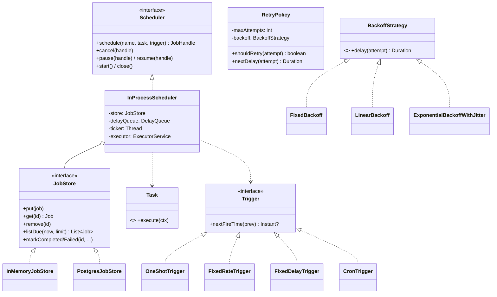
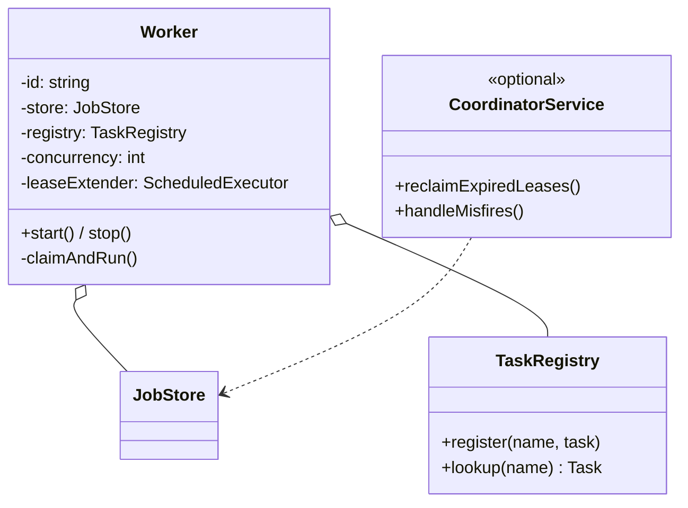

# 07 · Task Scheduler — Class Diagrams

## In-process scheduler



## Distributed worker



## Package layout (`com.scheduler`)

```
api/         Scheduler, Task, JobHandle, TaskContext
core/        Job, JobState, RetryPolicy, BackoffStrategy + Fixed/Linear/Exp,
             Execution, MisfirePolicy
trigger/     Trigger + OneShotTrigger/FixedRateTrigger/FixedDelayTrigger/CronTrigger
store/       JobStore + InMemoryJobStore (+ PostgresJobStore stub)
executor/    InProcessScheduler
worker/      Worker + TaskRegistry (+ CoordinatorService stub)
```

## Why these abstractions

### `Trigger` as Strategy
4 trigger types now; more later (calendar, dependency-on-other-job). The scheduler doesn't care; it asks `trigger.nextFireTime(prev)`.

### `BackoffStrategy` as Strategy
Same story; pluggable.

### `JobStore` as a portability boundary
In-memory vs Postgres vs Redis. The scheduler logic stays the same.

### `Worker` separated from `Scheduler`
Two roles:
- **Scheduler** decides *when* a job runs.
- **Worker** does the actual *executing*.

In single-process, they're combined. In distributed, they split: many workers, one (or a leader-elected) scheduler.

### `TaskRegistry` for distributed mode
A job's task is stored as `task_class` (string) in the DB. The worker looks it up in the local `TaskRegistry` to instantiate. This decouples definition from binary.

## Output

```
Strategy:    Trigger (nextFireTime); BackoffStrategy (delay); JobStore (storage)
Components:  Scheduler (planner) + Worker (executor) + TaskRegistry
Layered:     api → core → trigger / store / executor / worker
Portable:    InMemoryJobStore for tests; PostgresJobStore for production
```
