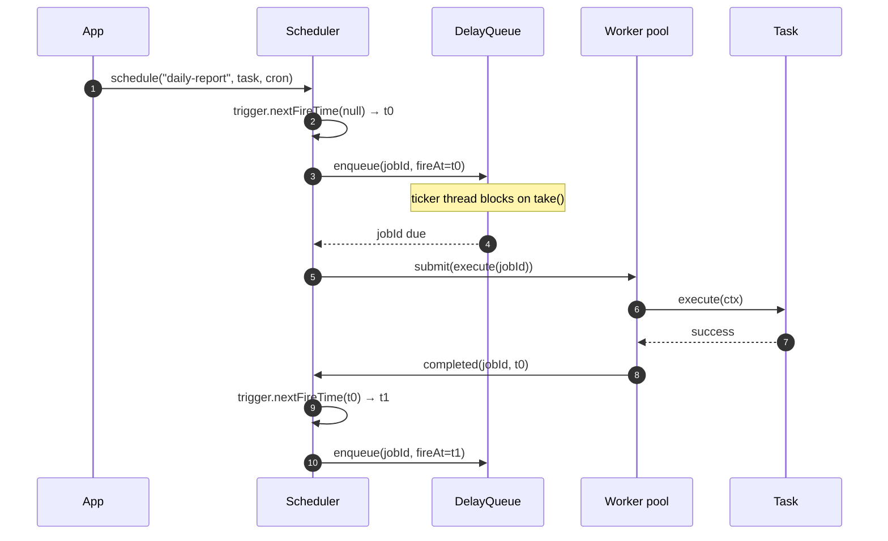
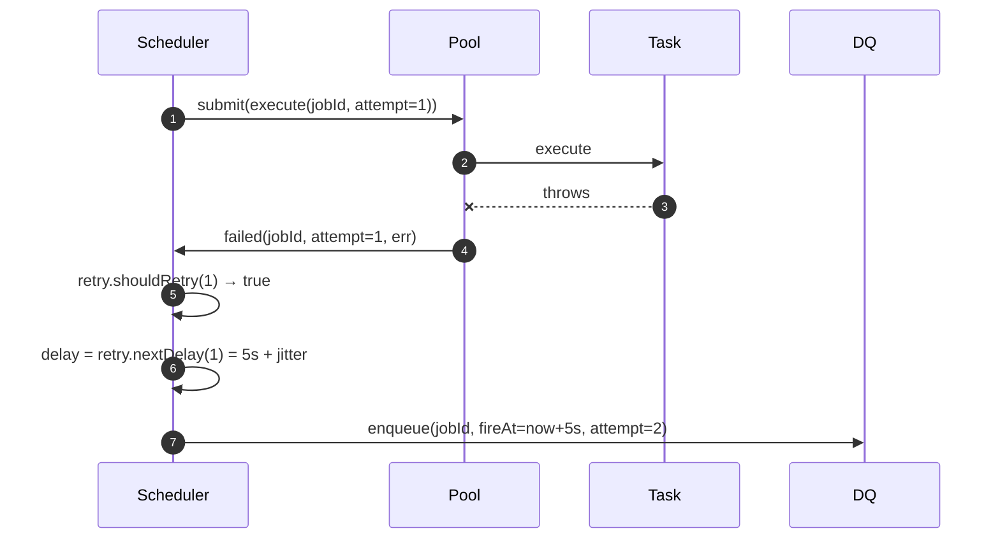
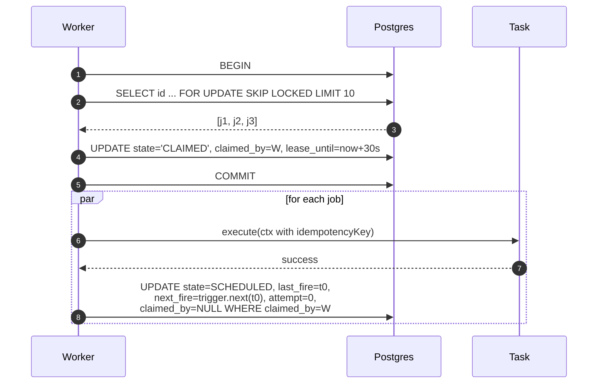
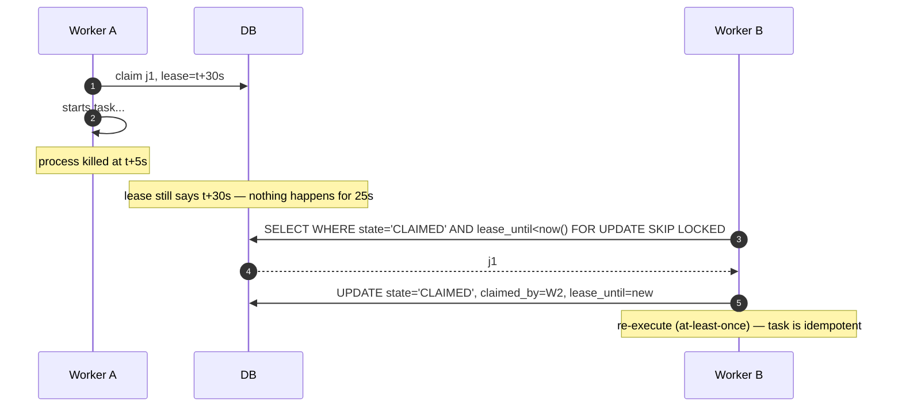
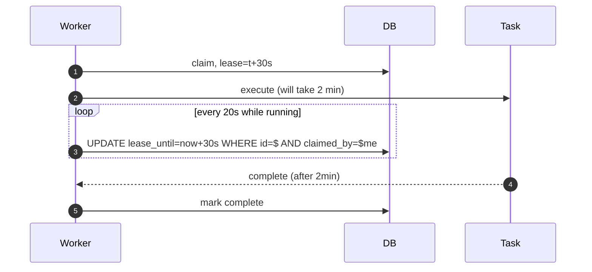
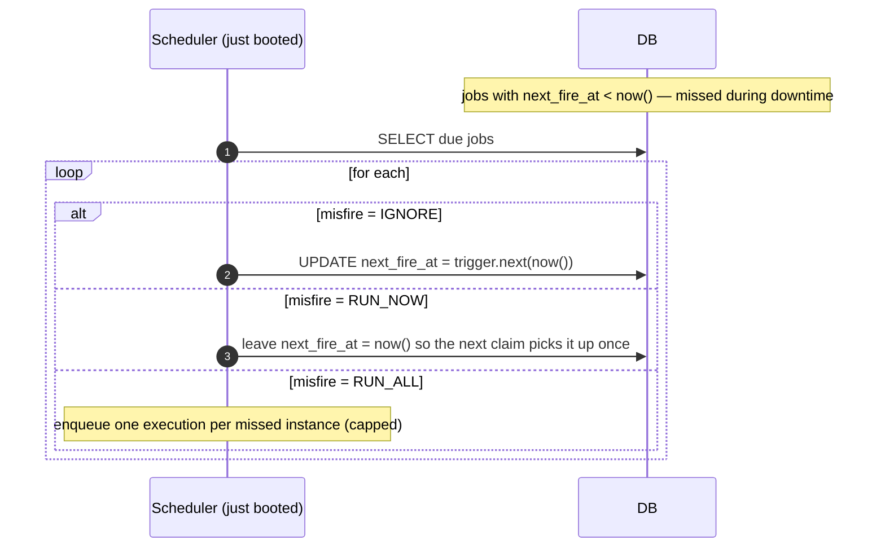
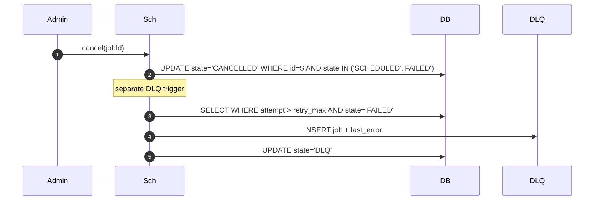

# 08 · Task Scheduler — Sequence Diagrams

## 1. In-process: schedule → fire → execute → reschedule



## 2. In-process: failure + retry



## 3. Distributed: claim + execute + complete



## 4. Distributed: worker crash → re-claim



## 5. Distributed: lease extension during long task



## 6. Misfire detection on startup



## 7. Cancel + DLQ



## Output

```
In-process:  schedule → DelayQueue tick → execute → reschedule via trigger
Failure:     retry with backoff; DLQ on exhaustion
Distributed: SELECT FOR UPDATE SKIP LOCKED claim; lease + heartbeat;
             expired lease → re-claim
Misfire:     IGNORE / RUN_NOW / RUN_ALL on detection
Idempotency: tasks must be idempotent (we provide a key per attempt)
```
