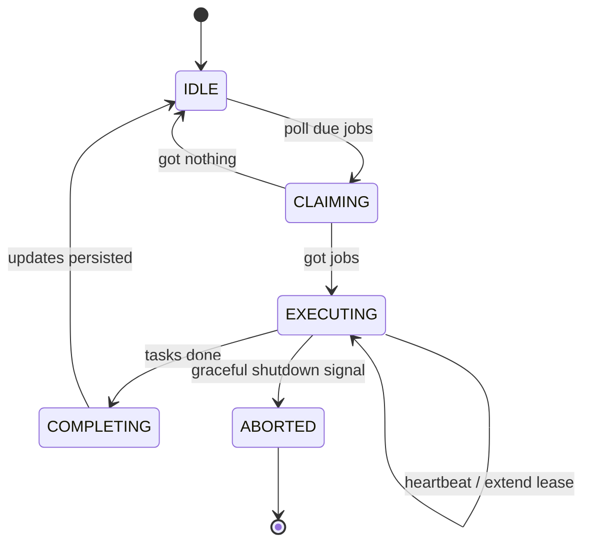

# 09 · Task Scheduler — State Machines

## Job state

```mermaid
stateDiagram-v2
    [*] --> SCHEDULED : create
    SCHEDULED --> CLAIMED : worker claims
    CLAIMED --> RUNNING : execution begins
    RUNNING --> SUCCEEDED : task ok (and one-shot)
    RUNNING --> SCHEDULED : task ok (and recurring; next fire computed)
    RUNNING --> FAILED   : task threw / timed out
    FAILED --> SCHEDULED : retry permitted; next fire = now + backoff
    FAILED --> DLQ       : retries exhausted
    SCHEDULED --> PAUSED : admin pauses
    PAUSED    --> SCHEDULED : admin resumes
    SCHEDULED --> CANCELLED : admin cancels
    CLAIMED   --> CANCELLED : admin cancels (worker will discover and abort)
    CLAIMED   --> SCHEDULED : visibility timeout expired (lease lost)
    SUCCEEDED --> [*]
    DLQ       --> [*]
    CANCELLED --> [*]
```



`CLAIMED → SCHEDULED` (lease expiry) is the **fundamental fault-tolerance** transition.

## Trigger lifecycle (one-shot vs recurring)

```mermaid
stateDiagram-v2
    [*] --> PENDING
    PENDING --> EXHAUSTED : nextFireTime returned null
    PENDING --> READY     : nextFireTime returned a time
    READY --> PENDING     : after fire; recompute
    EXHAUSTED --> [*]
```



- One-shot: returns the time once, then `null` forever.
- Recurring: keeps producing.

A trigger is "exhausted" → the job auto-transitions to `SUCCEEDED` after its last successful run.

## Retry attempt machine (per execution)

```mermaid
stateDiagram-v2
    [*] --> ATTEMPT_1
    ATTEMPT_1 --> SUCCESS  : task succeeds
    ATTEMPT_1 --> ATTEMPT_2 : task failed; can retry
    ATTEMPT_2 --> SUCCESS  : ok
    ATTEMPT_2 --> ATTEMPT_3 : failed
    ATTEMPT_3 --> SUCCESS
    ATTEMPT_3 --> DLQ      : exhausted
    SUCCESS --> [*]
    DLQ --> [*]
```



The job's `attempt` integer encodes the current state. `DLQ` is reached when `attempt > maxAttempts`.

## Worker lifecycle



Graceful shutdown: stop polling, finish in-flight work or release leases for fast re-pickup.

## Output

```
Job:      SCHEDULED → CLAIMED → RUNNING → (SUCCEEDED | SCHEDULED-recurring | FAILED → SCHEDULED | DLQ)
          PAUSED, CANCELLED, lease-expiry → SCHEDULED
Trigger:  PENDING → READY ↔ PENDING; EXHAUSTED on null
Retry:    ATTEMPT_n → SUCCESS or ATTEMPT_n+1 or DLQ
Worker:   IDLE → CLAIMING → EXECUTING (with heartbeats) → COMPLETING → IDLE
```
