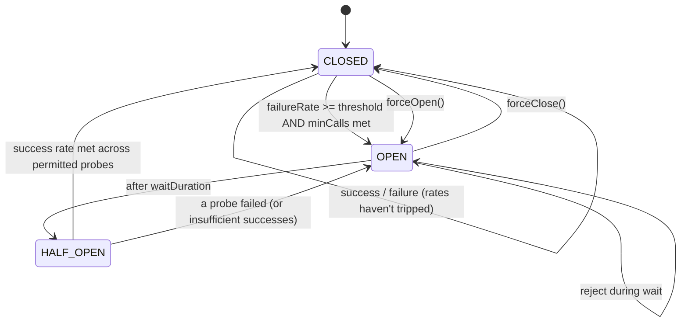

# 03 · Circuit Breaker — High-Level Design

## Architecture (in-process)

```mermaid
flowchart LR
    Caller[Caller code] -->|"execute(supplier)"| CB[CircuitBreaker]
    CB -- check state --> SM[StateMachine]
    SM -- CLOSED --> Allow1[Pass through]
    SM -- OPEN   --> Reject[Reject + (optional) fallback]
    SM -- HALF_OPEN --> Allow2[Permit N probes]
    Allow1 --> Down[Downstream]
    Allow2 --> Down
    Down -- result/exception --> Win[SlidingWindow]
    Win -- failure rate / slow rate --> SM
    SM -- transitions --> Ev[EventBus]
    Ev --> List[Listeners]
    Reg[Registry] -.- CB
```

## Roles

| Component | Responsibility |
| --- | --- |
| **CircuitBreaker** | Decide allow/reject; record outcomes |
| **StateMachine** | CLOSED/OPEN/HALF_OPEN logic and transitions |
| **SlidingWindow** | Records recent calls; computes failure & slow rates |
| **EventBus** | Notify listeners of state changes |
| **Registry** | Per-name breakers; shared config |

## Hot path

```
boolean acquire():
    state = current state           // volatile
    if state == OPEN:
        if openExpiredNow:
            CAS state OPEN → HALF_OPEN
            permits = HALF_OPEN_PERMITS
        else:
            return REJECTED
    if state == HALF_OPEN:
        permit = semaphore.tryAcquire()
        return permit ? ALLOWED : REJECTED
    return ALLOWED   // CLOSED
```

The 99% case is `CLOSED` → ~10 ns.

## Recording outcomes

```
onSuccess(durationNs):
    if duration > slowThreshold: window.recordSlow()
    else                       : window.recordSuccess()
    if state == HALF_OPEN:
        successesInHalfOpen++
        if successesInHalfOpen >= threshold:
            transitionToClosed()  // CAS
        elif probesUsed == permittedHalfOpen:
            evaluateAndTransitionToOpenIfFailed()
    else if state == CLOSED:
        if window.shouldTrip():
            transitionToOpen()     // CAS

onError(durationNs, exception):
    if classifier.isFailure(exception):
        window.recordFailure()
        // similar transition logic
    else:
        // not counted (e.g., 4xx user error)
        window.recordSuccess()  // or just ignore
```

## State transitions



## Sliding window options

### Count-based (ring buffer of size N)
```
[ S F S S S F S F F S ... ]   // newest at right; oldest replaced
failure_rate = failures / N
```

Simple. The "window" is the last N calls regardless of time.

### Time-based (bucketed by second)
```
                  now
                   ▼
[ b59 ][ b58 ][ ... ][ b1 ][ b0 ]
each bucket has counts (success, failure, slow)
```

Fixed time horizon (e.g., last 60 s). Old buckets fall off as time advances.

### Tradeoffs
- Count-based handles bursts fairly; time-based handles "last N seconds" cleanly.
- Time-based requires a clock; count-based doesn't.
- Resilience4j supports both.

## Failure modes (of the breaker itself)

| Failure | Mitigation |
| --- | --- |
| Listener throws | Catch; log; do not affect breaker |
| Clock anomaly | Use `System.nanoTime()` (monotonic) |
| Counter overflow | `long` is fine for ~30 years at 1 GHz; reset on transition |
| State CAS contention | Many threads racing to OPEN — CAS wins exactly one; others see new state |
| Bug: never transitions back | Test state machine exhaustively + force-close manual override |
| Memory leak in registry | Bounded; or evict unused breakers via TTL |

## Output

```
Hot path:    state check (volatile read) → allow / reject / probe-acquire
Recording:   onSuccess / onError feed sliding window
Window:      count-based ring buffer or time-based bucketed counters
Transitions: CAS-based; CLOSED → OPEN → HALF_OPEN → CLOSED|OPEN
Failure:     listener errors swallowed; monotonic clock; CAS resolves races
```
