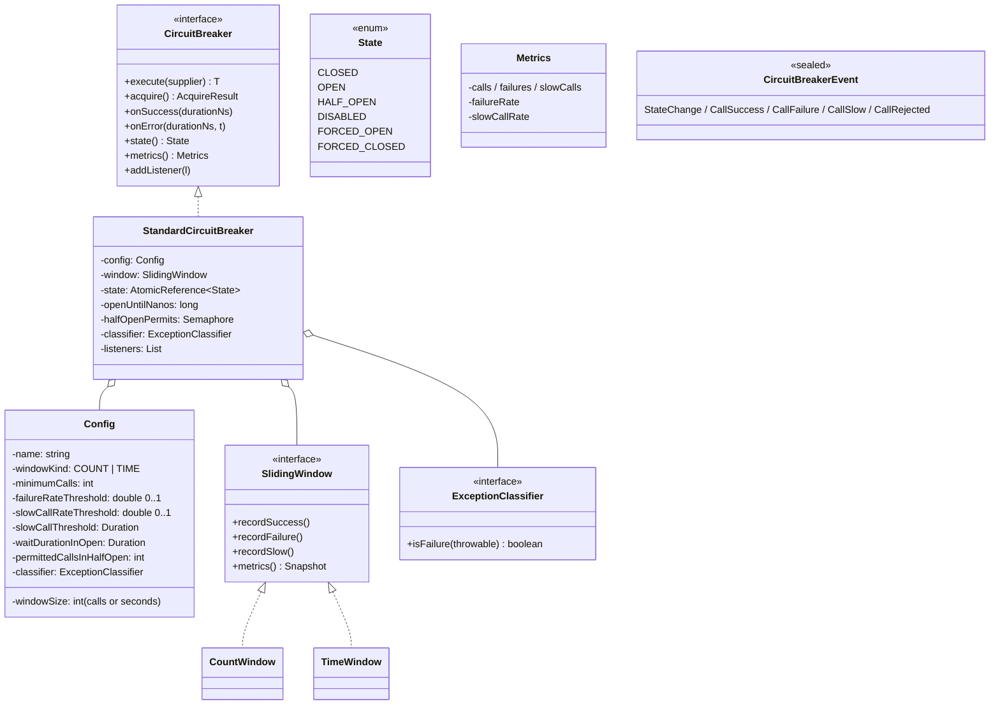

# 04 · Circuit Breaker — Domain Model

## Core entities



## Aggregates

| Aggregate root | Why root |
| --- | --- |
| **CircuitBreaker** | One per resource; owns state + window + listeners |
| **Registry** | Holds breakers; manages lifecycle |

## Value objects

| Type | Notes |
| --- | --- |
| `Config` | Immutable; per-breaker |
| `State` | Enum |
| `Metrics` | Snapshot value at a moment |
| `Event` | Discriminated union of breaker observations |
| `AcquireResult` | `ALLOWED` / `REJECTED` (with reason) |

## Key concepts

### State semantics
- **CLOSED**: traffic flows. Calls and outcomes are recorded.
- **OPEN**: short-circuit. No traffic. After `waitDuration`, automatically becomes HALF_OPEN.
- **HALF_OPEN**: probe phase. Limited concurrent calls allowed. Outcomes determine the next transition.
- **DISABLED**: bypass entirely; all traffic flows; no recording. Useful for shadow runs.
- **FORCED_OPEN / FORCED_CLOSED**: manual overrides; ignore signals.

### Failure rate threshold
The breaker trips when `failures / total ≥ threshold` and `total ≥ minimumCalls`. The `minimumCalls` floor prevents tripping on 2/2 in a sparse window.

Common defaults: `failureRate=0.5`, `slowCallRate=1.0`, `minimumCalls=10`, `windowSize=100` (count) or `60s` (time).

### Slow calls
A call that succeeds but takes too long (e.g., 5 s when downstream is supposed to respond in 200 ms). It signals "the dependency is sick even if technically working." Treated like a failure for transition decisions.

### Permitted calls in HALF_OPEN
Default 10. The breaker lets 10 probes through. Their outcomes determine:
- All 10 succeed (or success rate above threshold) → CLOSED.
- One fails → OPEN.
- Calls beyond 10 are rejected during the probe phase.

### Exception classification
Not all exceptions are "real" failures. A 4xx response means the *caller* did something wrong, not the *dependency*. The breaker classifier filters: only `IOException`, `5xx`, `TimeoutException`, etc., count as failures.

### Bulkhead
A semaphore that caps concurrent calls. Orthogonal to the breaker but commonly bundled. Prevents a slow dependency from saturating your worker pool.

### Event bus
State changes emit `StateChange(from, to, reason)`. Successful, failed, slow, rejected calls also emit events. Subscribers can:
- Push to metrics (Prometheus counter).
- Log.
- Trigger pager.

## Domain events

| Event | When |
| --- | --- |
| `StateChange(from, to, reason)` | Transition |
| `CallSuccess(durationNs)` | Successful call recorded |
| `CallFailure(durationNs, throwable)` | Failed call recorded |
| `CallSlow(durationNs)` | Successful but slow |
| `CallRejected(reason)` | Rejected by breaker |
| `Reset()` | Manual reset |

## Output

```
Aggregates:    CircuitBreaker, Registry
Value objects: Config, State, Metrics, Event, AcquireResult
States:        CLOSED, OPEN, HALF_OPEN (+ DISABLED, FORCED_*)
Concepts:      failure rate, slow rate, minimum calls, exception classifier,
               permitted probes, bulkhead, event bus
```
