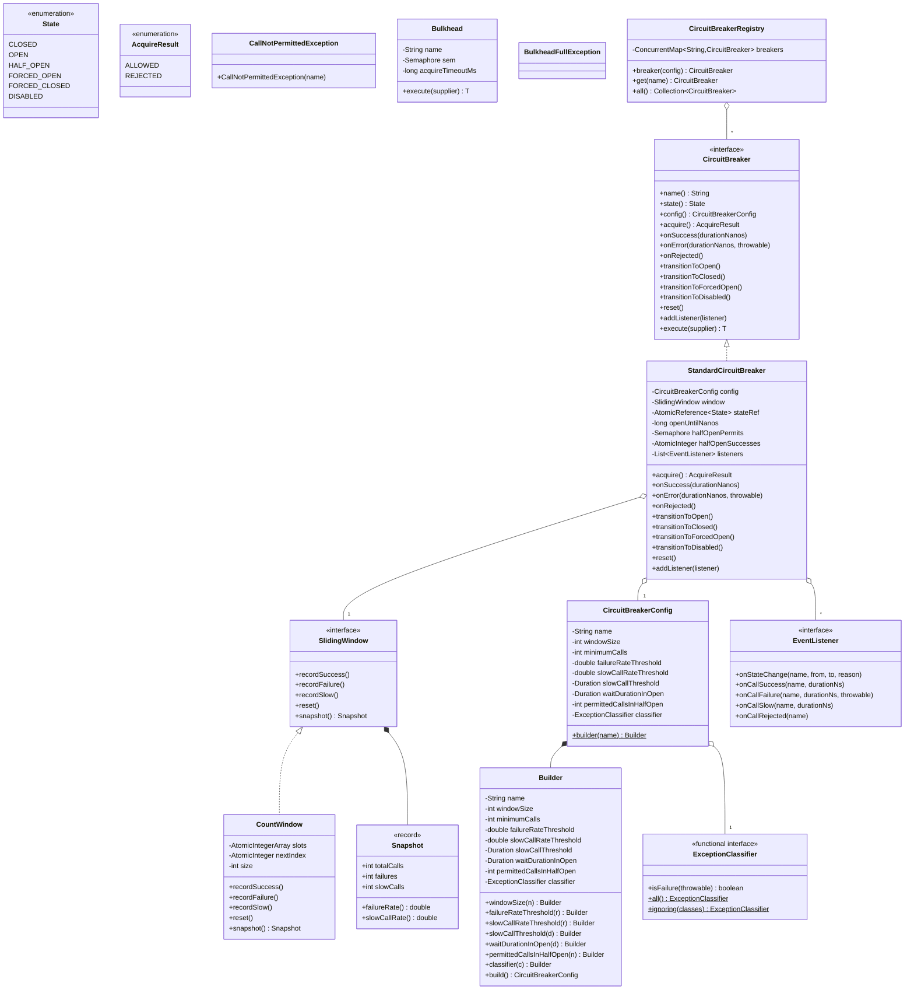
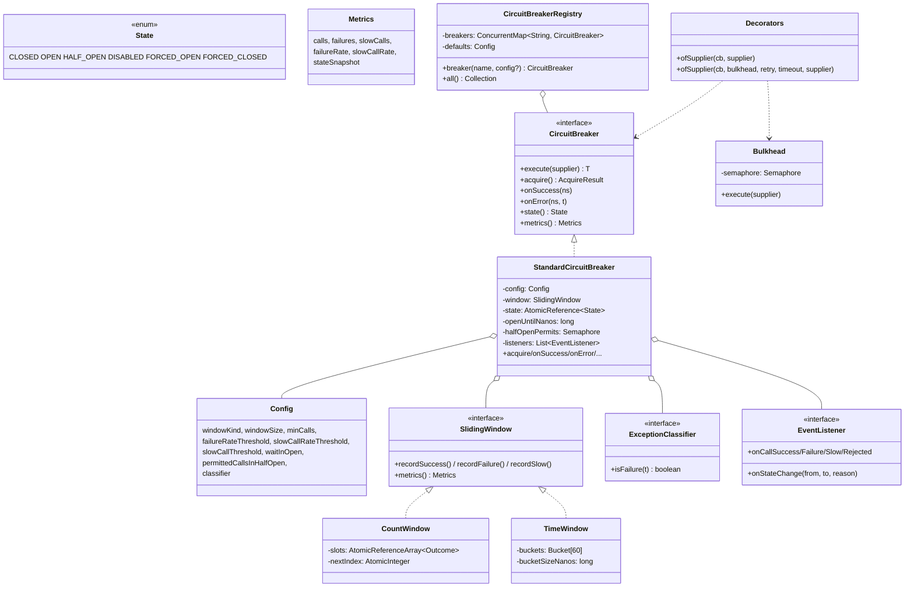

# 07 · Circuit Breaker — Class Diagrams

## Aggregated class diagram

A single view of every class, interface, and enum in the system — fields and methods included. Source of truth: the Java skeleton under `12_machine_coding_skeleton/`.



---


## Core class diagram



## Package layout (`com.circuitbreaker`)

```
api/        CircuitBreaker, Config (+ Builder), State, Metrics,
            CallNotPermittedException, ExceptionClassifier, EventListener
core/       StandardCircuitBreaker
window/     SlidingWindow, CountWindow, TimeWindow
policy/     ExceptionClassifier impls; Bulkhead (semaphore)
registry/   CircuitBreakerRegistry, Decorators
```

## Why these abstractions

### `CircuitBreaker` as an interface
Test/mocked implementations exist; a `NoopCircuitBreaker` for when the user wants to disable without removing the wiring.

### `SlidingWindow` as a strategy
Two implementations cover 99 %: count-based (simple, cheap) and time-based (semantically clear). Same interface; same set of operations.

### `Config` as immutable + builder
Once a breaker is constructed, its config is final. Reconfigure = create a new breaker.

### `EventListener` as a thin observer
Multiple listeners; subscribe/unsubscribe. Listeners must not throw — caught by breaker.

### `ExceptionClassifier`
Pluggable: count `IOException` and `TimeoutException` but not `BadRequestException`. Default classifier counts everything.

### `Registry` for shared default config
Many breakers share a default; per-breaker overrides for special cases.

### `Decorators` builder
Combines `Bulkhead → CircuitBreaker → Retry → Timeout`. Order matters; the builder hides the right ordering.

## Output

```
Layered:  api → core (StandardCircuitBreaker) → window (Count/Time) → registry
Strategy: SlidingWindow, ExceptionClassifier
Pattern:  CircuitBreaker is the policy; Window is the data structure;
          Decorators combine resilience primitives in the right order
```
