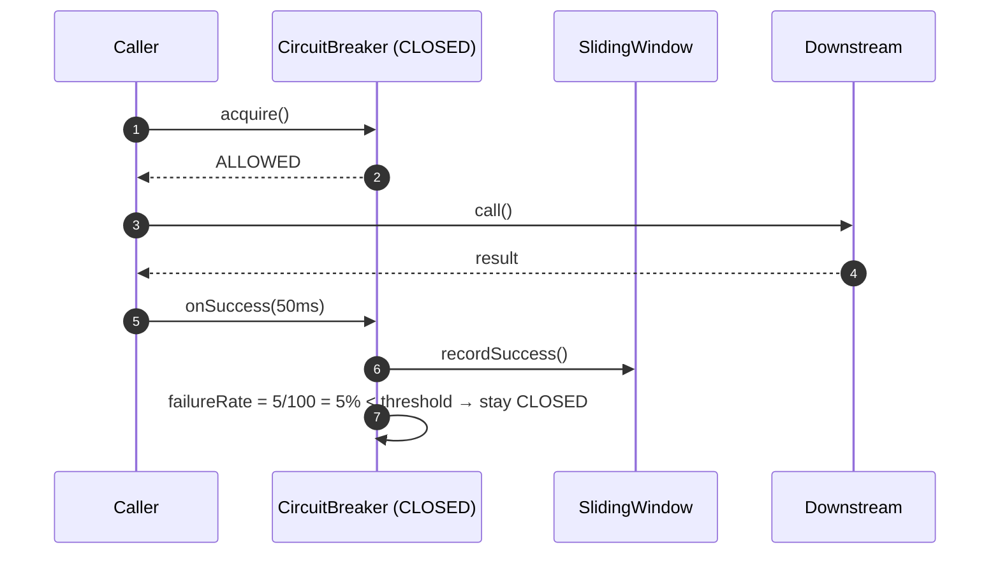
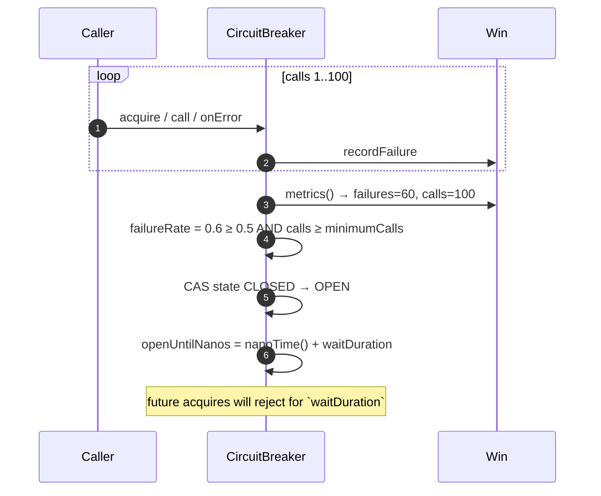
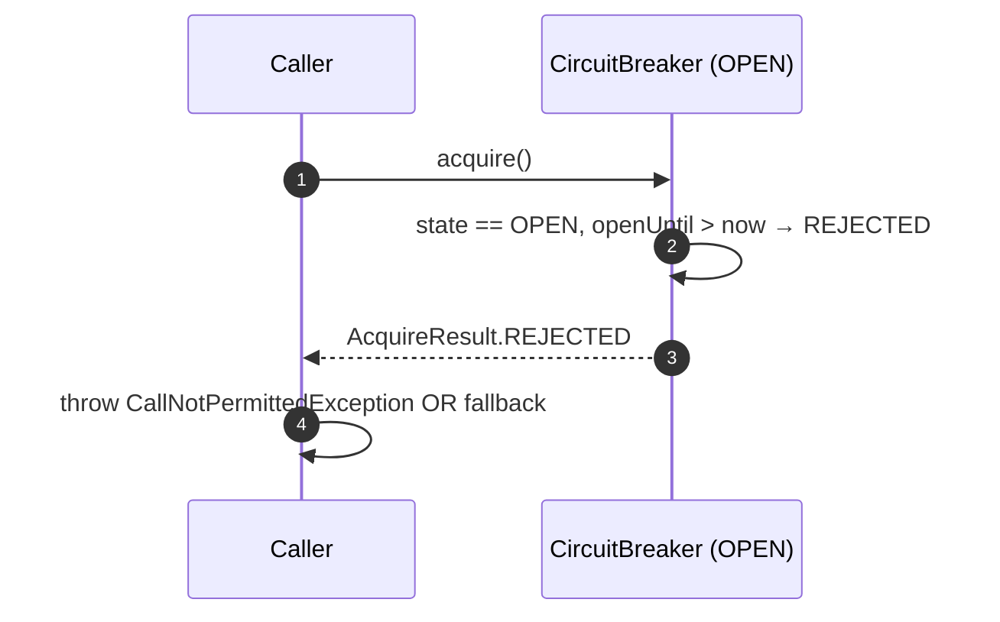
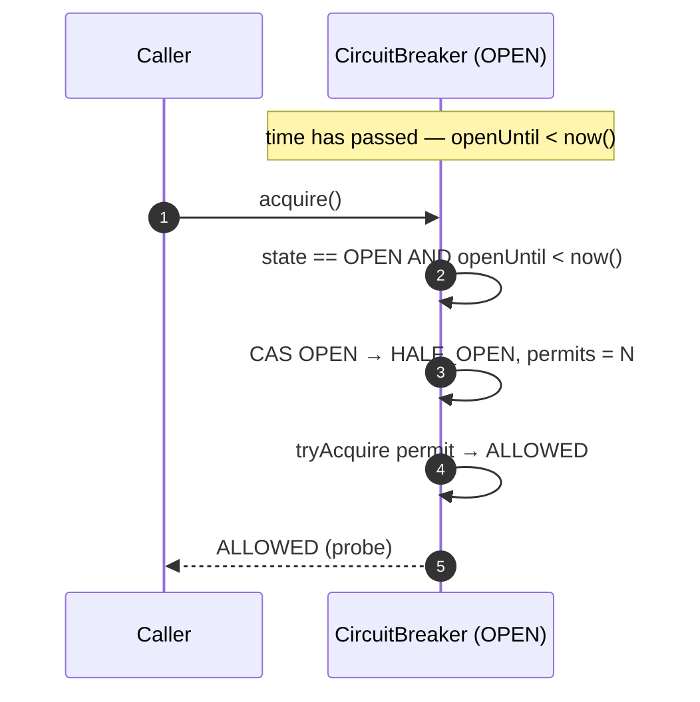
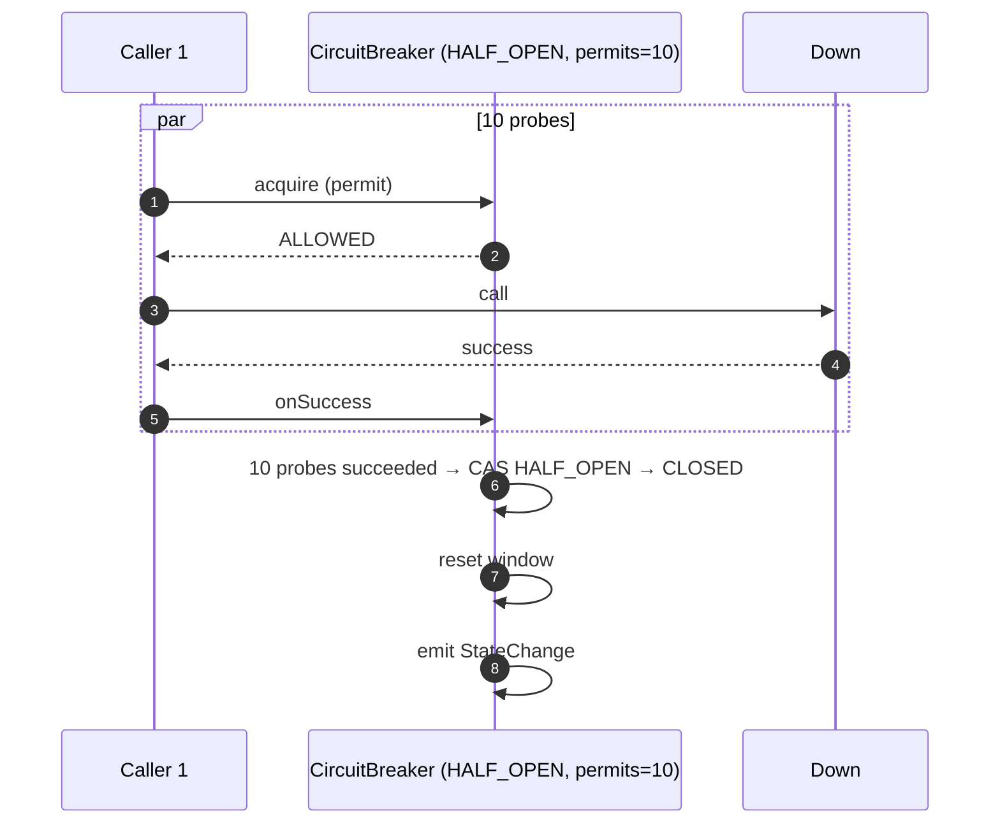
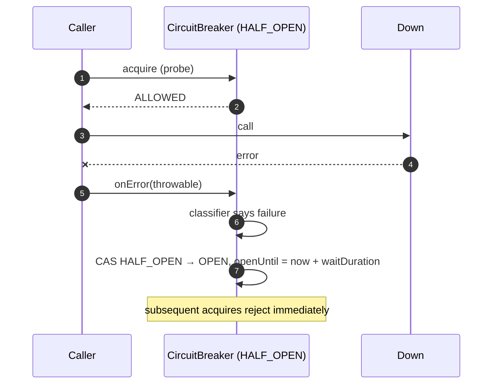
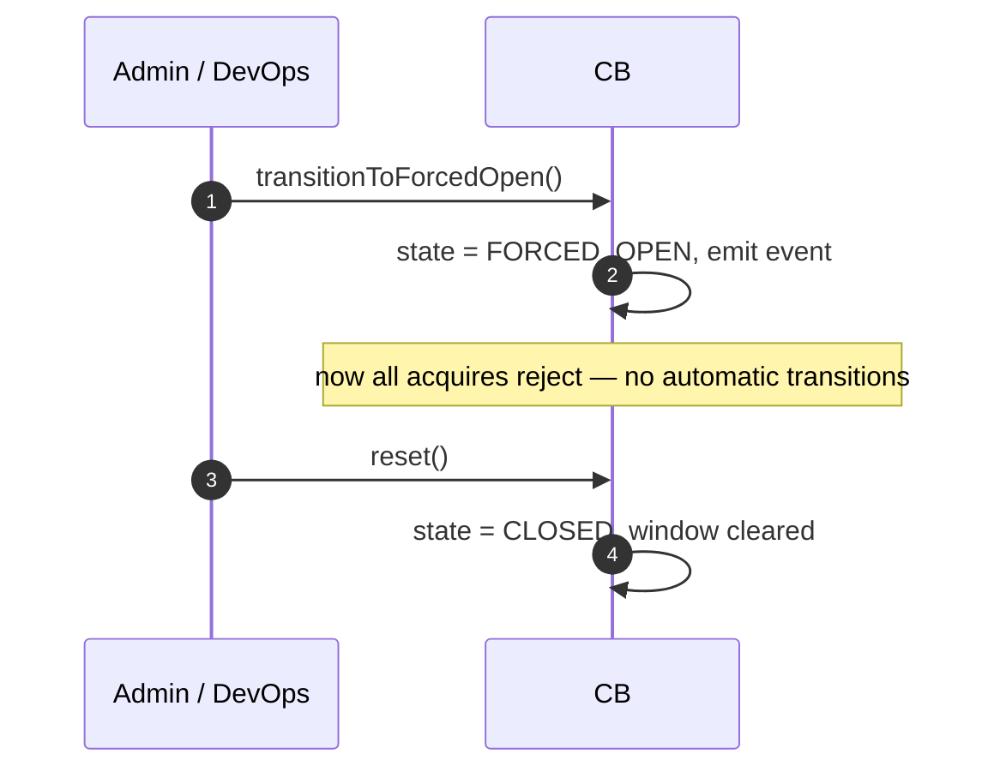
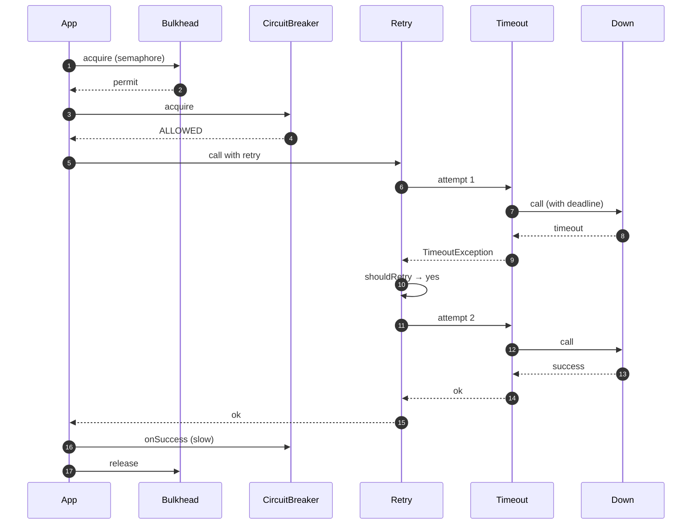

# 08 · Circuit Breaker — Sequence Diagrams

## 1. CLOSED — successful call



## 2. CLOSED → OPEN: failure-rate trip



## 3. OPEN: short-circuit reject



## 4. OPEN → HALF_OPEN auto-transition



## 5. HALF_OPEN — success path → CLOSED



## 6. HALF_OPEN — a probe fails → OPEN



## 7. Manual force-open



## 8. Combined: Bulkhead + CB + Retry + Timeout



Order is critical: Bulkhead first (so we never call CB if at concurrency limit); CB second; Retry third (so retries are subject to CB); Timeout innermost.

## Output

```
Hot path:    CLOSED acquire → caller pays ~ns
Trip:        failure rate ≥ threshold + min calls → CAS CLOSED → OPEN
Wait:        OPEN until nanoTime > openUntil → CAS OPEN → HALF_OPEN
Probe:       HALF_OPEN allows N probes; success → CLOSED, fail → OPEN
Manual:      force-open / force-close / reset for DevOps
Combined:    Bulkhead → CircuitBreaker → Retry → Timeout
```
