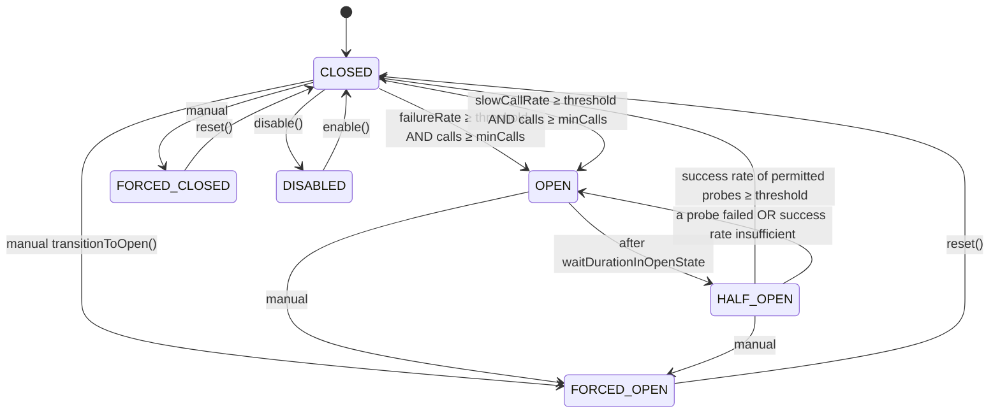
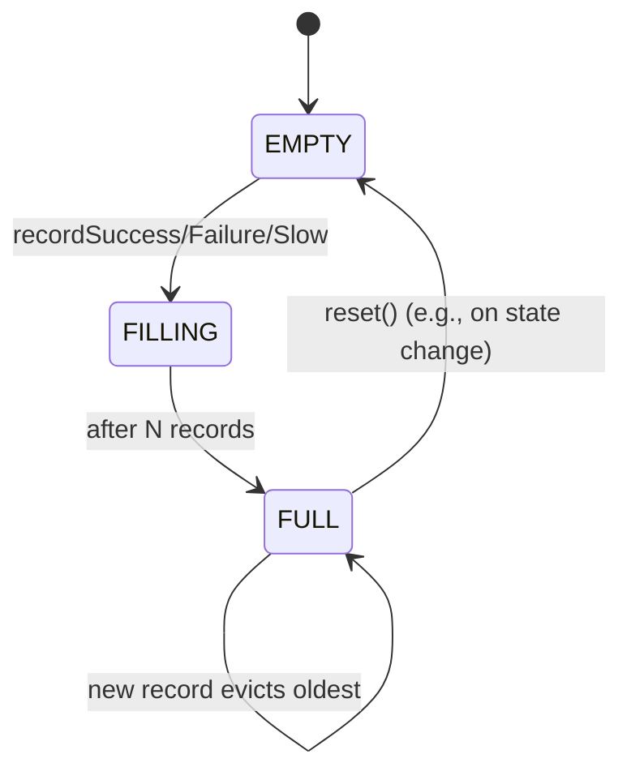
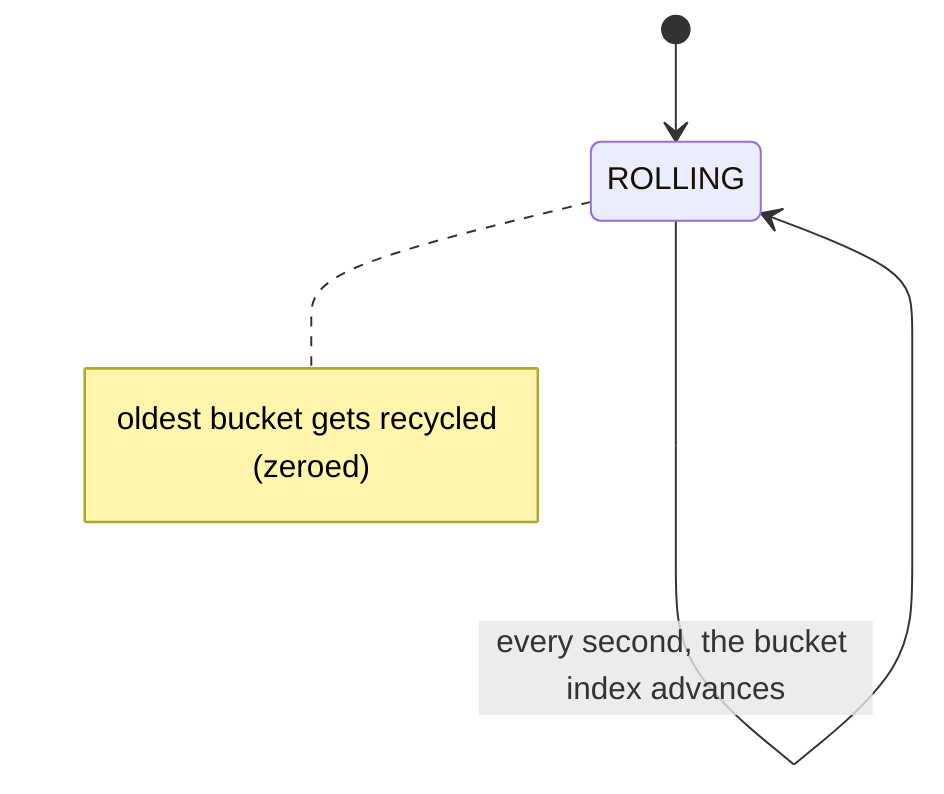
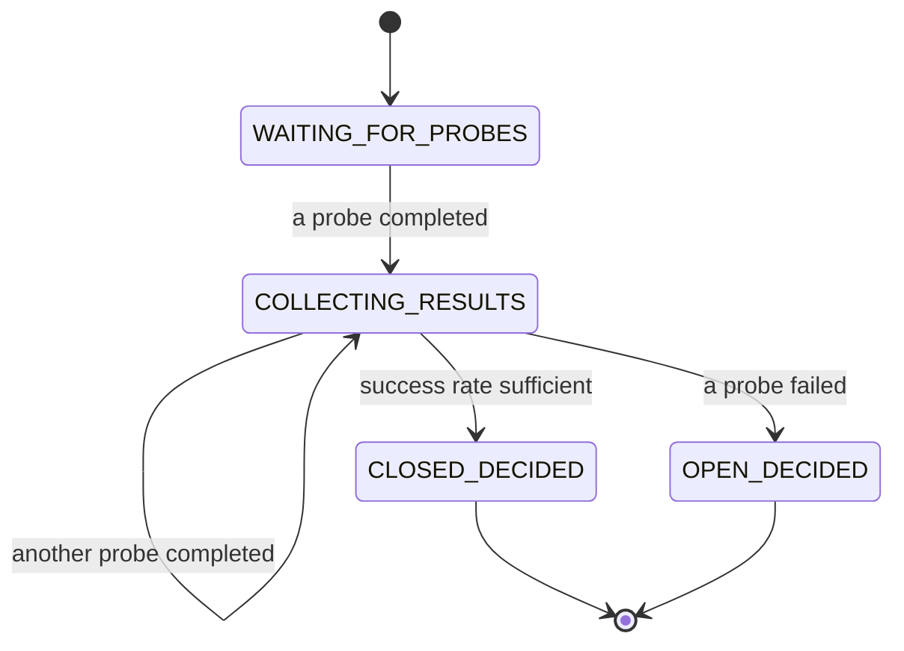

# 09 · Circuit Breaker — State Machines

## Primary state machine



`FORCED_*` and `DISABLED` are administrative overrides:
- `FORCED_OPEN`: rejects everything; ignores signal.
- `FORCED_CLOSED`: allows everything; ignores signal.
- `DISABLED`: allows everything; **and** doesn't record. Useful for "shadow" mode.

## Window state (count-based)



The "minimum calls" check matters only while in `EMPTY` or `FILLING`.

## Window state (time-based)



The window never "fills" the way count-based does. It's always rolling over the last N seconds.

## HALF_OPEN probe state



In simpler implementations, **any** failed probe → OPEN. In more lenient ones, you wait until N probes complete and decide based on rate.

## Output

```
Primary:    CLOSED → OPEN → HALF_OPEN → CLOSED|OPEN; manual overrides via FORCED_*
Window:     count-based EMPTY → FILLING → FULL → FULL (eviction); reset on state change
Probe:      WAITING → COLLECTING → CLOSED|OPEN_DECIDED
```
