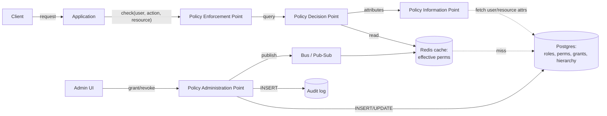
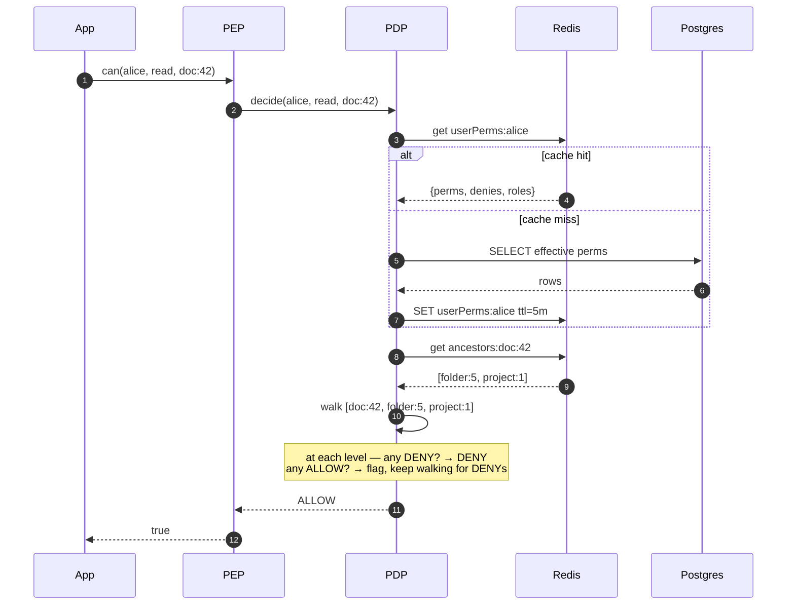
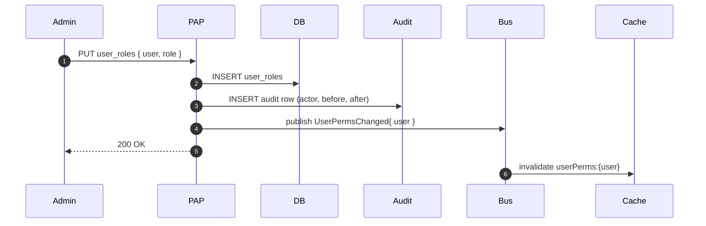

# 03 · Permission System — High-Level Design

## Architecture



## Roles (authz industry vocab)

| Role | Responsibility |
| --- | --- |
| **PEP** (Enforcement) | Calls `check()` at every protected entry point. Enforces decision. |
| **PDP** (Decision) | Evaluates policies; returns ALLOW/DENY |
| **PAP** (Administration) | Manages policies (admin UI / API) |
| **PIP** (Information) | Provides attributes (user dept, resource owner) |

Separating PEP from PDP makes the system testable: the PDP is a pure function of policies + attributes.

## Hot path: `can(user, action, resource)`



## Decision algorithm (RBAC + hierarchy + DENY)

```python
def can(user, action, resource):
    perms = get_effective_perms(user)  # cached: {(action, resourcePattern, ALLOW|DENY)}
    saw_allow = False
    for r in resource_path(resource):  # leaf → root
        for (act, pattern, decision) in perms:
            if matches(act, pattern, action, r):
                if decision == DENY:
                    return DENY
                else:
                    saw_allow = True
        # important: continue scanning parents for any DENY
    return ALLOW if saw_allow else DENY
```

**DENY wins**, regardless of position. **Default deny** if no rule matches.

## Grant write path



The cache invalidation is the consistency boundary. Within a few hundred ms, all PDP instances get the update via pub/sub.

## Wildcard matching

Action patterns: `read`, `write`, `*` (any).
Resource patterns: `doc:*`, `doc:42`, `folder:*/doc:*`.

Specificity rule: more specific (fewer `*`) wins for ALLOW. DENY always wins regardless of specificity.

For interview, simple matching: literal equality + `*`. Full glob/regex is V2.

## Failure modes

| Failure | Mitigation |
| --- | --- |
| Cache outage | Fall through to DB; degrade latency, not correctness |
| DB outage | PDP can serve from cache; new users default deny |
| Bus delay | Stale cache; check returns ALLOW for revoked permission for ~5 min |
| Misconfigured rule | Test in staging; admin-rules audit log |
| Tenant cross-leak bug | Always include `tenant_id` in queries; never query without it |
| Cycle in role hierarchy | Reject at write time |

## Output

```
Roles:    PEP (enforce) | PDP (decide) | PAP (admin) | PIP (attributes)
Hot path: cached effective perms + cached ancestors → walk leaf-to-root
Algo:     DENY wins; default deny; wildcards by specificity for ALLOW
Write:    DB + audit + invalidate via Bus
Failure:  cache fallthrough; tenant scoping enforced everywhere
```
