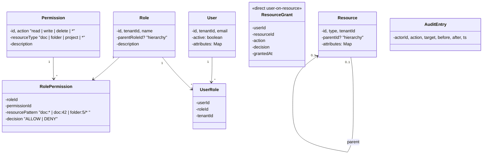

# 04 · Permission System — Domain Model

## Core entities



## Aggregates

| Aggregate root | Why root |
| --- | --- |
| **Role** | Owns its permission grants; admin operations all go through role updates |
| **Resource** | Owns its hierarchy + direct grants |
| **User** | Holds role assignments (light aggregate) |

## Value objects

| Type | Notes |
| --- | --- |
| `Permission` | `(action, resourceType)` — small, deduplicated globally per tenant |
| `Decision` | `ALLOW` / `DENY` enum |
| `ResourcePattern` | `"doc:42"` / `"doc:*"` / `"folder:5/*"` — strings with simple grammar |
| `EffectivePermissionSet` | Cached: all (action, pattern, decision) for a user |

## Key concepts

### RBAC vs ABAC vs ReBAC

| Approach | Question answered | Example |
| --- | --- | --- |
| **RBAC** | "Does the user's role have this permission?" | "Editor can edit any doc." |
| **ABAC** | "Do attributes match policy?" | "Allow if user.dept == doc.dept." |
| **ReBAC** | "Is there a path in the relationship graph?" | "Alice owns doc → can edit." |

Real systems combine all three. Start RBAC; add ABAC for tenant boundaries / data sensitivity; add ReBAC for sharing primitives ("share this doc with Bob").

### Role hierarchy
`admin → editor → viewer`. `admin` inherits all of `editor`'s permissions plus `editor` inherits `viewer`'s. Effective permissions are the union walking up.

Cycles are forbidden. Cycle detection at write time.

### Resource hierarchy
`org > workspace > folder > sub-folder > doc`. A grant on `folder:5` applies to all descendants unless overridden.

When checking `can(user, read, doc:42)`:
1. Compute resource path: `[doc:42, folder:5, workspace:2, org:1]`.
2. Check grants at each level.
3. DENY at any level → DENY.
4. ALLOW at the most-specific level wins (or first ALLOW wins if no DENY).

### Wildcards
- `*` matches any single segment (`read:doc:*` matches `read:doc:42`).
- For interviews: literal `*` for "any" is enough.

### Specificity for ALLOW
When multiple ALLOWs match, the most-specific wins. `read:doc:42 ALLOW` overrides `read:doc:* DENY`? **No.** DENY wins regardless of specificity. But `read:doc:* ALLOW` and `read:doc:42 ALLOW` are equivalent for the result.

### Default deny
If no rule matches, return DENY. **The default must be deny** for security — fail closed.

### Effective permission set
For a user, the set of `(action, resourcePattern, decision)` tuples derived from:
- All roles the user has (including inherited via hierarchy).
- All direct resource grants on the user.

Cached per user. Invalidated on grant change.

### Audit log
Every grant change logged: `(actor, action, target, before, after, timestamp, reason)`. Append-only. Long retention.

For compliance: SOC2, ISO 27001 require these logs to be intact.

## Domain events

| Event | When |
| --- | --- |
| `RoleCreated`, `RoleDeleted` | Role lifecycle |
| `PermissionGranted(role, perm)` | Grant on role |
| `RoleAssigned(user, role)` | User gets role |
| `RoleRevoked(user, role)` | User loses role |
| `ResourceGranted(user, resource, action)` | Direct grant |
| `RoleHierarchyChanged` | Parent changed |
| `EffectivePermsInvalidated(user)` | Cache invalidation signal |

## Output

```
Aggregates:    Role, Resource, User
Value objects: Permission, Decision, ResourcePattern, EffectivePermissionSet
Models:        RBAC (V1) + Resource hierarchy (V1) + ABAC (V1 light) + ReBAC (V2)
Concepts:      DENY > ALLOW; default deny; effective set per user (cached);
               role hierarchy with cycle detection; wildcard matching
```
