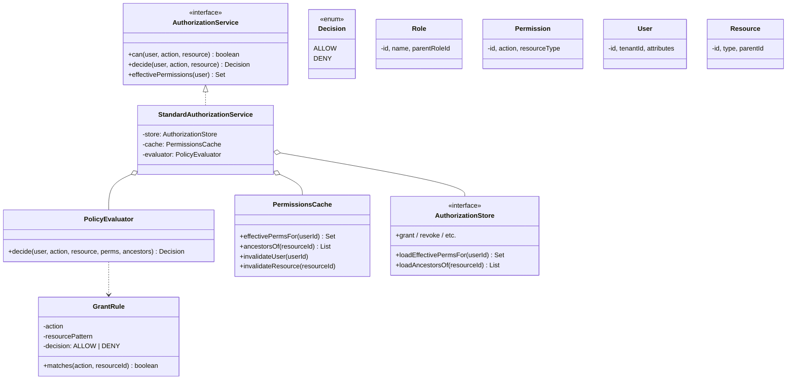

# 07 · Permission System — Class Diagrams

## Core class diagram



## Package layout (`com.authz`)

```
api/      AuthorizationService, Decision, Permission, GrantRule
core/     StandardAuthorizationService, PolicyEvaluator
model/    User, Role, Permission, Resource (POJOs)
policy/   Wildcard matcher, expression evaluator (ABAC stub)
store/    AuthorizationStore, InMemoryAuthorizationStore (+ Postgres stub)
engine/   PermissionsCache (in-memory; Redis-backed in V2)
```

## Why these abstractions

### `AuthorizationService` interface
The PEP calls this. Multiple implementations: in-process, gRPC remote, mock for tests.

### `PolicyEvaluator` is pure
Given `(user, action, resource, perms, ancestors)`, return decision. No side effects. Trivial to unit-test.

### `AuthorizationStore` for storage
In-memory for tests; Postgres for production. Same interface.

### `PermissionsCache` separately
Decoupled from store; can swap to Redis. The cache is the consistency boundary; invalidation is a first-class operation.

### `GrantRule` value object
`(action, resourcePattern, decision)`. Immutable. Drives matching.

### Light ABAC
The skeleton has a placeholder for an attribute-based predicate that can wrap a `GrantRule`. Production extends this.

## Output

```
Layered:     api → core → model + policy + store + engine
Strategy:    AuthorizationStore (in-memory / Postgres)
Pure:        PolicyEvaluator is a deterministic function over inputs
Cache:       PermissionsCache — first-class; invalidation events drive freshness
```
