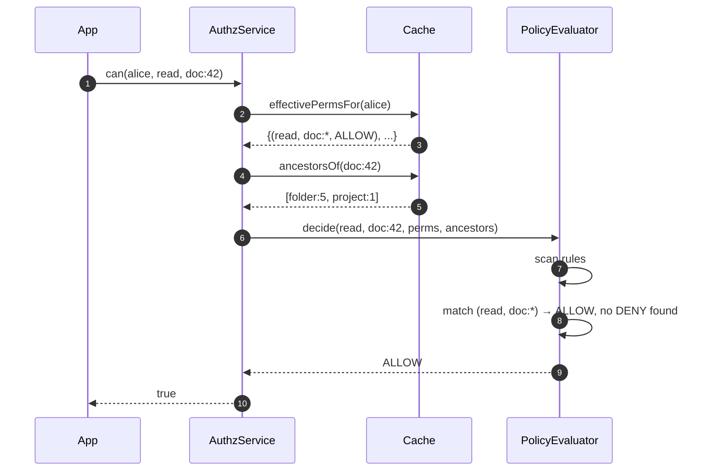
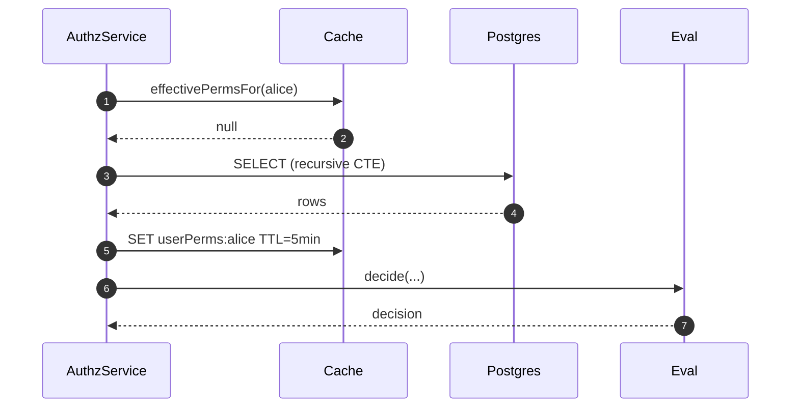
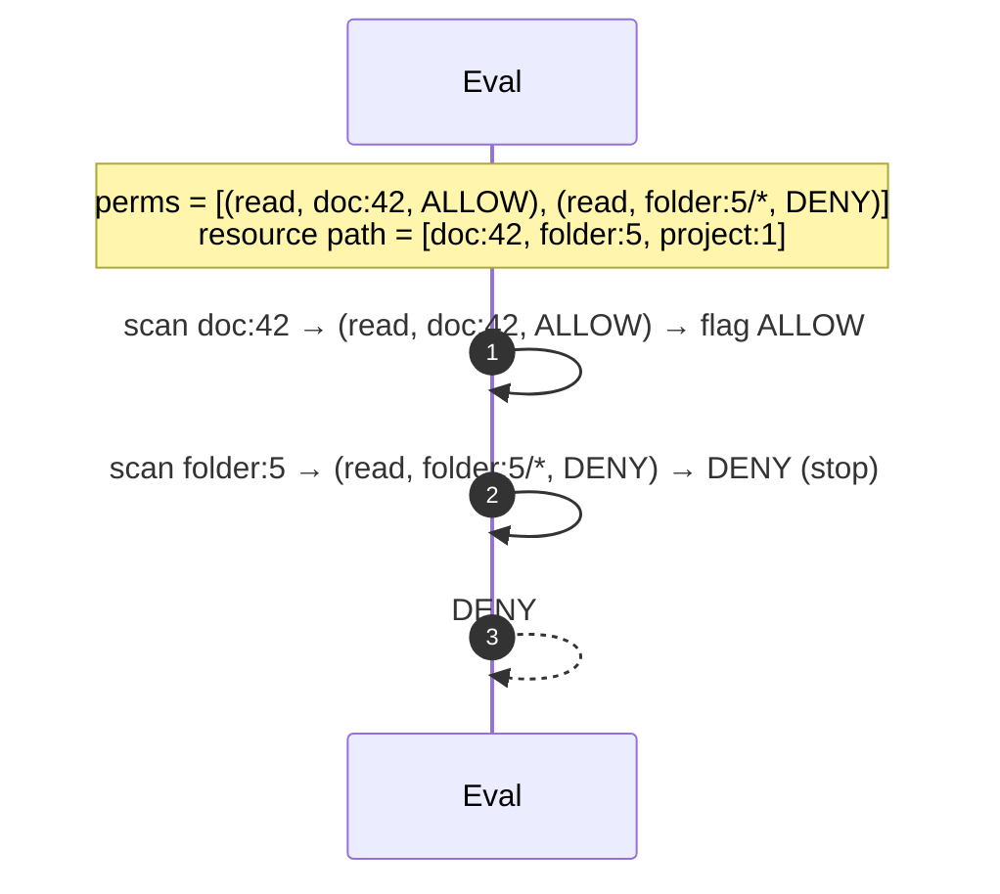
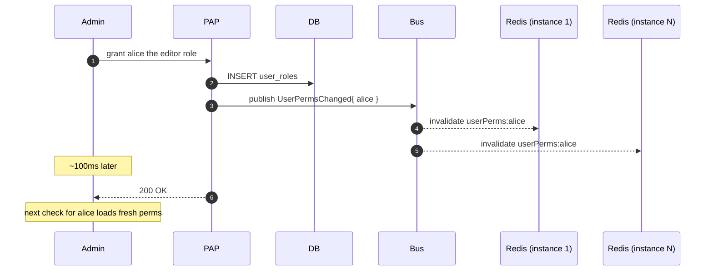
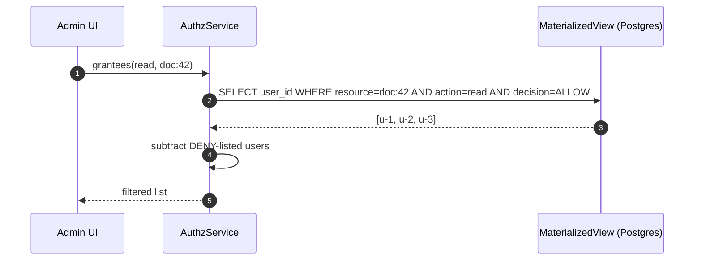
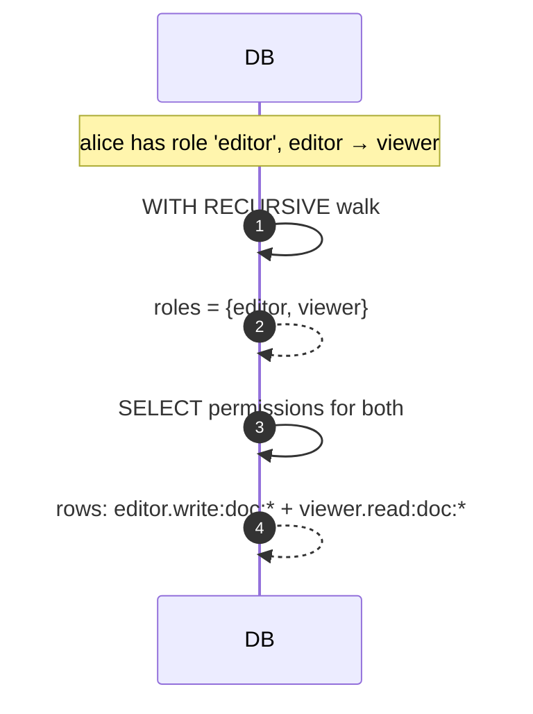
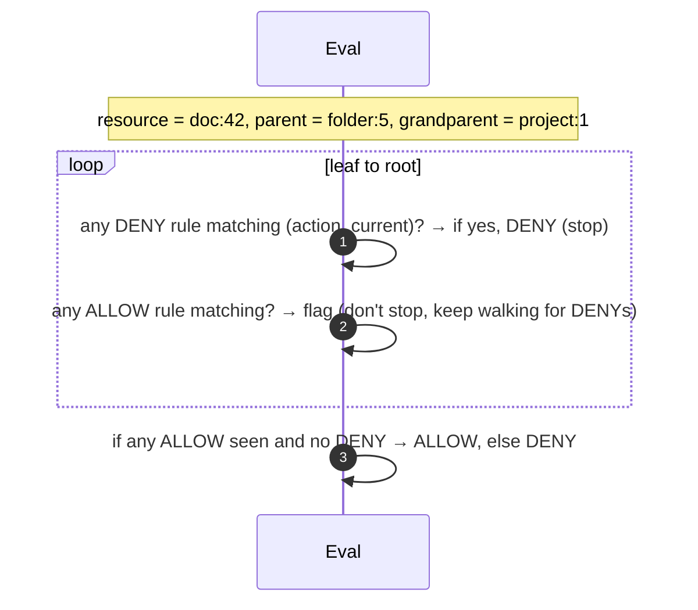
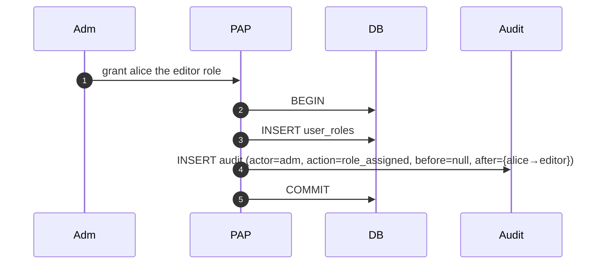

# 08 · Permission System — Sequence Diagrams

## 1. `can(user, read, doc:42)` — happy path with cache hit



## 2. Cache miss — load from DB



## 3. DENY at parent overrides ALLOW at child



## 4. Grant → invalidate cache → next check sees update



## 5. Inverse query — "who can read doc:42?"



The materialized view is updated by triggers on grant changes (or async via pub/sub).

## 6. Role hierarchy traversal



## 7. Resource hierarchy walk during decision



## 8. Audit on grant



## Output

```
Hot path:    cache → evaluator → decision; <1ms with cache hit
DENY wins:   evaluator scans all matching rules; can't return on first ALLOW
Cache:       invalidation via pub/sub on every grant change
Inverse:     materialized view; updated async
Hierarchy:   role + resource hierarchies traversed in evaluator
Audit:       transactional with grants
```
