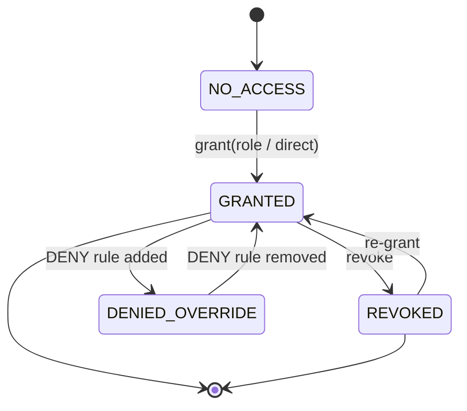
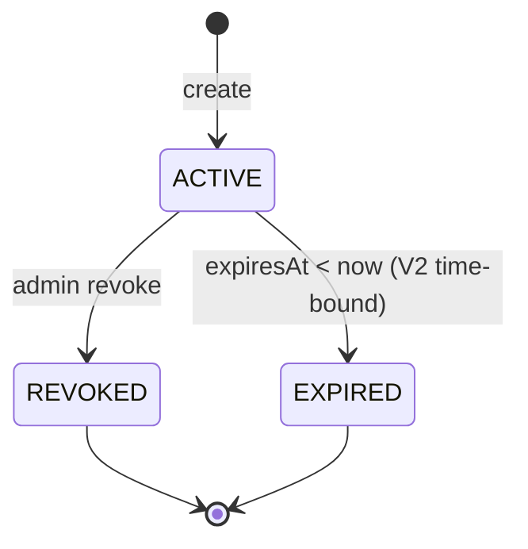

# 09 · Permission System — State Machines

## User-permission lifecycle



A user's effective access on a particular `(action, resource)` is one of:
- **NO_ACCESS** (default deny; nothing matches).
- **GRANTED** (some ALLOW matches and no DENY).
- **DENIED_OVERRIDE** (an ALLOW exists but a DENY also matches).

## Grant lifecycle



Time-bound grants are V2; ACTIVE → REVOKED is the V1 transition.

## Cache lifecycle (per-user)

```mermaid
stateDiagram-v2
    [*] --> ABSENT
    ABSENT --> POPULATED : on first read
    POPULATED --> POPULATED : within TTL; reads hit
    POPULATED --> ABSENT : TTL expires
    POPULATED --> ABSENT : invalidation event
    ABSENT --> [*]
```



Two paths to ABSENT: TTL (lazy) or invalidation event (proactive). Both correctness-safe.

## Role hierarchy (cycles forbidden)

When updating `parentRoleId`:

```mermaid
stateDiagram-v2
    [*] --> CHECKING
    CHECKING --> VALID    : walk up; reach root without seeing self
    CHECKING --> INVALID  : self detected → cycle
    VALID --> APPLIED
    INVALID --> [*]       : reject
```



## Decision finite state machine (during evaluation)

```mermaid
stateDiagram-v2
    [*] --> SCANNING
    SCANNING --> SAW_ALLOW    : ALLOW matched
    SCANNING --> DENIED       : DENY matched (terminal)
    SAW_ALLOW --> DENIED      : DENY matched (terminal)
    SAW_ALLOW --> ALLOWED     : exhaustive scan; no DENY
    SCANNING --> NO_MATCH     : exhaustive scan; no rule matched
    DENIED --> [*]
    ALLOWED --> [*]
    NO_MATCH --> [*]   : default deny
```



`DENIED` is terminal (short-circuit). `SAW_ALLOW` keeps scanning to look for DENYs.

## Output

```
User access: NO_ACCESS / GRANTED / DENIED_OVERRIDE
Grant:       ACTIVE → REVOKED (V1); + EXPIRED (V2)
Cache:       ABSENT ↔ POPULATED via TTL or invalidation
Hierarchy:   CHECKING → VALID | INVALID (cycle)
Decision:    SCANNING → DENIED (short-circuit) or ALLOWED (after exhaustive scan)
```
