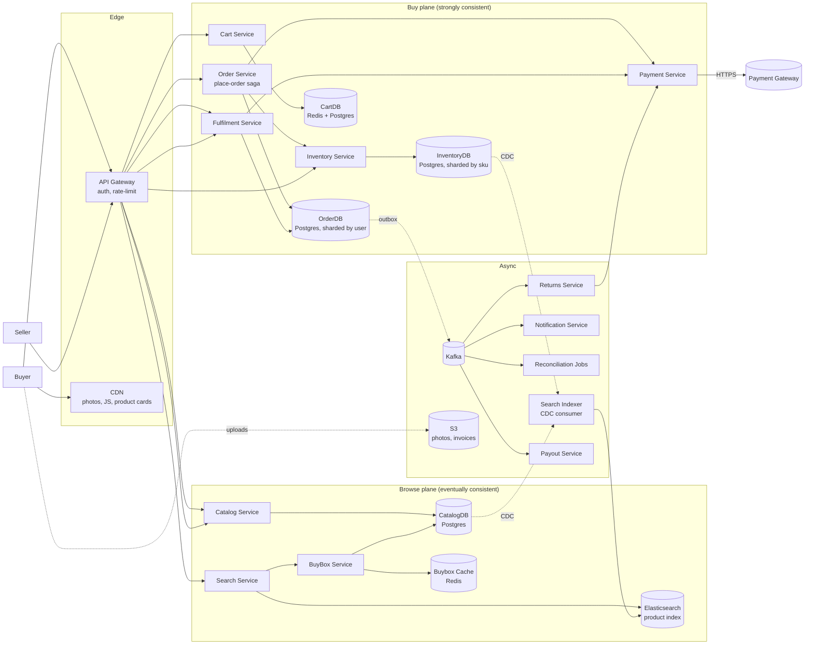

# 03 · E-Commerce — High-Level Design

## Architecture overview



---

## Plane separation

The system splits explicitly into a **browse plane** (catalog, search, buybox) and a **buy plane** (cart, order, inventory, payment, fulfilment), mirroring car rental's pattern.

### Browse plane — eventually consistent
- **Search Service** queries Elasticsearch, then enriches with the buybox-winning offer for each result.
- **Catalog Service** answers per-product / per-SKU detail.
- **BuyBox Service** maintains the "winning offer per SKU" cache. Recomputed via Kafka events on offer changes.
- All caches in front + CDN-served photos. p99 < 250 ms.

### Buy plane — strongly consistent
- **Cart Service** owns soft cart lines; Redis primary with Postgres fallback for durability.
- **Order Service** is the place-order saga orchestrator.
- **Inventory Service** owns `(seller_id, sku_id)` rows; only path for atomic decrement / increment.
- **Payment Service** wraps the gateway with idempotency (auth, capture, void, refund, MIT).
- **Fulfilment Service** owns shipment state, marks dispatched, triggers capture per shipment.
- Strongly consistent reads from primary; replicas serve "my orders".

---

## Component roles

| Component | Owns | Talks to |
| --- | --- | --- |
| API Gateway | AuthN/Z, rate-limit | All backend services |
| Search Service | ES queries, facet aggregations | ES + BuyBox |
| Catalog Service | Product, SKU, ListingOffer CRUD | CatalogDB |
| BuyBox Service | Winning-offer-per-SKU cache | BBC, CatalogDB |
| Cart Service | Cart lines (Redis primary) | CRDB |
| Order Service | place-order saga | InvS, PayS, ODB, K |
| Inventory Service | atomic CAS on inventory_units | IDB |
| Payment Service | authorize/capture/void/refund/MIT | gateway, ODB |
| Fulfilment Service | shipments, captures-on-dispatch | ODB, PayS |
| Returns Service | post-delivery return aggregate | ODB, PayS |
| Reconciliation Jobs | orphan auths, oversells, drift | All services |
| Search Indexer | CDC → ES | CatalogDB, IDB → ES |
| Payout Service | seller settlement, ledger | PayS, ODB |
| Notification Service | email/sms/push | Kafka consumer |

---

## Hot path #1 — place order

```
1. POST /v1/orders { Idempotency-Key, cartId, addressId, paymentMethodId }
2. OS dedupes by (user_id, idempotency_key)
3. OS hydrates cart → list of (offer_id, qty, price_at_add)
4. OS validates address, recomputes prices, surfaces price changes if any
5. OS → InvS reserve(N lines) atomically:
   - For each (seller_id, sku_id): UPDATE inventory_units SET available=available-qty, reserved=reserved+qty
       WHERE seller_id=$s AND sku_id=$k AND available >= qty
   - If any UPDATE affects 0 rows → rollback prior decrements, return OUT_OF_STOCK
6. OS → PayS authorize(total, idemKey=order_id)
7. OS persists Order + OrderItems + Shipments + Payment + outbox(OrderPlaced) in one TXN
8. OS returns 201 with order id
9. Outbox → Kafka → notification, search index update for hot SKUs, seller dashboards
```

Latency budget: **800 ms p99**. Gateway authorize dominates.

---

## Hot path #2 — shipment dispatch (capture)

```
1. POST /v1/shipments/{id}/dispatch { awb, carrier, packedAt }
   - called by Seller dashboard or fulfilment partner webhook
2. FulS validates shipment status in (PACKED)
3. FulS → PayS captureOnAuth(authId, shipmentAmount, idemKey=shipment_id)
   - if auth window expired: fall back to MIT(savedMethod, amount)
4. FulS persists shipment status DISPATCHED + capture_id in one TXN
5. Outbox: ShipmentDispatched
6. Returns 200
```

Latency budget: **300 ms p99**.

---

## Hot path #3 — return → refund

```
1. POST /v1/returns { shipmentId, reason, idempotency-key }
2. RetS validates: shipment.delivered, within return window, eligible
3. RetS creates Return aggregate (REQUESTED), schedules pickup
4. (async) After courier picks up + warehouse inspects:
   POST /v1/returns/{id}/inspect { passed, restock }
5. RetS, on passed=true: → PayS refund(captureId, amount, idemKey=return_id)
6. RetS, restock=true: → InvS increment(seller_id, sku_id, qty)
7. RetS persists Return as REFUNDED + outbox
```

Latency budget for the *request*: **400 ms p99**. The refund itself runs async.

---

## Failure modes

| Failure | Handling |
| --- | --- |
| Inventory shard down | Affected SKUs fail place-order; catalog soft-marks unavailable |
| Payment gateway down | Place-order returns 503; circuit breaker; existing captures queue + retry |
| OrderDB primary down | Place-order fails fast; 30 s auto-failover; cart untouched |
| Kafka down | Outbox grows; place-order unaffected (synchronous path doesn't depend on publish); consumers backlog drains |
| BuyBox cache down | Fall back to compute on-demand from CatalogDB; slower but correct |
| Search index drifted | Buyer sees stale price; place-order re-validates; OUT_OF_STOCK or PRICE_CHANGED surfaces correctly |
| Authorize succeeds, persist fails | Reconciliation finds orphan auths every 5 min and voids them |
| Capture fails after auth window | MIT fallback; if MIT also fails, ops dunning |
| Refund fails | Retry with backoff; ops escalation after 24 h |
| Seller suspended mid-order | Pending shipments routed to Returns; ops handles refund |

---

## Why a saga, not 2PC

2PC across our DBs + the external gateway is not feasible. Each step is idempotent; failures compensate.

| Step | Compensation |
| --- | --- |
| Reserve N inventory rows | Increment them back |
| Authorize total | Gateway void |
| Persist order TXN | DB ROLLBACK (still in same TXN) |
| Capture on dispatch | Refund |
| MIT for late capture | Refund |

A reconciliation job catches half-states (e.g., authorized but no order row → release auth).

---

## Why split the planes

If browse and buy shared one DB, the sale-day search storm would starve the place-order writes. Plane separation lets us:
- Scale ES / Redis / CDN for the read storm.
- Keep OrderDB and InventoryDB hot but small.
- Tolerate browse-plane staleness during peak (search-results say "in stock" but inventory at place-order is the truth).

---

## Cross-cutting infrastructure

- **Outbox + Kafka** for reliable event publish from the buy plane.
- **CDC (Debezium)** from CatalogDB and InventoryDB into the Search Indexer.
- **Vault** for tokenized payment methods; raw card data never touches our DB.
- **Feature flags** (see L17) to gate buybox strategies and pricing experiments.
- **Circuit breakers** on every external-vendor adapter (gateway, courier, seller webhook).

---

## Output

```
Two planes:    browse (eventual) + buy (strong)
Hot paths:     place-order, dispatch (capture), returns (refund)
Async:         Kafka for events, CDC for search, payout & recon workers
Failure:       compensation per step + reconciliation safety net
External deps: payment gateway + carrier APIs — both circuit-breakered
```
